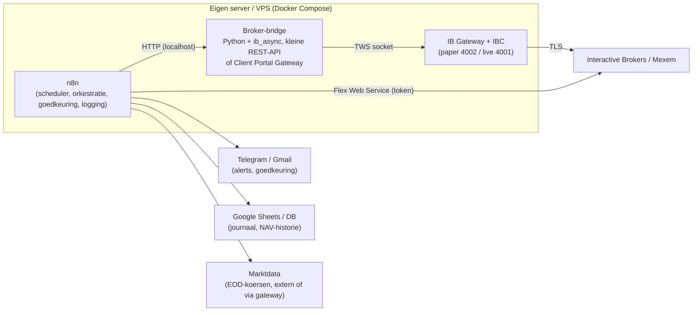

# Beleggen via Mexem met een API: realistisch rendement en inrichting

*Onderzoeksnotitie, september 2026. Geen beleggingsadvies; dit is een analyse van
wat het bewijs zegt en hoe je een geautomatiseerde opzet technisch en
organisatorisch zou bouwen.*

---

## 1. Samenvatting in vijf regels

1. **Verwacht rendement dat ik eerlijk kan beloven: 5 tot 7% nominaal per jaar**
   (bruto, voor belasting) over een horizon van 10+ jaar, met een wereldwijd
   gespreide indexkern. Niet meer.
2. **Elk jaar afzonderlijk is een gok**: -35% tot +35% is normaal. Rendement is
   een verdeling, geen getal.
3. **Actief of algoritmisch de markt verslaan lukt structureel bijna niemand**:
   na 15 jaar verslaat in geen enkele fondscategorie de meerderheid van de
   professionals hun index. Daytraders verliezen in ruim 80% van de gevallen.
4. **Belasting en kosten bepalen meer dan alpha**: box 3 kost je boven de
   vrijstelling zo'n 2,1% van je vermogen per jaar, ongeacht je rendement.
5. **API-toegang bij Mexem bestaat en werkt** (het is de Interactive Brokers
   stack), maar volledig onbeheerd draaien is lastig door verplichte 2FA-login
   en wekelijkse herauthenticatie. Het is prima voor maandelijks herbalanceren
   en monitoring, niet voor "zet het aan en vergeet het".

---

## 2. Wat is Mexem eigenlijk, en wat betekent dat voor de API

- Mexem Ltd is een Cypriotisch bedrijf (kantoor in Amstelveen), vergund door
  CySEC en via het MiFID II-paspoort geregistreerd bij de AFM. Het is een
  **introducing broker van Interactive Brokers**; je effecten liggen bij
  Interactive Brokers Ireland (toezicht Central Bank of Ireland, Ierse
  compensatieregeling tot EUR 20.000).
- Gevolg: **alle Mexem-API's zijn IBKR-API's**. Documentatie, tooling en
  community rond IBKR zijn direct toepasbaar.
- Kostenpeil (volgens Mexem en reviews 2026, altijd zelf controleren):

| Post | Tarief |
|---|---|
| Europese aandelen/ETF's | 0,06% per order, minimum ca. EUR 1,80 |
| Amerikaanse aandelen | USD 0,005 per aandeel, minimum USD 1 |
| Valutaconversie EUR/USD | 0,005%, minimum ca. USD 5 |
| Twee ETF-aankopen per maand | gratis (orderwaarde tot ca. USD 1.600, voorwaarden gelden) |
| Bewaarloon, inactiviteit, servicefee | geen |
| Realtime marktdata | abonnement per beurs nodig voor API-koersen |

De lage valutakosten en de gratis ETF-orders zijn relevant voor de strategie:
maandelijks inleggen in twee ETF's is bij Mexem in de praktijk (bijna) gratis.

### 2.1 Beschikbare API's

Mexem noemt zelf drie API's (bron: mexem.com/api en de FAQ):

| API | Wat | Voor wie | Onbeheerd draaien? |
|---|---|---|---|
| **TWS API** | Socket-API via Trader Workstation of IB Gateway. Orders, posities, marktdata, historische data. Python, Java, C#, C++. | Alle klanten met handelsrechten | Ja, met IBC of vergelijkbare tooling; wekelijkse 2FA blijft |
| **Client Portal Web API** | REST + WebSocket via een lokale "Client Portal Gateway" (Java) of via OAuth | Alle klanten (gateway). OAuth 2.0 alleen voor instellingen; voor particulieren "in overweging, geen ETA" | Beperkt: gateway vereist handmatige login met gebruikersnaam en wachtwoord |
| **FIX API** | Institutioneel orderprotocol, geen account- of marktdata | Instellingen | n.v.t. |
| **Flex Web Service** | Rapportages (trades, posities, NAV) via token, echt headless | Alle klanten | Ja, volledig |

Belangrijke praktische beperkingen (bron: IBKR Campus, IBC/ib-gateway-docker,
ibg-controller):

- IBKR dwingt **dagelijks een herstart of auto-logoff** af en **wekelijks een
  volledige herauthenticatie** inclusief 2FA (zondag rond 01:00 ET).
- Met IBC (of de Docker-image `gnzsnz/ib-gateway-docker`) herstart de gateway
  dagelijks zonder nieuwe login. De wekelijkse 2FA kun je alleen automatiseren
  door een TOTP-secret in de container te zetten (`ibg-controller`) of 2FA uit
  te zetten (`ibeam`). Beide verlagen je beveiliging; ik zou dit niet doen voor
  een live-account met serieus vermogen. Accepteer één handmatige login per week.
- Realtime en historische koersen via de API vereisen **betaalde
  marktdata-abonnementen** op de gebruikersnaam; op een gratis proefaccount
  krijg je die niet. Een paper-account spiegelt de abonnementen van je
  live-account.
- Paper trading: poorten 7497 (TWS) / 4002 (Gateway). Live: 7496 / 4001.

---

## 3. Hoeveel rendement kun je realistisch verwachten

### 3.1 Wat de geschiedenis zegt

| Bron | Cijfer |
|---|---|
| UBS Global Investment Returns Yearbook 2026 (Dimson, Marsh, Staunton) | Wereldaandelen 1900-2025: **6,6% reëel** per jaar; obligaties 1,6% reëel |
| MSCI ACWI in EUR, 10 jaar t/m aug 2026 | **12,1% per jaar** (netto) |
| Idem, jaarrendementen 2016-2025 | +11, +9, -5, +29, +7, +28, -13, +18, +25, +8 |

De laatste tien jaar waren uitzonderlijk goed. Wie dat als "normaal" neemt,
gaat teleurgesteld worden. Zelfs in die gouden periode zaten jaren van -13% en
tussentijdse dalingen van ruim -30% (maart 2020).

### 3.2 Wat de grote huizen vooruit verwachten (10-jaars, nominaal)

| Huis | Verwachting |
|---|---|
| Vanguard (VCMM, 2026) | Amerikaanse aandelen 3,9 tot 5,9% |
| AQR (2026) | Wereldwijde 60/40: 3,4% **reëel**; risicopremies "gecomprimeerd" |
| Diverse anderen (Invesco, Verus, Morningstar-overzicht) | Wereld ca. 6%; ontwikkeld ex-VS en opkomende markten 7,5 tot 8% |

Consensus: waarderingen zijn hoog, vooral in de VS, dus lagere verwachte
rendementen dan het historisch gemiddelde. Niemand van deze partijen voorspelt
dubbele cijfers voor een breed gespreide portefeuille.

### 3.3 Kan een slimme strategie of een algoritme dit verslaan

Het bewijs is eenduidig en ontnuchterend:

- **SPIVA (S&P, jaareinde 2025)**: over 15 jaar is er **geen enkele categorie**
  (aandelen VS, internationaal, obligaties) waarin de meerderheid van actieve
  fondsen hun benchmark verslaat. Over 20 jaar verliest ca. 92% van de
  Amerikaanse fondsen. In 2025 alleen al verloor 79% van de large-cap fondsen
  van de S&P 500.
- **Barber & Odean**: de 20% actiefste particuliere beleggers presteren ca. 6,5
  procentpunt per jaar slechter dan de markt. In Taiwan (360.000 daytraders)
  verliest 84% geld, mediaan -8,7%, minder dan 1% is consistent winstgevend.
- **Factorpremies vervallen na publicatie**: gemiddeld verdwijnt ca. 50% van de
  alpha zodra een anomalie is gepubliceerd. Momentum leverde in de jaren '90
  ca. 10% per jaar, nu dichter bij 2%.
- **LLM's als stockpicker**: recente studies laten in echte out-of-sample
  periodes een bescheiden verbetering zien (Sharpe 0,57 naar 0,69 op een
  momentumstrategie, 2024-2025), maar de Sharpe van nieuws-gebaseerde GPT-
  strategieën daalde van 6,5 (2021) naar 1,2 (2024). Het voordeel zit vooral in
  kleine, illiquide aandelen en verdwijnt zodra meer partijen het doen.

Mijn eigen positie hierin: **ik kan de markt niet voorspellen, en ik ga niet
doen alsof.** Wat ik wel goed kan is discipline afdwingen: regels vastleggen,
ze consequent uitvoeren, kosten laag houden, en emotionele fouten (paniekverkoop,
FOMO-aankopen) uit het proces halen. Dat is aantoonbaar waardevol; het gedrags-
verschil tussen "gedisciplineerd indexbelegger" en "gemiddelde particulier" is
in onderzoek meerdere procentpunten per jaar. Maar het is geen alpha, het is
het vermijden van eigen fouten.

### 3.4 Mijn antwoord op "hoeveel haal jij per jaar"

| Scenario | Verwacht rendement (nominaal, bruto, per jaar, 10+ jaar) |
|---|---|
| Wereldwijde indexkern, maandelijks bijkopen, jaarlijks herbalanceren | **5 tot 7%**, middenwaarde ca. 6% |
| Idem plus een bescheiden systematische satelliet (trend/momentum, 10 tot 15%) | 5 tot 8%; mogelijk lagere maximale daling, mogelijk ook 1 tot 2% minder |
| Actief handelen, daytraden, opties schrijven "voor inkomen", hefboom | Verwachting **negatief tot marktrendement minus kosten**; kleine kans op veel meer, grote kans op veel minder |

Wie je een consistente 15 tot 20% per jaar belooft, verkoopt iets. Renaissance
Medallion haalt dat, en die is dicht voor buitenstaanders.

### 3.5 Wat er van dat rendement overblijft: box 3

- Box 3 belast in 2026 en 2027 een **forfaitair rendement van 5,88%** op
  beleggingen tegen **36%**. Dat is ca. **2,1% van je belegde vermogen per jaar**
  boven de vrijstelling (EUR 59.357 per persoon, EUR 118.714 met fiscaal partner).
- Dit forfait geldt ook in een verliesjaar (tenzij je via de tegenbewijsregeling
  aantoont dat je werkelijke rendement lager was).
- De Wet werkelijk rendement (beoogd 2028) staat sinds 2 september 2026 op de
  tocht; het kabinet stuurt richting een vermogenswinstbelasting. Tot dan blijft
  het forfaitaire stelsel gelden.
- Praktisch gevolg: bij 6% verwacht rendement en 2,1% heffing houd je netto ca.
  3,9% over, ruwweg 1,5 tot 2% reëel na inflatie. Dat is het eerlijke plaatje.
- Nederlandse eigenaardigheid: omdat er (nog) geen vermogenswinstbelasting is,
  is veel handelen nu fiscaal niet gestraft. Dat verandert waarschijnlijk vanaf
  2028. Bouw je strategie dus niet op fiscale voordelen van hoge omzet.
- Dividendlekkage: Ierse UCITS-ETF's (VWCE, WEBN) lekken ca. 0,25% per jaar op
  Amerikaanse dividenden. Northern Trust-fondsen (via Meesman) hebben FBI-status
  en lekken bijna niets, maar zijn niet via Mexem te koop. Voor de Mexem-kern is
  **WEBN (Amundi Prime All Country World, TER 0,07%)** de goedkoopste brede
  keuze; VWCE (TER 0,22%) is het meer liquide alternatief.

---

## 4. Hoe ik het zou inrichten: de strategie

### 4.1 Kern-satelliet, regels boven meningen

```
Portefeuille
├── 85 tot 90%  Kern: 1 wereldwijde all-country ETF (WEBN of VWCE)
│               Maandelijks bijkopen (gratis ETF-orders), nooit verkopen
│               behalve voor herbalanceren of onttrekking
├── 10 tot 15%  Satelliet: systematisch, regelgebaseerd, gelimiteerd budget
│               Optie A: trendfilter (10-maands SMA) op 2 tot 3 regio/sector-ETF's
│               Optie B: kwaliteit/momentum-ETF, buy-and-hold
└── 0 tot 10%   Cash/geldmarkt-ETF als buffer, telt mee in herbalanceren
```

Regels die het algoritme hard afdwingt:

- **Geen hefboom, geen shorts, geen geschreven opties, geen crypto-derivaten.**
  Eén keer -100% wist alle eerdere winst.
- **Positielimiet**: geen enkele satellietpositie boven 5% van de portefeuille.
- **Herbalanceren op banden**: pas handelen als een weging meer dan 5
  procentpunt (absoluut) of 25% (relatief) van doel afwijkt. Dit minimaliseert
  transacties en dus kosten.
- **Handelsmoment**: één keer per maand, vaste dag, limietorders rond de
  midprijs, nooit market-orders bij opening of sluiting.
- **Kill-switch**: als de satelliet meer dan 20% onder haar piek staat, gaat ze
  naar cash en stopt het algoritme tot een mens het herstart.
- **Vier-ogen-principe**: het algoritme stelt orders voor, een mens keurt ze
  goed (in n8n een Wait-node met Telegram/e-mail-knop). Pas na 6 tot 12 maanden
  foutloos paper- en live-draaien overweeg ik volledige automatisering, en dan
  alleen voor de kernaankopen.

### 4.2 Waarom niet meer satelliet

Elke procent die je uit de indexkern haalt, moet het tegen een 90%-kans op
onderprestatie opnemen (SPIVA). De satelliet is er om te leren en te meten, niet
om rijk van te worden. Meet hem altijd tegen de kern: presteert hij na 3 jaar
slechter, dan stopt hij.

---

## 5. Hoe ik het zou inrichten: de techniek

### 5.1 Architectuur



Rolverdeling:

- **n8n** is de dirigent: schema's, retries, foutafhandeling, menselijke
  goedkeuring, notificaties, logging. n8n is geen handelsengine en moet geen
  tick-data verwerken.
- **Broker-bridge**: één klein Python-servicetje (ib_async, opvolger van
  ib_insync) met vier endpoints: `GET /positions`, `GET /nav`,
  `POST /orders` (met idempotency-key), `GET /health`. Alternatief zonder eigen
  code: de **Client Portal Gateway** en n8n HTTP Request-nodes rechtstreeks op
  `https://localhost:5000/v1/api/...`. Derde optie: de community-node
  `@l4z41/n8n-nodes-ibkr` (TWS API, orders, posities, realtime bars). Die is
  jong (5 sterren, 11 commits); geschikt om te proberen in paper, niet als
  fundament voor live vermogen zonder eigen review van de code.
- **IB Gateway + IBC** in Docker (`gnzsnz/ib-gateway-docker`). API-instellingen:
  alleen `127.0.0.1` als trusted IP, "Read-Only API" aan voor de monitoring-
  gateway, aparte gateway (of aparte client-id) voor de order-flow.

### 5.2 Client Portal Web API endpoints die je nodig hebt

| Doel | Endpoint |
|---|---|
| Sessie in leven houden (elke ~1 min) | `POST /v1/api/tickle` |
| Auth-status | `POST /v1/api/iserver/auth/status` |
| Accounts | `GET /v1/api/portfolio/accounts` |
| Posities | `GET /v1/api/portfolio/{accountId}/positions/0` |
| Saldo/NAV | `GET /v1/api/portfolio/{accountId}/summary` |
| Instrument zoeken (conid) | `POST /v1/api/iserver/secdef/search` |
| Order plaatsen | `POST /v1/api/iserver/account/{accountId}/orders` |
| Orderbevestiging (precautionary messages) | `POST /v1/api/iserver/reply/{replyId}` |
| Open orders | `GET /v1/api/iserver/account/orders` |

Let op de bevestigingsdialoog: IBKR retourneert bij orders vaak een `replyId`
met een waarschuwing die je expliciet moet beantwoorden voordat de order live
gaat. Bouw dat in als aparte stap, niet als blinde "ja".

### 5.3 De n8n-workflows

1. **Health check (elke 5 min, beurstijden)**
   Schedule Trigger → HTTP `auth/status` → IF niet geauthenticeerd → Telegram
   "Gateway uit, log in". Plus `tickle` om de sessie vast te houden.
2. **Maandelijkse herbalancering (1e handelsdag, 16:00 CET)**
   Schedule → haal NAV en posities → haal slotkoersen → Code-node berekent
   doelwegingen en afwijkingen → alleen orders buiten de banden → Telegram
   met orderlijst en knop "Goedkeuren" (Wait-node, timeout 12 uur, default
   = niets doen) → plaats limietorders → log naar Sheets → bevestiging.
3. **Kill-switch (dagelijks na sluiting)**
   Bereken drawdown van de satelliet t.o.v. piek → boven 20%: annuleer open
   orders, zet vlag "satelliet uit" in een datastore, alarm.
4. **Journaal (dagelijks 07:00)**
   Flex Web Service query (trades, posities, NAV) → parse XML → Sheets/DB. Er
   bestaat al een n8n-template voor precies dit (n8n.io template 12151).
5. **Maandrapport**
   NAV-reeks → rendement, volatiliteit, drawdown, vergelijking met WEBN als
   benchmark → e-mail. Dit is het belangrijkste rapport: het beantwoordt de
   vraag of de satelliet zijn bestaan rechtvaardigt.

### 5.4 Veiligheid en operationele hygiëne

- Wachtwoord en TOTP nooit in workflow-JSON; alleen in n8n-credentials of
  Docker-secrets. Overweeg een **aparte IBKR-gebruiker** met beperkte rechten
  voor de API (dat kan onder hetzelfde account).
- **Read-only** waar het kan. Alleen de herbalanceringsflow mag orders sturen.
- **Idempotentie**: geef elke order een eigen `orderRef`/clientOrderId en
  controleer op bestaande open orders voordat je plaatst. Een retry mag nooit
  een dubbele order worden.
- **Order-limieten in code**: maximaal X orders per dag, maximaal Y% van NAV
  per order, alleen whitelisted conids. Een bug in de wegingsberekening mag
  niet je hele portefeuille kunnen omzetten.
- **Paper eerst, minimaal 3 maanden**, daarna live met een klein bedrag,
  daarna opschalen. Vergelijk paper-uitkomsten met de benchmark voordat je
  ook maar één euro live zet.
- Verwacht en plan de **wekelijkse handmatige 2FA-login**. Zorg dat de
  maandelijkse herbalancering niet op maandagochtend valt.

### 5.5 Kosten van de opzet

| Post | Indicatie |
|---|---|
| VPS (2 vCPU, 4 GB) | EUR 5 tot 15 per maand; of thuis op een mini-pc |
| Marktdata-abonnementen | EUR 0 als je EOD-koersen extern haalt; anders EUR 2 tot 15 per beurs per maand |
| Transacties bij maandelijks herbalanceren | vaak EUR 0 (gratis ETF-orders), anders enkele euro's |
| Eigen tijd | het echte kostenpost: bouw ca. 20 tot 40 uur, beheer 1 tot 2 uur per maand |

---

## 6. Wat ik nadrukkelijk niet zou doen

- Daytraden of intraday-signalen via n8n verwerken. De latentie, de
  datakosten en het bewijs zijn alle drie tegen je.
- Een LLM (inclusief mijzelf) live koop/verkoop laten beslissen op nieuws of
  "sentiment". Gebruik LLM's voor het schrijven en reviewen van code, voor
  documentatie en voor het samenvatten van je maandrapport, niet als orakel.
- Backtests vertrouwen zonder out-of-sample periode, transactiekosten,
  slippage en survivorship-bias. Een strategie die in backtest 30% per jaar
  doet, doet dat live niet.
- 2FA uitschakelen om de gateway makkelijker onbeheerd te laten draaien.
- Gecompliceerde producten (turbo's, CFD's, opties schrijven) voor "extra
  rendement". Dat is het verkopen van verzekeringen zonder kapitaalbuffer.

---

## 7. Stappenplan

1. **Week 1**: Paper-account activeren bij Mexem; TWS API aanzetten; IB Gateway
   met IBC in Docker draaien; verbinden met een script dat alleen posities
   leest.
2. **Week 2**: Kern-ETF kiezen (WEBN of VWCE), doelwegingen en regels op
   papier vastleggen (dit document als startpunt), benchmark definiëren.
3. **Week 3 tot 4**: n8n-workflows 1, 4 en 5 (health, journaal, rapport). Nog
   geen orders.
4. **Maand 2 tot 4**: Workflow 2 (herbalancering) met handmatige goedkeuring in
   paper. Workflow 3 (kill-switch).
5. **Maand 5**: Evaluatie: klopte elke order, elke berekening, elk alarm? Zo
   niet: terug naar 4.
6. **Maand 6**: Live met een klein bedrag, alle orders nog handmatig goedkeuren.
7. **Na 12 maanden**: Beslis op basis van het maandrapport of de satelliet
   blijft. Overweeg pas dan automatische goedkeuring voor kern-aankopen.

---

## 8. Bronnen

Mexem en IBKR API

- [Mexem: API-overzicht](https://www.mexem.com/api)
- [Mexem FAQ: welke soorten API's zijn beschikbaar](https://www.mexem.com/faqs/what-types-of-apis-are-available)
- [Mexem FAQ: TWS API met proefaccounts](https://www.mexem.com/faqs/can-i-use-the-tws-api-with-free-trial-accounts)
- [IBKR Campus: Trading Web API](https://www.interactivebrokers.com/campus/ibkr-api-page/web-api-trading/)
- [IBKR Campus: Launching and Authenticating the Gateway](https://www.interactivebrokers.com/campus/trading-lessons/launching-and-authenticating-the-gateway/)
- [IBKR Campus: OAuth 1.0A Extended](https://www.interactivebrokers.com/campus/ibkr-api-page/oauth-1-0a-extended/)
- [IBKR TWS API: Streaming Market Data](https://interactivebrokers.github.io/tws-api/market_data.html)
- [gnzsnz/ib-gateway-docker](https://github.com/gnzsnz/ib-gateway-docker)
- [code-hustler-ft3d/ibg-controller](https://github.com/code-hustler-ft3d/ibg-controller)
- [Voyz/ibeam issue 150: gateway auto restart](https://github.com/Voyz/ibeam/issues/150)
- [l4z41/n8n-nodes-ibkr](https://github.com/l4z41/n8n-nodes-ibkr)
- [n8n-template: Log daily Interactive Brokers trades to a Google Sheets journal](https://n8n.io/workflows/12151-log-daily-interactive-brokers-trades-to-a-google-sheets-journal/)

Mexem als broker, kosten, toezicht

- [Financer: MEXEM review 2026](https://financer.nl/review/mexem/)
- [Brokerchooser: MEXEM kosten](https://brokerchooser.com/broker-reviews/mexem-review/mexem-fees)
- [Finner: Beleggen bij MEXEM](https://www.finner.nl/brokers/mexem-review)
- [Waarinbeleggen: MEXEM review 2026](https://waarinbeleggen.nl/mexem-review/)
- [Traden.nl: Mexem review 2026](https://www.traden.nl/mexem)

Rendementsverwachtingen en bewijs

- [UBS Global Investment Returns Yearbook 2026](https://www.ubs.com/global/en/media/display-page-ndp/en-20260303-global-investment-returns-yearbook-2026.html)
- [MSCI ACWI Index (EUR) factsheet](https://www.msci.com/www/fact-sheet/msci-acwi-index/010001866)
- [Vanguard: VCMM return forecasts](https://corporate.vanguard.com/content/corporatesite/us/en/corp/vemo/vemo-return-forecasts.html)
- [AQR: 2026 Capital Market Assumptions](https://www.aqr.com/Insights/Research/Alternative-Thinking/2026-Capital-Market-Assumptions-for-Major-Asset-Classes)
- [Morningstar: Experts forecast stock and bond returns, 2026 edition](https://www.morningstar.com/markets/experts-forecast-stock-bond-returns-2026-edition)
- [S&P Dow Jones Indices: SPIVA](https://www.spglobal.com/spdji/en/research-insights/spiva/)
- [SPIVA U.S. Persistence Scorecard, jaareinde 2025](https://www.spglobal.com/spdji/en/spiva/article/us-persistence-scorecard/)
- [Barber, Lee, Liu, Odean: Do Individual Day Traders Make Money? (Taiwan)](http://www.econ.yale.edu/~shiller/behfin/2004-04-10/barber-lee-liu-odean.pdf)
- [Barber et al.: The Cross-Section of Speculator Skill](https://faculty.haas.berkeley.edu/odean/papers/day%20traders/The%20Cross-Section%20of%20Speculator%20Skill.pdf)
- [Barber, Odean e.a.: Retail Trades Positively Predict Returns but Are Not Profitable](https://papers.ssrn.com/sol3/papers.cfm?abstract_id=3783492)
- [Why and how systematic strategies decay (arXiv)](https://arxiv.org/pdf/2105.01380)
- [Not All Factors Crowd Equally: alpha decay (arXiv 2025)](https://arxiv.org/pdf/2512.11913)
- [Quantpedia: Time Series Momentum Effect](https://quantpedia.com/strategies/time-series-momentum-effect)
- [ChatGPT in Systematic Investing (arXiv 2025)](https://arxiv.org/html/2510.26228v1)
- [Can ChatGPT Forecast Stock Price Movements? (Lopez-Lira & Tang)](https://arxiv.org/html/2304.07619v5.pdf)

Belasting en ETF-keuze (NL)

- [Consumentenbond: Vermogensbelasting 2026](https://www.consumentenbond.nl/belastingaangifte/zelf-aangifte-doen/wat-is-vermogensbelasting)
- [Vermogensbeheer.nl: Vermogensbelasting 2026](https://www.vermogensbeheer.nl/artikelen/vermogensbelasting)
- [Holdwise: Box 3 in 2027](https://holdwise.nl/kennisbank/box-3-2027)
- [Mr FOB: Kostenberekening beste ETF](https://www.financieelonafhankelijkblog.nl/kostenberekening-beste-etf/)
- [Mr FOB: Wat is dividendlekkage](https://www.financieelonafhankelijkblog.nl/fob-kennisbank/wat-is-dividendlekkage/)
- [Beleggen.co: VWCE dividendlekkage en box 3](https://beleggen.co/fondsen/kosten-rendement/vwce-dividendlekkage-box-3-belasting/)

---

## 9. Het "overnight effect": kopen bij close, verkopen bij open

Populair op TikTok: houd aandelen alleen 's nachts aan. Het fenomeen is echt en
al sinds 2008 academisch beschreven (Cooper, Cliff & Gulen; Lou, Polk & Skouras
2019 in de Journal of Financial Economics; Knuteson 2020). De bruto cijfers zijn
spectaculair:

| Instrument | Periode | Alleen 's nachts (close→open) | Alleen overdag (open→close) | Kopen en houden (product) |
|---|---|---|---|---|
| SPY (S&P 500) | 30 jaar | $1 → $17,27 | $1 → $1,20 | ≈ $1 → $20,7 |
| Tesla | 5 jaar | $1 → $10,08 | $1 → $0,59 | ≈ $1 → $5,9 |
| Nvidia | 5 jaar | $1 → $9,18 | $1 → $1,98 | ≈ $1 → $18,2 |
| AMC | 5 jaar | $1 → $102 | $1 → $0,0005 | ≈ $1 → $0,05 |

Bron: Elm Wealth, "Still Working the Night Shift" (2025).

Drie dingen vallen op als je verder kijkt dan het plaatje:

1. **Voor de index is "alleen 's nachts" niet beter dan kopen en houden.** SPY
   deed 17x 's nachts tegen ruwweg 21x kopen-en-houden. Het rendement zit in de
   nacht, maar je krijgt het ook gewoon door te blijven zitten. Bij Nvidia was
   overdag ook positief, dus daar verloor de nachtstrategie zelfs de helft.
2. **De winnaars zijn achteraf gekozen.** Tesla en AMC zijn de extreemste
   voorbeelden uit duizenden aandelen. Lou, Polk & Skouras laten zien dat het
   nachtrendement vooral hoog is bij aandelen die overdag door instellingen
   worden verkocht en waar particulieren op afkomen. Welke aandelen dat de
   komende vijf jaar zijn, weet je niet vooraf.
3. **Het is structureel niet exploiteerbaar door de kosten.** Je doet 252
   rondjes per jaar. Bij Tesla was de bruto extra opbrengst boven kopen-en-houden
   ca. 11% per jaar. Dat is 0,044% per rondje, ofwel 0,022% per transactie.
   Daarboven is alles weg.

### 9.1 Wat het bij Mexem zou kosten

| Kostenpost | Per transactie | Per jaar (504 transacties) |
|---|---|---|
| Commissie VS-aandelen, minimum USD 1 | USD 1 | USD 504 |
| Idem op een positie van EUR 5.000 | 0,02% | ca. 10% van de positie |
| Idem op een positie van EUR 50.000 | 0,002% | ca. 1% van de positie |
| Halve spread mega-cap bij opening (breedste moment van de dag) | 0,01 tot 0,05% | 5 tot 25% |
| Slippage in de openingsveiling | onbekend, niet nul | |

Zelfs met een grote positie en market-on-close/market-on-open orders (die de
spread deels vermijden) kom je in de buurt van of boven de 0,022% per
transactie die de hele Tesla-meevaller opsnoept. Bij een kleine positie is het
minimumtarief alleen al fataal.

### 9.2 De praktijktest is al gedaan

NightShares lanceerde in 2022 twee ETF's die precies dit deden (NSPY op de
S&P 500, NIWM op de Russell 2000), met institutionele uitvoeringskosten. Na
één jaar: NSPY -6,9% tegenover +22% voor de S&P 500; NIWM -10% tegenover +16%
voor de Russell 2000. Beide fondsen zijn in augustus 2023 geliquideerd. Het
effect draaide in 2022-2023 om (overdag was beter) en de kosten deden de rest.
Elm Wealth, dat het effect het grondigst heeft doorgerekend, schrijft letterlijk
dat het de strategie niet aanbeveelt omdat "transactiekosten inclusief
marktimpact het grootste deel of de volledige verwachte winst wegvagen".

### 9.3 Nederlandse complicaties

- Amerikaanse ETF's zoals SPY zijn voor Nederlandse particulieren niet te
  kopen (PRIIPs/KID-regels). Een Europese UCITS-ETF op de S&P 500 sluit om 17:30
  CET terwijl Wall Street tot 22:00 CET handelt; de "nacht" van die ETF bevat
  dus 4,5 uur Amerikaanse dagsessie. Het effect vertaalt zich niet netjes.
- Voor losse Amerikaanse aandelen werkt het mechanisch wel, met alle kosten van
  hierboven. Box 3 straft de omzet op dit moment niet, maar een
  vermogenswinstbelasting vanaf ca. 2028 zou dat wel doen.

### 9.4 Oordeel

Het overnight effect is een echte anomalie en een van de interessantste open
puzzels in de financiële literatuur. Maar: voor de brede markt levert het niets
extra op boven kopen en houden, voor losse aandelen weet je pas achteraf welke
het waren, en de kosten van 500 transacties per jaar maken het voor een
particulier bij vrijwel elke aanname verliesgevend tegenover simpel blijven
zitten. Wie het toch wil zien: bouw het in paper trading met MOC- en MOO-orders
(een n8n-workflow op twee schema's is genoeg) en meet het na een jaar tegen de
kern-ETF, inclusief commissies. Verwacht niet dat het wint.

Bronnen voor dit hoofdstuk

- [Lou, Polk & Skouras: A Tug of War: Overnight Versus Intraday Expected Returns (JFE 2019)](https://personal.lse.ac.uk/polk/research/TugOfWar.pdf)
- [Knuteson: Strikingly Suspicious Overnight and Intraday Returns](https://papers.ssrn.com/sol3/papers.cfm?abstract_id=3705017)
- [Elm Wealth: Still Working the Night Shift (2025)](https://elmwealth.com/night-shift/)
- [Elm Wealth: Night Moves, Is the Overnight Drift the Grandmother of All Market Anomalies?](https://elmwealth.com/night-moves-overnight-drift/)
- [CXO Advisory: Buy at the Close and Sell at the Open?](https://www.cxoadvisory.com/calendar-effects/buy-at-the-close-and-sell-at-the-open/)
- [STOXX: When do returns come from? The overnight effect](https://stoxx.com/when-do-returns-come-from-an-analysis-of-the-overnight-effect-in-equities-trading/)
- [Bloomberg: Overnight ETFs Shut Down With Returns Lagging (NSPY, NIWM)](https://www.bloomberg.com/news/articles/2023-07-19/-night-effect-funds-to-shut-down-with-overnight-returns-elusive)
- [etf.com: 2 NightShares ETFs Close After Struggling to Gain Traction](https://www.etf.com/sections/news/2-nightshares-etfs-close-after-struggling-gain-traction)
- [Quantpedia: Market Sentiment and an Overnight Anomaly](https://quantpedia.com/market-sentiment-and-an-overnight-anomaly/)

### 9.5 Variant: vrijdag close kopen, maandag open verkopen

Dit is het klassieke "weekend effect", en het werkt de verkeerde kant op.

- **French (1980)** vond voor de S&P 500 over 1953-1977 dat het maandagrendement
  (dat de weekendnacht bevat) gemiddeld significant **negatief** was, terwijl
  alle andere dagen positief waren. Zijn verklaring: bedrijven parkeren slecht
  nieuws tot na vrijdag-close, zodat de markt het in het weekend kan verwerken.
- **Recent onderzoek naar overnight-rendementen per weeknacht** (Weekly
  Seasonality in Overnight Effects, 2023) vindt hetzelfde beeld in
  close-to-open termen: de nacht van maandag op dinsdag is consistent positief,
  de nacht van vrijdag op maandag is de zwakste en gemiddeld negatief, voor
  Amerikaanse large caps en index-ETF's.
- **Het effect is bovendien instabiel.** Op de AEX is de weekendanomalie na de
  jaren '90 verdwenen en werd maandag zelfs positief; in de kredietcrisis was
  hij weer negatief. CXO Advisory concludeert voor SPY (1993-2017) dat
  overnight-effecten per weekdag "zeer klein" zijn en "niet stabiel over
  subperiodes".

Wat je met deze variant koopt: 2,5 dag blootstelling aan nieuws (geopolitiek,
weekendverklaringen, Aziatische opening) tegen de historisch laagste of zelfs
negatieve compensatie van alle nachten. Voordeel ten opzichte van de dagelijkse
variant is alleen dat je 52 in plaats van 252 rondjes per jaar doet, dus de
kostenlast is een vijfde. Maar een vijfde van de kosten op een verwacht
rendement van ongeveer nul is nog steeds een verwacht verlies. Wie het toch
probeert kiest beter maandag-close naar dinsdag-open, en verwacht ook daar na
kosten niets over te houden.

Extra bronnen

- [French (1980): Stock Returns and the Weekend Effect, JFE](https://www-2.rotman.utoronto.ca/~kan/3032/pdf/AssetPricingAnomalies/French_JFE_1980.pdf)
- [Weekly Seasonality in Overnight Effects of the Stock Market (Applied Economics and Finance)](https://redfame.com/journal/index.php/aef/article/download/7705/6965)
- [CXO Advisory: SPY by Day of the Week and Overnight](https://www.cxoadvisory.com/calendar-effects/spy-by-day-of-week-and-overnight/)
- [De Ronde (EUR-scriptie): The weekend effect in the stock market during the current crisis (AEX)](https://thesis.eur.nl/pub/8071/Ronde,%20J.M.%20de%20(295825).doc)

---

## 10. Concreet plan bij EUR 750 per maand in IWDA en CNDX

Uitgangssituatie: maandelijks IWDA (iShares Core MSCI World, TER 0,20%) en
CNDX (iShares Nasdaq 100, TER 0,30%), inleg gaat van EUR 250 naar EUR 750, met
een bewuste overweging van Amerikaanse tech via CNDX.

### 10.1 Wat je nu eigenlijk bezit (doorkijk, cijfers medio 2026)

| | IWDA | CNDX |
|---|---|---|
| Verenigde Staten | ca. 72% | ca. 97% |
| Informatietechnologie | ca. 30% | ca. 60% |
| Nvidia / Apple / Microsoft | 5,4 / 5,1 / 3,0% | 9,1 / 8,6 / 7,5% |
| Top-10 gewicht | ca. 26% | ca. 50% |
| Aantal posities | ca. 1.280 | 101 |

IWDA is al voor bijna een derde tech en voor bijna driekwart Amerikaans. Alles
in CNDX zit al in IWDA. CNDX koopt dus geen nieuwe spreiding, het verdubbelt
de weging van dezelfde tien namen. Zo ziet de portefeuille eruit bij
verschillende CNDX-aandelen:

| CNDX-aandeel in portefeuille | VS | IT-sector | Nvidia | Top-5 namen samen |
|---|---|---|---|---|
| 0% | 72% | 30% | 5,4% | 18,5% |
| 20% | 77% | 36% | 6,1% | 22% |
| 30% | 80% | 39% | 6,5% | 24% |
| 50% | 85% | 45% | 7,2% | 27% |

### 10.2 Is de tech-tilt verstandig

Eerlijk beeld van beide kanten:

- **Voor**: de Nasdaq-100 deed sinds 1985 ca. 14,8% per jaar tegen 11,5% voor
  de S&P 500, en versloeg de S&P in 14 van de 18 jaren sinds 2007.
- **Tegen**: -83% van 2000 tot 2002, en pas in 2015 weer op het niveau van 2000
  (15 jaar). Van 1999 tot 2009 -6% per jaar terwijl de brede markt -1% deed.
  Waarderingen staan nu opnieuw hoog. De markt weet al dat Amerikaanse tech
  dominant is en heeft dat ingeprijsd; een extra rendement is niet
  vanzelfsprekend, het extra risico wel.
- Een tilt is een mening, en meningen horen klein te zijn. Wie na drie goede
  jaren de tilt verhoogt, koopt duur; wie na een crash verlaagt, verkoopt goedkoop.
  Daarom: percentage nu vastleggen, opschrijven, en niet meer aan komen.

### 10.3 Voorstel

| Onderdeel | Bedrag per maand | Aandeel | Rol |
|---|---|---|---|
| Kern: IWDA | EUR 600 | 80% | Wereldwijde spreiding, blijft het fundament |
| Tilt: Nasdaq-100 ETF | EUR 150 | 20% | Bewuste overweging Amerikaanse tech |

Regels:

1. **Tilt maximaal 20% van de inleg en maximaal 25% van de portefeuille.**
   Komt CNDX door koersstijging boven 25%, dan gaan volgende maanden 100% naar
   IWDA tot het weer onder 20% zit. Nooit verkopen om te herbalanceren; sturen
   met nieuwe inleg is gratis en zonder gedoe.
2. **Nooit ophogen na een goed jaar.** Het percentage mag alleen omlaag, en
   alleen bij een jaarlijkse evaluatie, niet tijdens een crash.
3. **Kopen op een vaste dag**, bijvoorbeeld de eerste handelsdag na salaris,
   met een limietorder rond de midprijs. Niet timen.
4. **Eén keer per jaar kijken**, in dezelfde maand. Verder de app dichtlaten.

Optioneel voor de kern: nieuwe aankopen verleggen naar een all-country ETF
(WEBN, TER 0,07%, of VWCE) zodat ook opkomende markten meelopen. Bestaande
IWDA niet verkopen; twee kernposities naast elkaar is prima. Dit is fijnslijpen,
geen noodzaak.

### 10.4 Praktisch bij Mexem

- **Twee gratis ETF-aankopen per maand** (orders tot ca. EUR 1.600). EUR 600
  IWDA plus EUR 150 CNDX past daar precies in: nul commissie op de hele inleg.
- **CNDX kost ca. USD 1.665 per stuk** (september 2026). EUR 150 per maand
  koopt dus geen heel aandeel. Drie oplossingen, in volgorde van voorkeur:
  1. **Fractionele aandelen** aanzetten (Client Portal, instellingen,
     handelsrechten). IBKR biedt dit voor liquide Europese ETF's op Euronext
     Amsterdam; controleer dat CNDX in aanmerking komt en of de gratis
     ETF-regeling ook voor fractionele orders geldt.
  2. **Overstappen voor nieuwe tech-aankopen naar Xtrackers Nasdaq 100
     (TER 0,20%)**, goedkoper dan CNDX en met een lagere koers per stuk.
     Bestaande CNDX gewoon houden.
  3. **Sparen en per half jaar één CNDX kopen.** Twee maanden cash kost
     verwaarloosbaar weinig rendement.
- Vermijd valutaconversie: koop de EUR-notering op Euronext Amsterdam, niet de
  USD-lijn in Londen.

### 10.5 Wat je mag verwachten van EUR 750 per maand

| Rendement per jaar | 10 jaar | 20 jaar | 30 jaar |
|---|---|---|---|
| 4% | EUR 110k | EUR 275k | EUR 521k |
| 6% | EUR 123k | EUR 347k | EUR 753k |
| 8% | EUR 137k | EUR 442k | EUR 1,1 mln |

Zelf ingelegd: EUR 90k, 180k, 270k. Bruto, voor box 3. De vrijstelling
(EUR 59k per persoon) bereik je bij 6% na ongeveer 6 jaar; daarna kost box 3
ca. 2,1% van het vermogen boven de vrijstelling per jaar. Reken dus liever met
de 4%-kolom als netto verwachting.

### 10.6 Randvoorwaarden die belangrijker zijn dan de ETF-keuze

1. Noodbuffer van 3 tot 6 maanden uitgaven op een spaarrekening, buiten de
   beleggingen.
2. Geen schulden met rente boven ca. 4% naast de inleg; die eerst aflossen is
   een zeker rendement.
3. Horizon van minimaal 10 jaar voor dit geld. Alles wat je binnen 5 jaar nodig
   hebt, hoort niet in aandelen.
4. De inleg moet ook door in een jaar van -30%. Als EUR 750 dan te veel voelt,
   is het nu te veel.

Bronnen bij dit hoofdstuk

- [justETF: iShares Core MSCI World UCITS ETF (IWDA)](https://www.justetf.com/en/etf-profile.html?isin=IE00B4L5Y983)
- [Trackinsight: IWDA holdings en sectoren](https://www.trackinsight.com/en/fund/IWDA)
- [stockanalysis: CNDX holdings](https://stockanalysis.com/quote/lon/CNDX/holdings/)
- [iShares: Nasdaq 100 UCITS ETF (CNDX)](https://www.ishares.com/uk/individual/en/products/253741/ishares-nasdaq-100-ucits-etf)
- [Investing.com: CNDX koers](https://www.investing.com/etfs/cs-(ie)-on-nasdaq-100)
- [CME Group: Nasdaq's Stellar Returns, Potential Risks Ahead](https://www.cmegroup.com/insights/economic-research/2024/nasdaqs-stellar-returns-potential-risks-ahead.html)
- [DQYDJ: NASDAQ Drawdown History](https://dqydj.com/nasdaq-drawdown-history/)
- [CFA Institute: Market Concentration and Lost Decades](https://rpc.cfainstitute.org/blogs/enterprising-investor/2025/market-concentration-and-lost-decades)
- [justETF: Top Nasdaq 100 ETFs](https://www.justetf.com/en/how-to/nasdaq-100-etfs.html)
- [Interactive Brokers: fractional shares in European stocks and ETFs](https://www.businesswire.com/news/home/20220531005157/en/Interactive-Brokers-Introduces-Fractional-Shares-Trading-in-European-Stocks-and-ETFs)
- [The Happy Investors: ETF's kopen bij MEXEM](https://thehappyinvestors.nl/hoe-etfs-kopen-verkopen-mexem/)

---

## 11. Veelgestelde vragen over timing

### 11.1 Is +12% van 1 januari tot 18 september een supergoed jaar?

Nee, een goed maar gewoon jaar. IWDA stond op 21 augustus 2026 op +10,3% voor
het jaar, dus jouw portefeuille loopt in lijn met de markt (jouw cijfer is een
geldgewogen rendement inclusief tussentijdse aankopen, dus niet exact
vergelijkbaar, maar dezelfde orde). Ter vergelijking, MSCI World sinds 1970:

| Kenmerk | Waarde |
|---|---|
| Gemiddeld jaarrendement | ca. 10 tot 11% |
| Standaarddeviatie | ca. 20% |
| Jaren boven +10% | ca. 63% van de jaren |
| Jaren boven +20% | ca. 40% van de jaren (2019, 2021, 2023, 2024, 2025 zaten daar allemaal boven) |
| Jaren onder 0% | ca. 25% van de jaren |

+12% na 8,5 maanden is ongeveer +17% op jaarbasis: iets boven het gemiddelde,
ver onder de topjaren. Het vierde jaar op rij met dubbele cijfers is wel
uitzonderlijk; dat is een reden om rendementsverwachtingen te temperen, geen
reden om iets te veranderen.

### 11.2 Is er een moment in de maand waarop de koers standaard lager is?

Er is één goed gedocumenteerd patroon: het **turn-of-the-month effect**
(McConnell & Xu 2008, Financial Analysts Journal). Over 1926-2005 viel in de
VS vrijwel al het extra rendement op de laatste handelsdag van de maand en de
eerste drie van de volgende; de overige dagen leverden gemiddeld ongeveer
niets. Het effect komt voor in 31 van de 35 onderzochte landen. Verklaring:
salarissen, pensioenpremies en fondsinstroom komen rond de maandwissel de
markt in.

Wat het waard is voor jou: als je op de 24e in plaats van de 5e koopt, vang je
dat effect op die ene inleg. Historisch ca. 0,5% op de inleg van die maand,
dus ca. EUR 3 tot 4 op EUR 750, en het effect is de laatste decennia zwakker.
Analyses over 30 jaar S&P 500 vinden dat de koopdag voor een maandelijkse
inlegger vrijwel geen verschil maakt. Praktische regel: koop op de dag dat het
geld binnenkomt. Wil je het toch optimaliseren zonder kosten: leg de order in
de laatste week van de maand en zo dicht mogelijk bij de slotveiling (het
overnight-effect uit hoofdstuk 9 werkt dan in je voordeel). Meer is er niet te
halen.

### 11.3 Een maand overslaan om volgende maand dubbel te kopen?

Nee. Dat is markttiming, en het bewijs daarover is eenduidig:

- **Schwab, 20 jaar, USD 2.000 per jaar**: perfecte timing (elk jaar op de
  bodem kopen) eindigde op USD 151.391, direct beleggen op 135.471,
  maandelijks spreiden op 134.856, elk jaar op de top kopen op 121.171, en
  wachten in cash op 44.438. Direct beleggen haalde 92% van het onmogelijke
  perfecte resultaat; wachten kostte het meest.
- **Maggiulli, "Even God Couldn't Beat Dollar-Cost Averaging"**: iemand die
  elke dip perfect op de bodem koopt (met voorkennis) verliest in 70% van de
  40-jaarsperiodes sinds 1920 nog van een simpele maandelijkse inleg, omdat
  het geld in de tussentijd rendement mist. Zit je twee maanden naast de
  bodem, dan verlies je in 97% van de gevallen.
- De markt stijgt gemiddeld ca. 0,5 tot 0,8% per maand. Elke maand wachten
  kost dus verwacht 0,5 tot 0,8% van die inleg, plus het risico dat de
  "betere" maand nooit komt.

Regel: hetzelfde bedrag, elke maand, op dezelfde dag, ook als de koers hoog
staat, juist als de koers laag staat. Het enige moment waarop dubbel inleggen
verstandig is, is wanneer je meer geld over hebt.

Bronnen bij dit hoofdstuk

- [Investing.com: IWDA koers en YTD](https://www.investing.com/etfs/ishares-msci-world---acc)
- [Wikipedia: MSCI World jaarrendementen sinds 1970](https://en.wikipedia.org/wiki/MSCI_World)
- [Dimensional: The Uncommon Average](https://www.dimensional.com/no-en/insights/the-uncommon-average)
- [McConnell & Xu (2008): Equity Returns at the Turn of the Month](https://business.purdue.edu/faculty/mcconnell/publications/Equity-Returns-at-the-Turn-of-the-Month.pdf)
- [Quantpedia: Turn of the Month in Equity Indexes](https://quantpedia.com/strategies/turn-of-the-month-in-equity-indexes)
- [DCA Insights: Best Days to Invest, Does Timing Really Matter?](https://dcainsights.com/blog/best-days-to-invest)
- [Charles Schwab: Does Market Timing Work?](https://www.schwab.com/learn/story/does-market-timing-work)
- [Of Dollars and Data: Even God Couldn't Beat Dollar-Cost Averaging](https://ofdollarsanddata.com/even-god-couldnt-beat-dollar-cost-averaging/)

### 11.4 Welke dag dan wel: het concrete recept

Als je toch een vaste dag moet kiezen, kies dan de dag waarop de kleine,
bekende effecten allemaal jouw kant op werken in plaats van tegen je:

| Keuze | Waarom |
|---|---|
| **Dag: de 26e van de maand** (of de eerste handelsdag daarna als het weekend is) | Je zit dan belegd tijdens het turn-of-the-month-venster (laatste handelsdag plus eerste drie van de nieuwe maand), waar historisch het grootste deel van het maandrendement valt. Bovendien sluit het aan op de meeste salarisdata, dus het geld staat niet nodeloos stil. |
| **Tijd: tussen 16:00 en 17:15 Nederlandse tijd** | Wall Street is dan open (vanaf 15:30). Marktmakers kunnen IWDA en CNDX dan direct afdekken, waardoor de spread op Euronext Amsterdam het kleinst is. Voor 15:30 en in de eerste 30 minuten na 09:00 zijn spreads breder. Laat in de middag pakt je ook het overnight-effect mee. |
| **Order: limietorder op de midprijs** (tussen bied en laat) | Voorkomt dat je de volle spread betaalt. Wordt hij niet gevuld, zet dan binnen een kwartier de limiet op de laatprijs. Nooit een marktorder om 09:00. |
| **Niet: de tweede woensdag of een andere dag midden in de maand** | Midden in de maand is historisch juist het zwakste deel van het maandpatroon. Het verschil is klein, maar waarom bewust de verkeerde kant kiezen. |

Wat het oplevert: hooguit enkele euro's per inleg, over dertig jaar misschien
enkele honderden tot een enkele duizend euro. Dat is ruis vergeleken met het
bedrag dat je inlegt en het feit dat je het volhoudt. Maar het kost niets, en
een vaste dag is het echte doel: dan hoef je nooit meer na te denken over
"is dit een goed moment". Zet in n8n een herinnering op de 26e om 16:00 en
klaar.

---

## 12. EUR 500 in ETF's en EUR 250 in losse aandelen: AI-thema, 5-jaarsbeeld en namen

*Stand van zaken 18 september 2026. Dit is mijn beste lezing van openbare
informatie, geen advies. Voor losse aandelen heb ik geen voorsprong op de
markt; de cijfers hieronder zijn gemiddeld een dag oud en iedereen kent ze.*

### 12.1 De 500/250-verdeling: mijn oordeel

Een derde van je inleg in losse aandelen is aan de bovenkant van wat ik
verstandig vind, maar verdedigbaar als je het als bewuste, begrensde weddenschap
inricht. Wat het bewijs zegt over aandelen kiezen:

- **Bessembinder (2018)**: van alle Amerikaanse aandelen sinds 1926 deed 58% het
  over hun hele bestaan slechter dan kortlopende staatsobligaties. De mediane
  aandeel had een negatief levensrendement. 4% van de bedrijven leverde alle
  netto vermogensgroei van de markt. Aandelen kiezen is dus zoeken naar een
  paar naalden in een hooiberg die gemiddeld verliest.
- **Morningstar, thematische fondsen**: over 15 jaar versloeg maar 1 op de 10
  thematische fondsen de wereldindex, en 55% bestond na 15 jaar niet meer.
  Professionals die een thema kiezen, verliezen dus meestal, ook als het thema
  klopt. Je doet drie weddenschappen tegelijk: het thema groeit, deze
  bedrijven profiteren, en de winstgroei zit nog niet in de koers.
- **Cisco-les**: Cisco had in 2000 gelijk over internet en verloor toch 86%.
  De koers van 2000 is 25 jaar later nog niet terug. Gelijk hebben over de
  technologie is niet hetzelfde als geld verdienen aan het aandeel.

Daarom deze voorwaarden, anders zou ik het niet doen:

| Regel | Waarom |
|---|---|
| **De 250 vervangt de CNDX-tilt**, hij komt er niet bovenop | IWDA (30% tech) plus CNDX plus AI-aandelen is drie keer dezelfde weddenschap. Met 500 IWDA en 250 AI-aandelen zit je al op ca. 53% tech in de hele portefeuille. |
| **8 tot 10 namen, gelijk gewogen, max 5% van de totale portefeuille per naam** | Eén naam die -80% doet (Micron in 2008, Nvidia in 2022: -66%) mag nooit je jaar bepalen. |
| **Kopen in rotatie: één naam per maand, EUR 250 per order** | Tien orders van EUR 25 kosten bij Mexem USD 1 per order minimum, dus 4% van je inleg. Eén order van 250 kost 0,4%. |
| **Minimale houdperiode 3 jaar, geen handelen op nieuws** | De enige voorsprong van een particulier is geduld. Daytraden hebben we in hoofdstuk 3 afgeschoten. |
| **Meetlat: IWDA.** Na 3 jaar meer dan 10 procentpunt achter? Dan stopt de inleg in aandelen en gaat alles naar de kern. | Dit is de belangrijkste regel. Zonder meetlat praat je elke uitkomst goed. |
| **Nooit bijkopen na een verdubbeling, nooit verkopen na een halvering** buiten de jaarlijkse evaluatie | Voorkomt de twee klassieke fouten. |
| **W-8BEN invullen** bij Mexem | Anders 30% in plaats van 15% Amerikaanse dividendbelasting. De 15% is verrekenbaar in box 3. |
| **Valuta: eens per kwartaal EUR 750 omwisselen**, of Europese noteringen kopen (ASML, BESI, Siemens Energy in EUR) | Het minimumtarief voor valutaconversie (ca. USD 5 volgens reviews, controleer dit) is op EUR 250 al 2%. |

### 12.2 Waar de AI-keten staat in september 2026

De geldstroom is echt en groter dan wat dan ook in de geschiedenis van tech:

| Feit | Bron |
|---|---|
| Big-tech AI-capex 2026 ca. USD 725 mrd (Amazon 200, Google 185, Meta 125, Microsoft 120); Oracle ca. 70 mrd in FY2027 | valueaddvc, TMT Finance |
| Goldman Sachs: USD 1.000 mrd wereldwijde AI-investering in 2026; UBS: 1.450 mrd in 2027, 4.100 mrd cumulatief 2026-2028 | Goldman Sachs, UBS via TMT Finance |
| Hyperscalers geven 102% van hun cloud-omzet uit aan capex | Yahoo Finance |
| Geschatte AI-omzet 2026: USD 50 tot 60 mrd tegenover 500+ mrd capex, dus USD 8 tot 10 investering per USD 1 omzet | Sourcery Intel |
| OpenAI verwacht ca. USD 14 mrd verlies in 2026; Deutsche Bank schat 140 mrd cumulatief 2024-2029 | CNBC, Bloomberg |
| Nvidia investeerde USD 30 mrd in OpenAI en 10 mrd in Anthropic, beide grote klanten; Nvidia garandeert USD 6,3 mrd onverkochte capaciteit bij CoreWeave | Bloomberg, I/O Fund |
| Oracle leende USD 43 mrd om negatieve vrije kasstroom te dekken; banken worden voorzichtiger | Convergences, Sourcery Intel |
| Softwaresector verloor USD 830 mrd in zes handelsdagen in februari 2026 na de lancering van agent-functies | Reuters via Techglock |
| Datacenter-moratoria ingediend in 11 Amerikaanse staten, 50+ lokaal aangenomen | Sourcery Intel |

**Waar het knelpunt zit, is verschoven.** In 2023-2024 was het de GPU. In 2026
zijn het:

1. **Geheugen (HBM en DRAM).** SK Hynix, Samsung en Micron zijn voor 2026
   uitverkocht. DDR5-contractprijzen meer dan verdubbeld, spotprijzen +700% in
   een jaar. Nieuwe fabrieken leveren pas vanaf tweede helft 2027. Micron is uit
   de consumentenmarkt gestapt om alles aan AI te leveren.
2. **Stroom.** Racks van 30 tot 100+ kW tegenover 5 tot 15 kW klassiek.
   Gasturbines komen van drie fabrikanten (GE Vernova, Siemens Energy,
   Mitsubishi); wachttijden tot zeven jaar. GE Vernova heeft 100 GW onder
   contract en slots tot 2030 vol. Netaansluitingen duren jaren. Kernenergie
   wordt rechtstreeks aan hyperscalers verkocht via 20-jaarscontracten (Vistra
   aan Meta 2,6 GW, Constellation aan Microsoft en Meta).
3. **Geavanceerde productie en packaging.** TSMC 3nm draait op 100% met drie
   keer zoveel vraag als aanbod; capex naar USD 60 tot 64 mrd, omzet +40%.
   ASML verhoogde de 2026-verwachting twee keer, naar ca. USD 51 mrd. Hybrid
   bonding (BESI) staat op elke roadmap.
4. **Netwerk en optica.** AI-clusters worden over meerdere datacenters verbonden
   ("scale-across"). Arista schat die markt op USD 3 tot 4 mrd nu en 15 tot
   20 mrd in 2030. Marvell, Broadcom, Credo, Coherent en Lumentum leveren de
   optische onderdelen.
5. **Koeling.** Vloeistofkoeling is standaard bij nieuwe AI-racks (Vertiv,
   Schneider Electric).

**Verschuiving binnen compute.** Nvidia heeft nog 90%+ van de versnellers,
maar inference (het draaien van modellen, nu twee derde van alle AI-rekenwerk)
verschuift naar maatwerkchips: Google TPU, Amazon Trainium (1 mln+ uitgerold),
Microsoft Maia, Meta MTIA, OpenAI Titan. Broadcom en Marvell ontwerpen ca. 95%
daarvan, Broadcom alleen ca. 60%. Analisten zien Nvidia's inference-aandeel
richting 20 tot 30% in 2028. AMD kreeg 6 GW van OpenAI en 6 GW van Meta voor
de MI450, levering vanaf tweede helft 2026.

**Volgende golven, nog grotendeels privaat.** Physical AI en humanoïde robots:
USD 47 mrd venture-geld in de eerste helft van 2026, meer dan 2022-2024
samen. Beursgenoteerd zijn er nauwelijks zuivere spelers. AI-agents in
bedrijfssoftware: 88% gebruikt AI, 23% schaalt agents; Salesforce Agentforce
USD 800 mln ARR, +169%. De markt heeft SaaS als verliezer bestempeld, maar
wie de winnaar wordt is open.

### 12.3 Mijn 5-jaarsbeeld

Twee scenario's, en ik weet niet welke het wordt:

- **Uitbouw gaat door (mijn inschatting: 55%).** Capex groeit naar USD 1.000+
  mrd per jaar, AI-omzet haalt langzaam in, de knelpunten (geheugen, stroom,
  packaging, optica) blijven jaren krap. Leveranciers van die knelpunten
  verdienen bovengemiddeld; hyperscalers verdienen gemiddeld; softwarebedrijven
  zonder eigen data verliezen.
- **Verteringsfase (45%).** Ergens in 2027-2028 blijkt de omzet de capex niet
  te dragen, een grote partij (OpenAI, Oracle, een neocloud) komt in
  financieringsproblemen, hyperscalers snijden in orders. Dezelfde aandelen
  hierboven dalen 40 tot 70%, precies zoals Cisco, Nortel en Sun in 2000-2002,
  terwijl de technologie zelf gewoon doorgaat. Geheugen is daarbij het meest
  cyclisch: nieuwe fabrieken uit 2027 kunnen in 2028 een prijsinstorting geven.

Wat ik wél met redelijke zekerheid durf te zeggen: de vraag naar stroom,
netcapaciteit en geavanceerde chipproductie is structureel en niet alleen
AI-gedreven (elektrificatie, herindustrialisering, defensie). Dat maakt de
"stroom en fabricage"-laag robuuster dan de "GPU-huur"-laag.

### 12.4 De namen: medium tot hoog risico, waar ik het meest van verwacht

Gelijk gewogen, tien namen, in rotatie kopen. Cijfers per begin/half september
2026, afgerond. "Verwachting" is mijn persoonlijke inschatting van de kans dat
de naam IWDA over 5 jaar verslaat; niets hiervan is zeker.

**Laag A: knelpunten met bewijsbare orderboeken (ca. 60% van de 250)**

| Naam (ticker, beurs) | Laag | Waardering en momentum | Waarom | Belangrijkste risico | Risico |
|---|---|---|---|---|---|
| **Broadcom** (AVGO, Nasdaq) | Maatwerkchips, netwerk | AI-omzet +221% naar USD 16,7 mrd per kwartaal; doel USD 115 mrd FY27, 230 mrd FY28; ca. 12x FY28-winst; koers vlak sinds juni | Goedkoopste manier om de verschuiving van GPU naar maatwerkchip te bezitten; zes klanten waaronder Google, Meta, OpenAI, Anthropic | Als hyperscalers capex snijden, worden maatwerkprogramma's als eerste uitgesteld; softwaretak (VMware) zwak | Medium-hoog |
| **ASML** (ASML, Amsterdam, EUR) | Lithografie | Fwd K/W ca. 28; 2026-verwachting twee keer verhoogd naar ca. USD 51 mrd | Monopolie op EUV; elke AI-chip ter wereld gaat door hun machines; geen valutakosten | China-exportbeperkingen; cyclisch; capaciteitsvragen | Medium |
| **TSMC** (TSM, NYSE ADR) | Productie | K/W ca. 30; omzet +40%; 3nm op 100% bezetting, vraag 3x aanbod | Maakt letterlijk elke geavanceerde AI-chip (Nvidia, AMD, Broadcom, Google, Amazon) | Taiwan. Dit ene risico is niet weg te diversifiëren en verklaart de korting | Medium-hoog |
| **Siemens Energy** (ENR, Xetra, EUR) | Gasturbines, netapparatuur | Fwd K/W ca. 33; EV/EBITDA 26 tegenover 61 voor GE Vernova; +17% YTD | Zelfde knelpunt als GE Vernova tegen minder dan de helft van de waardering; 60% van turbineorders voor datacenters | Uitvoeringsproblemen (windtak Gamesa), lange levertijden zijn ook lange kasstroomcycli | Medium-hoog |
| **Vistra** (VST, NYSE) | Stroomproductie | Fwd K/W ca. 14; -8% YTD terwijl de S&P +12% deed | 20-jaars nucleair contract met Meta (2,6 GW, kasstroom vanaf 2027), Cogentrix-overname (10 gascentrales); de goedkoopste "stroom voor AI"-naam | Gas- en stroomprijzen dalen; politiek (Texas wil datacenters pauzeren); regulering van PPA-premies | Medium |
| **Micron** (MU, Nasdaq) | Geheugen (HBM) | Fwd K/W ca. 13 na +70 tot 197% dit jaar; omzet +167%; brutomarge 73%; HBM4 uitverkocht t/m 2026 | Eén van drie HBM-leveranciers ter wereld; het scherpste knelpunt van 2026 | **Het meest cyclische aandeel op deze lijst.** Nieuwe fabrieken 2H2027 kunnen in 2028 de prijzen laten instorten (-80% in 2008 en 2022 was normaal); prijsafsprakenrechtszaak juni 2026 | Hoog |

**Laag B: speculatiever, kleiner of duurder (ca. 40% van de 250)**

| Naam (ticker, beurs) | Laag | Waardering en momentum | Waarom | Belangrijkste risico | Risico |
|---|---|---|---|---|---|
| **Vertiv** (VRT, NYSE) | Koeling, stroomverdeling in het datacenter | Fwd K/W ca. 31; +57% YTD, +78% in 52 weken | Vloeistofkoeling is verplicht bij 100 kW-racks; marktleider | Duur na de rally; concurrentie van Schneider en Aziatische spelers | Medium-hoog |
| **Arista Networks** (ANET, NYSE) | AI-netwerk (Ethernet) | Omzetdoel 2026 verhoogd naar USD 11,5 mrd, AI-omzet naar 3,5 mrd (verdubbeld) | Vraag "materieel boven beschikbaar aanbod"; scale-across markt 5x groter in 2030 | Hoge waardering; Nvidia (Spectrum-X) en Broadcom-whitebox als concurrent | Medium-hoog |
| **Marvell** (MRVL, Nasdaq) | Maatwerkchips, optica | FY27-omzetdoel USD 11 mrd; koers +16% op cijfers; kocht Polariton (siliciumfotonica) | Nummer twee in maatwerk-AI-chips naast Broadcom, plus optische interconnects | Klantconcentratie (Amazon, Microsoft); verliest wel eens een programma aan Broadcom | Hoog |
| **BESI** (BESI, Amsterdam, EUR) | Hybrid bonding (packaging) | Koers ca. EUR 230 tot 240, beurswaarde ca. EUR 10 mrd; orders +129% j-o-j | Breedst gekwalificeerde leverancier van hybrid bonding (21 klanten: TSMC, Samsung, Intel, Micron); staat op elke roadmap; geen valutakosten | Klein, extreem volatiel (bewegingen van 10% per dag zijn normaal); afhankelijk van timing van klanten | Hoog |

**Wat ik bewust niet op de lijst zet**

| Naam | Reden |
|---|---|
| **Nvidia** | Je bezit al 5 tot 9% via IWDA/CNDX. Prima bedrijf, maar niet nodig als losse positie; inference-aandeel staat onder druk. |
| **AMD** | Fwd K/W 80 tot 100 na +114 tot 140% dit jaar. De MI450-contracten zijn echt, maar de koers prijst perfectie in. |
| **CoreWeave, Nebius, IREN** (neoclouds) | Schuld gedekt door GPU's die snel afschrijven; CoreWeave leent tegen SOFR +5,5% met covenants die volgens analisten in 2027 kunnen knappen; USD 25 mrd schuld bij capex van 3,7x omzet. Als er een 2000-moment komt, begint het hier. Hooguit een lotje van 1 tot 2%, niet meer. |
| **Oracle** | USD 43 mrd geleend voor negatieve kasstroom, afhankelijk van OpenAI. |
| **Palantir, Salesforce, ServiceNow en andere software** | De markt weet niet wie agents winnen of verliezen, ik ook niet. Waarderingen (Palantir) of disruptierisico (SaaS) te hoog. |
| **Tesla als robotica-aandeel** | Optimus is een optie op een optie; waardering staat los van fundamentals. Voor physical AI is er nog geen beursgenoteerde zuivere speler; dat thema zit voorlopig in venture capital. |
| **GE Vernova, Constellation** | Zelfde thema als Siemens Energy en Vistra tegen 2 tot 3x de waardering. |

### 12.5 Wat ik van deze mand verwacht

Eerlijk: ik geef deze tien namen samen misschien 45 tot 55% kans om IWDA over
vijf jaar te verslaan, met ongeveer het dubbele van de volatiliteit en een
realistische kans op een tussentijdse daling van 50%. Dat is geen ringing
endorsement; het is de eerlijkste inschatting die ik kan geven van een
weddenschap op een thema dat iedereen kent. Het argument ervoor is niet dat
ik slimmer ben dan de markt, maar dat deze laag (geheugen, stroom, fabricage,
netwerk) fysieke knelpunten met contracten en orderboeken vertegenwoordigt,
en dat je bewust wilt overwegen op AI. Het argument ertegen staat in 12.1.

Als je het doet: schrijf de tien namen, de regels en de meetlat vandaag op,
en lees ze pas over een jaar terug.

### 12.6 Bronnen bij dit hoofdstuk

Macro en kapitaalstromen

- [valueaddvc: Big Tech AI Capex Hits $725B in 2026](https://valueaddvc.com/blog/big-tech-ai-capex-in-2025-microsoft-google-meta-amazon-and-the-spending-race)
- [TMT Finance: 2026 hyperscaler capex tops US$700bn](https://www.tmtfinance.com/intel/2026-hyperscaler-capex-tops-us700bn-analysis)
- [Goldman Sachs: Global AI Investment Forecast to Exceed $1 Trillion in 2026](https://www.goldmansachs.com/insights/articles/global-investment-is-forecast-to-exceed-1-trillion-in-2026)
- [Yahoo Finance: Hyperscalers Are Spending 102% of Cloud Revenue on Capex](https://finance.yahoo.com/technology/ai/articles/ai-absurd-spending-boom-hyperscalers-162709082.html)
- [Bloomberg: AI Circular Deals, How Microsoft, OpenAI and Nvidia Keep Paying Each Other](https://www.bloomberg.com/graphics/2026-ai-circular-deals/)
- [CNBC: Cramer warns AI's circular financing echoes dot-com bubble](https://www.cnbc.com/2026/07/27/jim-cramer-warns-ai-circular-financing-echoes-dot-com-bubble.html)
- [Sourcery Intel: The Hidden Financial Bubble in AI Infrastructure](https://sourceryintel.com/reports/ai-infrastructure-financial-bubble)
- [Techglock: Enterprise AI Agents 2026, the quarter software changed](https://techglock.com/blog/enterprise-ai-agents-2026-inside-the-quarter-that-rewrote-software)

Knelpunten

- [Network World: Samsung warns of memory shortages driving price surge in 2026](https://www.networkworld.com/article/4113772/samsung-warns-of-memory-shortages-driving-industry-wide-price-surge-in-2026.html)
- [Wikipedia: 2024-present global memory supply shortage](https://en.wikipedia.org/wiki/2024%E2%80%93present_global_memory_supply_shortage)
- [Spheron: Power-Bound, Not GPU-Bound](https://www.spheron.network/blog/ai-data-center-power-constraints-2026/)
- [Bloomberg: Siemens Energy, Mitsubishi struggle to keep up with gas turbine demand](https://www.bloomberg.com/features/2025-bottlenecks-gas-turbines/)
- [Power Engineering: GE Vernova turbine slots tighten through 2030](https://www.power-eng.com/gas/turbines/data-centers-drive-record-surge-in-ge-vernova-power-equipment-orders-as-turbine-slots-tighten-through-2030/)
- [Utility Dive: Vistra supports Texas data center pause](https://www.utilitydive.com/news/vistra-texas-data-center-pause-comanche-amazon-earnings/827434/)
- [Tom's Hardware: The custom AI ASIC state of play, May 2026](https://www.tomshardware.com/tech-industry/semiconductors/custom-ai-asics-examined-from-broadcom-to-mtia)
- [Introl: Custom Silicon Inflection 2026](https://introl.com/blog/custom-silicon-inflection-2026-hyperscaler-asics-nvidia-gpu)
- [CNBC: ASML hikes sales forecast for second time this year](https://www.cnbc.com/2026/07/15/asml-2q-earnings-ai-chips-orders.html)
- [Futuriom: OFC 2026 heralds optical shift for AI factories](https://www.futuriom.com/articles/news/ofc-2026-heralds-optical-shift-for-ai-factories/2026/03)
- [Crunchbase: VCs pour billions into physical AI, H1 2026](https://news.crunchbase.com/venture/physical-ai-funding-startups-robotics-aerospace-h1-2026/)

Bedrijven

- [Broadcom Q3 FY2026 results](https://investors.broadcom.com/news-releases/news-release-details/broadcom-inc-announces-third-quarter-fiscal-year-2026-financial)
- [Motley Fool: Broadcom's AI revenue soared 221%, so why is the stock flat?](https://www.fool.com/investing/2026/09/03/broadcom-ai-revenue-soared-221-profits-tripled-why-is-the-stock-flat/)
- [Investing.com: Micron at 10.7x forward PE](https://www.investing.com/analysis/micron-earnings-power-still-looks-undervalued-at-107x-forward-pe-200676559)
- [TIKR: Micron up 70% in 2026](https://www.tikr.com/blog/micron-stock-is-up-70-in-2026-heres-why-analysts-still-see-more-upside-ahead)
- [Gizmochina: Samsung, Micron, SK Hynix sued over RAM shortage](https://www.gizmochina.com/2026/06/30/samsung-micron-and-sk-hynix-sued-over-artificial-ram-shortage-and-price-hikes/)
- [GuruFocus: ASML forward PE](https://www.gurufocus.com/term/forward-pe-ratio/ASML)
- [Muffett Investments: BESI stock analysis](https://www.muffettinvestments.com/stock-research-reports/besi-stock-analysis)
- [Investing.com: Siemens Energy vs GE Vernova](https://uk.investing.com/news/stock-market-news/siemens-energy-vs-ge-vernova-which-power-stock-offers-more-upside-from-here-93CH-4847434)
- [stockanalysis: GE Vernova statistics](https://stockanalysis.com/stocks/gev/statistics/)
- [TIKR: Vertiv up 57% YTD](https://www.tikr.com/blog/vertiv-stock-is-up-57-ytd-in-2026-can-it-still-deliver-10-annual-returns)
- [Motley Fool: Constellation vs Vistra, September 2026](https://www.fool.com/investing/2026/09/06/nuclear-stock-face-off-is-stock-or-stock-the-bette/)
- [Yahoo Finance: Vistra's price has edged downward through 2026](https://finance.yahoo.com/markets/stocks/articles/vistra-price-edged-downward-throught-114906277.html)
- [24/7 Wall St: 3 AI networking stocks](https://247wallst.com/investing/2026/08/02/3-ai-networking-stocks-quietly-dominating-their-niche-in-august/)
- [heygotrade: AMD outperformed Nvidia with +114% gain](https://www.heygotrade.com/en/blog/amd-stock-analysis-2026-how-amd-quietly-outperformed-nvidia-with-114-gain/)
- [GuruFocus: Nvidia forward PE](https://www.gurufocus.com/term/forward-pe-ratio/NVDA)
- [Motley Fool: Should CoreWeave and Nebius investors worry about circular financing?](https://www.fool.com/investing/2026/09/03/should-coreweave-and-nebius-group-stock-investors/)
- [Insider Monkey: CoreWeave pays SOFR +5.5%, Nebius +2.5%](https://www.insidermonkey.com/blog/coreweave-pays-sofr-5-5-nebius-pays-2-5-ai-lenders-are-already-drawing-a-line-1837557/)

Bewijs over aandelen kiezen

- [Bessembinder: Do Stocks Outperform Treasury Bills? (SSRN)](https://papers.ssrn.com/sol3/papers.cfm?abstract_id=2900447)
- [Morningstar: Global Thematic Fund Landscape 2025](https://www.morningstar.com/business/insights/research/global-thematic-fund-landscape)
- [Morningstar: Investors in thematic ETFs show terrible timing](https://magazine.morningstar.com/issues/q1-2024/investors-in-thematic-etfs-show-terrible-timing)
