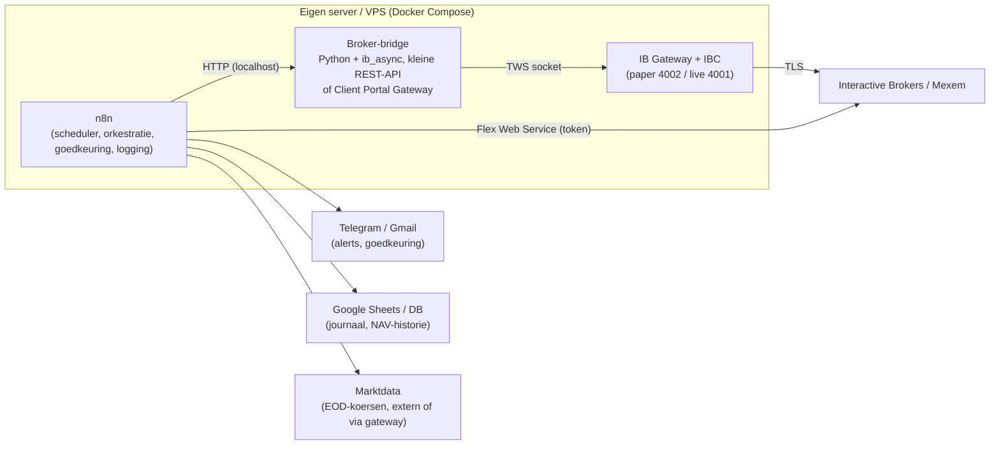

# Beleggen via Mexem met een API: realistisch rendement en inrichting

*Onderzoeksnotitie, september 2026. Geen beleggingsadvies; dit is een analyse van
wat het bewijs zegt en hoe je een geautomatiseerde opzet technisch en
organisatorisch zou bouwen.*

---

## 1. Samenvatting in vijf regels

1. **Verwacht rendement dat ik eerlijk kan beloven: 5 tot 7% nominaal per jaar**
   (bruto, voor belasting) over een horizon van 10+ jaar, met een wereldwijd
   gespreide indexkern. Niet meer.
2. **Elk jaar afzonderlijk is een gok**: -35% tot +35% is normaal. Rendement is
   een verdeling, geen getal.
3. **Actief of algoritmisch de markt verslaan lukt structureel bijna niemand**:
   na 15 jaar verslaat in geen enkele fondscategorie de meerderheid van de
   professionals hun index. Daytraders verliezen in ruim 80% van de gevallen.
4. **Belasting en kosten bepalen meer dan alpha**: box 3 kost je boven de
   vrijstelling zo'n 2,1% van je vermogen per jaar, ongeacht je rendement.
5. **API-toegang bij Mexem bestaat en werkt** (het is de Interactive Brokers
   stack), maar volledig onbeheerd draaien is lastig door verplichte 2FA-login
   en wekelijkse herauthenticatie. Het is prima voor maandelijks herbalanceren
   en monitoring, niet voor "zet het aan en vergeet het".

---

## 2. Wat is Mexem eigenlijk, en wat betekent dat voor de API

- Mexem Ltd is een Cypriotisch bedrijf (kantoor in Amstelveen), vergund door
  CySEC en via het MiFID II-paspoort geregistreerd bij de AFM. Het is een
  **introducing broker van Interactive Brokers**; je effecten liggen bij
  Interactive Brokers Ireland (toezicht Central Bank of Ireland, Ierse
  compensatieregeling tot EUR 20.000).
- Gevolg: **alle Mexem-API's zijn IBKR-API's**. Documentatie, tooling en
  community rond IBKR zijn direct toepasbaar.
- Kostenpeil (volgens Mexem en reviews 2026, altijd zelf controleren):

| Post | Tarief |
|---|---|
| Europese aandelen/ETF's | 0,06% per order, minimum ca. EUR 1,80 |
| Amerikaanse aandelen | USD 0,005 per aandeel, minimum USD 1 |
| Valutaconversie EUR/USD | 0,005%, minimum ca. USD 5 |
| Twee ETF-aankopen per maand | gratis (orderwaarde tot ca. USD 1.600, voorwaarden gelden) |
| Bewaarloon, inactiviteit, servicefee | geen |
| Realtime marktdata | abonnement per beurs nodig voor API-koersen |

De lage valutakosten en de gratis ETF-orders zijn relevant voor de strategie:
maandelijks inleggen in twee ETF's is bij Mexem in de praktijk (bijna) gratis.

### 2.1 Beschikbare API's

Mexem noemt zelf drie API's (bron: mexem.com/api en de FAQ):

| API | Wat | Voor wie | Onbeheerd draaien? |
|---|---|---|---|
| **TWS API** | Socket-API via Trader Workstation of IB Gateway. Orders, posities, marktdata, historische data. Python, Java, C#, C++. | Alle klanten met handelsrechten | Ja, met IBC of vergelijkbare tooling; wekelijkse 2FA blijft |
| **Client Portal Web API** | REST + WebSocket via een lokale "Client Portal Gateway" (Java) of via OAuth | Alle klanten (gateway). OAuth 2.0 alleen voor instellingen; voor particulieren "in overweging, geen ETA" | Beperkt: gateway vereist handmatige login met gebruikersnaam en wachtwoord |
| **FIX API** | Institutioneel orderprotocol, geen account- of marktdata | Instellingen | n.v.t. |
| **Flex Web Service** | Rapportages (trades, posities, NAV) via token, echt headless | Alle klanten | Ja, volledig |

Belangrijke praktische beperkingen (bron: IBKR Campus, IBC/ib-gateway-docker,
ibg-controller):

- IBKR dwingt **dagelijks een herstart of auto-logoff** af en **wekelijks een
  volledige herauthenticatie** inclusief 2FA (zondag rond 01:00 ET).
- Met IBC (of de Docker-image `gnzsnz/ib-gateway-docker`) herstart de gateway
  dagelijks zonder nieuwe login. De wekelijkse 2FA kun je alleen automatiseren
  door een TOTP-secret in de container te zetten (`ibg-controller`) of 2FA uit
  te zetten (`ibeam`). Beide verlagen je beveiliging; ik zou dit niet doen voor
  een live-account met serieus vermogen. Accepteer één handmatige login per week.
- Realtime en historische koersen via de API vereisen **betaalde
  marktdata-abonnementen** op de gebruikersnaam; op een gratis proefaccount
  krijg je die niet. Een paper-account spiegelt de abonnementen van je
  live-account.
- Paper trading: poorten 7497 (TWS) / 4002 (Gateway). Live: 7496 / 4001.

---

## 3. Hoeveel rendement kun je realistisch verwachten

### 3.1 Wat de geschiedenis zegt

| Bron | Cijfer |
|---|---|
| UBS Global Investment Returns Yearbook 2026 (Dimson, Marsh, Staunton) | Wereldaandelen 1900-2025: **6,6% reëel** per jaar; obligaties 1,6% reëel |
| MSCI ACWI in EUR, 10 jaar t/m aug 2026 | **12,1% per jaar** (netto) |
| Idem, jaarrendementen 2016-2025 | +11, +9, -5, +29, +7, +28, -13, +18, +25, +8 |

De laatste tien jaar waren uitzonderlijk goed. Wie dat als "normaal" neemt,
gaat teleurgesteld worden. Zelfs in die gouden periode zaten jaren van -13% en
tussentijdse dalingen van ruim -30% (maart 2020).

### 3.2 Wat de grote huizen vooruit verwachten (10-jaars, nominaal)

| Huis | Verwachting |
|---|---|
| Vanguard (VCMM, 2026) | Amerikaanse aandelen 3,9 tot 5,9% |
| AQR (2026) | Wereldwijde 60/40: 3,4% **reëel**; risicopremies "gecomprimeerd" |
| Diverse anderen (Invesco, Verus, Morningstar-overzicht) | Wereld ca. 6%; ontwikkeld ex-VS en opkomende markten 7,5 tot 8% |

Consensus: waarderingen zijn hoog, vooral in de VS, dus lagere verwachte
rendementen dan het historisch gemiddelde. Niemand van deze partijen voorspelt
dubbele cijfers voor een breed gespreide portefeuille.

### 3.3 Kan een slimme strategie of een algoritme dit verslaan

Het bewijs is eenduidig en ontnuchterend:

- **SPIVA (S&P, jaareinde 2025)**: over 15 jaar is er **geen enkele categorie**
  (aandelen VS, internationaal, obligaties) waarin de meerderheid van actieve
  fondsen hun benchmark verslaat. Over 20 jaar verliest ca. 92% van de
  Amerikaanse fondsen. In 2025 alleen al verloor 79% van de large-cap fondsen
  van de S&P 500.
- **Barber & Odean**: de 20% actiefste particuliere beleggers presteren ca. 6,5
  procentpunt per jaar slechter dan de markt. In Taiwan (360.000 daytraders)
  verliest 84% geld, mediaan -8,7%, minder dan 1% is consistent winstgevend.
- **Factorpremies vervallen na publicatie**: gemiddeld verdwijnt ca. 50% van de
  alpha zodra een anomalie is gepubliceerd. Momentum leverde in de jaren '90
  ca. 10% per jaar, nu dichter bij 2%.
- **LLM's als stockpicker**: recente studies laten in echte out-of-sample
  periodes een bescheiden verbetering zien (Sharpe 0,57 naar 0,69 op een
  momentumstrategie, 2024-2025), maar de Sharpe van nieuws-gebaseerde GPT-
  strategieën daalde van 6,5 (2021) naar 1,2 (2024). Het voordeel zit vooral in
  kleine, illiquide aandelen en verdwijnt zodra meer partijen het doen.

Mijn eigen positie hierin: **ik kan de markt niet voorspellen, en ik ga niet
doen alsof.** Wat ik wel goed kan is discipline afdwingen: regels vastleggen,
ze consequent uitvoeren, kosten laag houden, en emotionele fouten (paniekverkoop,
FOMO-aankopen) uit het proces halen. Dat is aantoonbaar waardevol; het gedrags-
verschil tussen "gedisciplineerd indexbelegger" en "gemiddelde particulier" is
in onderzoek meerdere procentpunten per jaar. Maar het is geen alpha, het is
het vermijden van eigen fouten.

### 3.4 Mijn antwoord op "hoeveel haal jij per jaar"

| Scenario | Verwacht rendement (nominaal, bruto, per jaar, 10+ jaar) |
|---|---|
| Wereldwijde indexkern, maandelijks bijkopen, jaarlijks herbalanceren | **5 tot 7%**, middenwaarde ca. 6% |
| Idem plus een bescheiden systematische satelliet (trend/momentum, 10 tot 15%) | 5 tot 8%; mogelijk lagere maximale daling, mogelijk ook 1 tot 2% minder |
| Actief handelen, daytraden, opties schrijven "voor inkomen", hefboom | Verwachting **negatief tot marktrendement minus kosten**; kleine kans op veel meer, grote kans op veel minder |

Wie je een consistente 15 tot 20% per jaar belooft, verkoopt iets. Renaissance
Medallion haalt dat, en die is dicht voor buitenstaanders.

### 3.5 Wat er van dat rendement overblijft: box 3

- Box 3 belast in 2026 en 2027 een **forfaitair rendement van 5,88%** op
  beleggingen tegen **36%**. Dat is ca. **2,1% van je belegde vermogen per jaar**
  boven de vrijstelling (EUR 59.357 per persoon, EUR 118.714 met fiscaal partner).
- Dit forfait geldt ook in een verliesjaar (tenzij je via de tegenbewijsregeling
  aantoont dat je werkelijke rendement lager was).
- De Wet werkelijk rendement (beoogd 2028) staat sinds 2 september 2026 op de
  tocht; het kabinet stuurt richting een vermogenswinstbelasting. Tot dan blijft
  het forfaitaire stelsel gelden.
- Praktisch gevolg: bij 6% verwacht rendement en 2,1% heffing houd je netto ca.
  3,9% over, ruwweg 1,5 tot 2% reëel na inflatie. Dat is het eerlijke plaatje.
- Nederlandse eigenaardigheid: omdat er (nog) geen vermogenswinstbelasting is,
  is veel handelen nu fiscaal niet gestraft. Dat verandert waarschijnlijk vanaf
  2028. Bouw je strategie dus niet op fiscale voordelen van hoge omzet.
- Dividendlekkage: Ierse UCITS-ETF's (VWCE, WEBN) lekken ca. 0,25% per jaar op
  Amerikaanse dividenden. Northern Trust-fondsen (via Meesman) hebben FBI-status
  en lekken bijna niets, maar zijn niet via Mexem te koop. Voor de Mexem-kern is
  **WEBN (Amundi Prime All Country World, TER 0,07%)** de goedkoopste brede
  keuze; VWCE (TER 0,22%) is het meer liquide alternatief.

---

## 4. Hoe ik het zou inrichten: de strategie

### 4.1 Kern-satelliet, regels boven meningen

```
Portefeuille
├── 85 tot 90%  Kern: 1 wereldwijde all-country ETF (WEBN of VWCE)
│               Maandelijks bijkopen (gratis ETF-orders), nooit verkopen
│               behalve voor herbalanceren of onttrekking
├── 10 tot 15%  Satelliet: systematisch, regelgebaseerd, gelimiteerd budget
│               Optie A: trendfilter (10-maands SMA) op 2 tot 3 regio/sector-ETF's
│               Optie B: kwaliteit/momentum-ETF, buy-and-hold
└── 0 tot 10%   Cash/geldmarkt-ETF als buffer, telt mee in herbalanceren
```

Regels die het algoritme hard afdwingt:

- **Geen hefboom, geen shorts, geen geschreven opties, geen crypto-derivaten.**
  Eén keer -100% wist alle eerdere winst.
- **Positielimiet**: geen enkele satellietpositie boven 5% van de portefeuille.
- **Herbalanceren op banden**: pas handelen als een weging meer dan 5
  procentpunt (absoluut) of 25% (relatief) van doel afwijkt. Dit minimaliseert
  transacties en dus kosten.
- **Handelsmoment**: één keer per maand, vaste dag, limietorders rond de
  midprijs, nooit market-orders bij opening of sluiting.
- **Kill-switch**: als de satelliet meer dan 20% onder haar piek staat, gaat ze
  naar cash en stopt het algoritme tot een mens het herstart.
- **Vier-ogen-principe**: het algoritme stelt orders voor, een mens keurt ze
  goed (in n8n een Wait-node met Telegram/e-mail-knop). Pas na 6 tot 12 maanden
  foutloos paper- en live-draaien overweeg ik volledige automatisering, en dan
  alleen voor de kernaankopen.

### 4.2 Waarom niet meer satelliet

Elke procent die je uit de indexkern haalt, moet het tegen een 90%-kans op
onderprestatie opnemen (SPIVA). De satelliet is er om te leren en te meten, niet
om rijk van te worden. Meet hem altijd tegen de kern: presteert hij na 3 jaar
slechter, dan stopt hij.

---

## 5. Hoe ik het zou inrichten: de techniek

### 5.1 Architectuur



Rolverdeling:

- **n8n** is de dirigent: schema's, retries, foutafhandeling, menselijke
  goedkeuring, notificaties, logging. n8n is geen handelsengine en moet geen
  tick-data verwerken.
- **Broker-bridge**: één klein Python-servicetje (ib_async, opvolger van
  ib_insync) met vier endpoints: `GET /positions`, `GET /nav`,
  `POST /orders` (met idempotency-key), `GET /health`. Alternatief zonder eigen
  code: de **Client Portal Gateway** en n8n HTTP Request-nodes rechtstreeks op
  `https://localhost:5000/v1/api/...`. Derde optie: de community-node
  `@l4z41/n8n-nodes-ibkr` (TWS API, orders, posities, realtime bars). Die is
  jong (5 sterren, 11 commits); geschikt om te proberen in paper, niet als
  fundament voor live vermogen zonder eigen review van de code.
- **IB Gateway + IBC** in Docker (`gnzsnz/ib-gateway-docker`). API-instellingen:
  alleen `127.0.0.1` als trusted IP, "Read-Only API" aan voor de monitoring-
  gateway, aparte gateway (of aparte client-id) voor de order-flow.

### 5.2 Client Portal Web API endpoints die je nodig hebt

| Doel | Endpoint |
|---|---|
| Sessie in leven houden (elke ~1 min) | `POST /v1/api/tickle` |
| Auth-status | `POST /v1/api/iserver/auth/status` |
| Accounts | `GET /v1/api/portfolio/accounts` |
| Posities | `GET /v1/api/portfolio/{accountId}/positions/0` |
| Saldo/NAV | `GET /v1/api/portfolio/{accountId}/summary` |
| Instrument zoeken (conid) | `POST /v1/api/iserver/secdef/search` |
| Order plaatsen | `POST /v1/api/iserver/account/{accountId}/orders` |
| Orderbevestiging (precautionary messages) | `POST /v1/api/iserver/reply/{replyId}` |
| Open orders | `GET /v1/api/iserver/account/orders` |

Let op de bevestigingsdialoog: IBKR retourneert bij orders vaak een `replyId`
met een waarschuwing die je expliciet moet beantwoorden voordat de order live
gaat. Bouw dat in als aparte stap, niet als blinde "ja".

### 5.3 De n8n-workflows

1. **Health check (elke 5 min, beurstijden)**
   Schedule Trigger → HTTP `auth/status` → IF niet geauthenticeerd → Telegram
   "Gateway uit, log in". Plus `tickle` om de sessie vast te houden.
2. **Maandelijkse herbalancering (1e handelsdag, 16:00 CET)**
   Schedule → haal NAV en posities → haal slotkoersen → Code-node berekent
   doelwegingen en afwijkingen → alleen orders buiten de banden → Telegram
   met orderlijst en knop "Goedkeuren" (Wait-node, timeout 12 uur, default
   = niets doen) → plaats limietorders → log naar Sheets → bevestiging.
3. **Kill-switch (dagelijks na sluiting)**
   Bereken drawdown van de satelliet t.o.v. piek → boven 20%: annuleer open
   orders, zet vlag "satelliet uit" in een datastore, alarm.
4. **Journaal (dagelijks 07:00)**
   Flex Web Service query (trades, posities, NAV) → parse XML → Sheets/DB. Er
   bestaat al een n8n-template voor precies dit (n8n.io template 12151).
5. **Maandrapport**
   NAV-reeks → rendement, volatiliteit, drawdown, vergelijking met WEBN als
   benchmark → e-mail. Dit is het belangrijkste rapport: het beantwoordt de
   vraag of de satelliet zijn bestaan rechtvaardigt.

### 5.4 Veiligheid en operationele hygiëne

- Wachtwoord en TOTP nooit in workflow-JSON; alleen in n8n-credentials of
  Docker-secrets. Overweeg een **aparte IBKR-gebruiker** met beperkte rechten
  voor de API (dat kan onder hetzelfde account).
- **Read-only** waar het kan. Alleen de herbalanceringsflow mag orders sturen.
- **Idempotentie**: geef elke order een eigen `orderRef`/clientOrderId en
  controleer op bestaande open orders voordat je plaatst. Een retry mag nooit
  een dubbele order worden.
- **Order-limieten in code**: maximaal X orders per dag, maximaal Y% van NAV
  per order, alleen whitelisted conids. Een bug in de wegingsberekening mag
  niet je hele portefeuille kunnen omzetten.
- **Paper eerst, minimaal 3 maanden**, daarna live met een klein bedrag,
  daarna opschalen. Vergelijk paper-uitkomsten met de benchmark voordat je
  ook maar één euro live zet.
- Verwacht en plan de **wekelijkse handmatige 2FA-login**. Zorg dat de
  maandelijkse herbalancering niet op maandagochtend valt.

### 5.5 Kosten van de opzet

| Post | Indicatie |
|---|---|
| VPS (2 vCPU, 4 GB) | EUR 5 tot 15 per maand; of thuis op een mini-pc |
| Marktdata-abonnementen | EUR 0 als je EOD-koersen extern haalt; anders EUR 2 tot 15 per beurs per maand |
| Transacties bij maandelijks herbalanceren | vaak EUR 0 (gratis ETF-orders), anders enkele euro's |
| Eigen tijd | het echte kostenpost: bouw ca. 20 tot 40 uur, beheer 1 tot 2 uur per maand |

---

## 6. Wat ik nadrukkelijk niet zou doen

- Daytraden of intraday-signalen via n8n verwerken. De latentie, de
  datakosten en het bewijs zijn alle drie tegen je.
- Een LLM (inclusief mijzelf) live koop/verkoop laten beslissen op nieuws of
  "sentiment". Gebruik LLM's voor het schrijven en reviewen van code, voor
  documentatie en voor het samenvatten van je maandrapport, niet als orakel.
- Backtests vertrouwen zonder out-of-sample periode, transactiekosten,
  slippage en survivorship-bias. Een strategie die in backtest 30% per jaar
  doet, doet dat live niet.
- 2FA uitschakelen om de gateway makkelijker onbeheerd te laten draaien.
- Gecompliceerde producten (turbo's, CFD's, opties schrijven) voor "extra
  rendement". Dat is het verkopen van verzekeringen zonder kapitaalbuffer.

---

## 7. Stappenplan

1. **Week 1**: Paper-account activeren bij Mexem; TWS API aanzetten; IB Gateway
   met IBC in Docker draaien; verbinden met een script dat alleen posities
   leest.
2. **Week 2**: Kern-ETF kiezen (WEBN of VWCE), doelwegingen en regels op
   papier vastleggen (dit document als startpunt), benchmark definiëren.
3. **Week 3 tot 4**: n8n-workflows 1, 4 en 5 (health, journaal, rapport). Nog
   geen orders.
4. **Maand 2 tot 4**: Workflow 2 (herbalancering) met handmatige goedkeuring in
   paper. Workflow 3 (kill-switch).
5. **Maand 5**: Evaluatie: klopte elke order, elke berekening, elk alarm? Zo
   niet: terug naar 4.
6. **Maand 6**: Live met een klein bedrag, alle orders nog handmatig goedkeuren.
7. **Na 12 maanden**: Beslis op basis van het maandrapport of de satelliet
   blijft. Overweeg pas dan automatische goedkeuring voor kern-aankopen.

---

## 8. Bronnen

Mexem en IBKR API

- [Mexem: API-overzicht](https://www.mexem.com/api)
- [Mexem FAQ: welke soorten API's zijn beschikbaar](https://www.mexem.com/faqs/what-types-of-apis-are-available)
- [Mexem FAQ: TWS API met proefaccounts](https://www.mexem.com/faqs/can-i-use-the-tws-api-with-free-trial-accounts)
- [IBKR Campus: Trading Web API](https://www.interactivebrokers.com/campus/ibkr-api-page/web-api-trading/)
- [IBKR Campus: Launching and Authenticating the Gateway](https://www.interactivebrokers.com/campus/trading-lessons/launching-and-authenticating-the-gateway/)
- [IBKR Campus: OAuth 1.0A Extended](https://www.interactivebrokers.com/campus/ibkr-api-page/oauth-1-0a-extended/)
- [IBKR TWS API: Streaming Market Data](https://interactivebrokers.github.io/tws-api/market_data.html)
- [gnzsnz/ib-gateway-docker](https://github.com/gnzsnz/ib-gateway-docker)
- [code-hustler-ft3d/ibg-controller](https://github.com/code-hustler-ft3d/ibg-controller)
- [Voyz/ibeam issue 150: gateway auto restart](https://github.com/Voyz/ibeam/issues/150)
- [l4z41/n8n-nodes-ibkr](https://github.com/l4z41/n8n-nodes-ibkr)
- [n8n-template: Log daily Interactive Brokers trades to a Google Sheets journal](https://n8n.io/workflows/12151-log-daily-interactive-brokers-trades-to-a-google-sheets-journal/)

Mexem als broker, kosten, toezicht

- [Financer: MEXEM review 2026](https://financer.nl/review/mexem/)
- [Brokerchooser: MEXEM kosten](https://brokerchooser.com/broker-reviews/mexem-review/mexem-fees)
- [Finner: Beleggen bij MEXEM](https://www.finner.nl/brokers/mexem-review)
- [Waarinbeleggen: MEXEM review 2026](https://waarinbeleggen.nl/mexem-review/)
- [Traden.nl: Mexem review 2026](https://www.traden.nl/mexem)

Rendementsverwachtingen en bewijs

- [UBS Global Investment Returns Yearbook 2026](https://www.ubs.com/global/en/media/display-page-ndp/en-20260303-global-investment-returns-yearbook-2026.html)
- [MSCI ACWI Index (EUR) factsheet](https://www.msci.com/www/fact-sheet/msci-acwi-index/010001866)
- [Vanguard: VCMM return forecasts](https://corporate.vanguard.com/content/corporatesite/us/en/corp/vemo/vemo-return-forecasts.html)
- [AQR: 2026 Capital Market Assumptions](https://www.aqr.com/Insights/Research/Alternative-Thinking/2026-Capital-Market-Assumptions-for-Major-Asset-Classes)
- [Morningstar: Experts forecast stock and bond returns, 2026 edition](https://www.morningstar.com/markets/experts-forecast-stock-bond-returns-2026-edition)
- [S&P Dow Jones Indices: SPIVA](https://www.spglobal.com/spdji/en/research-insights/spiva/)
- [SPIVA U.S. Persistence Scorecard, jaareinde 2025](https://www.spglobal.com/spdji/en/spiva/article/us-persistence-scorecard/)
- [Barber, Lee, Liu, Odean: Do Individual Day Traders Make Money? (Taiwan)](http://www.econ.yale.edu/~shiller/behfin/2004-04-10/barber-lee-liu-odean.pdf)
- [Barber et al.: The Cross-Section of Speculator Skill](https://faculty.haas.berkeley.edu/odean/papers/day%20traders/The%20Cross-Section%20of%20Speculator%20Skill.pdf)
- [Barber, Odean e.a.: Retail Trades Positively Predict Returns but Are Not Profitable](https://papers.ssrn.com/sol3/papers.cfm?abstract_id=3783492)
- [Why and how systematic strategies decay (arXiv)](https://arxiv.org/pdf/2105.01380)
- [Not All Factors Crowd Equally: alpha decay (arXiv 2025)](https://arxiv.org/pdf/2512.11913)
- [Quantpedia: Time Series Momentum Effect](https://quantpedia.com/strategies/time-series-momentum-effect)
- [ChatGPT in Systematic Investing (arXiv 2025)](https://arxiv.org/html/2510.26228v1)
- [Can ChatGPT Forecast Stock Price Movements? (Lopez-Lira & Tang)](https://arxiv.org/html/2304.07619v5.pdf)

Belasting en ETF-keuze (NL)

- [Consumentenbond: Vermogensbelasting 2026](https://www.consumentenbond.nl/belastingaangifte/zelf-aangifte-doen/wat-is-vermogensbelasting)
- [Vermogensbeheer.nl: Vermogensbelasting 2026](https://www.vermogensbeheer.nl/artikelen/vermogensbelasting)
- [Holdwise: Box 3 in 2027](https://holdwise.nl/kennisbank/box-3-2027)
- [Mr FOB: Kostenberekening beste ETF](https://www.financieelonafhankelijkblog.nl/kostenberekening-beste-etf/)
- [Mr FOB: Wat is dividendlekkage](https://www.financieelonafhankelijkblog.nl/fob-kennisbank/wat-is-dividendlekkage/)
- [Beleggen.co: VWCE dividendlekkage en box 3](https://beleggen.co/fondsen/kosten-rendement/vwce-dividendlekkage-box-3-belasting/)

---

## 9. Het "overnight effect": kopen bij close, verkopen bij open

Populair op TikTok: houd aandelen alleen 's nachts aan. Het fenomeen is echt en
al sinds 2008 academisch beschreven (Cooper, Cliff & Gulen; Lou, Polk & Skouras
2019 in de Journal of Financial Economics; Knuteson 2020). De bruto cijfers zijn
spectaculair:

| Instrument | Periode | Alleen 's nachts (close→open) | Alleen overdag (open→close) | Kopen en houden (product) |
|---|---|---|---|---|
| SPY (S&P 500) | 30 jaar | $1 → $17,27 | $1 → $1,20 | ≈ $1 → $20,7 |
| Tesla | 5 jaar | $1 → $10,08 | $1 → $0,59 | ≈ $1 → $5,9 |
| Nvidia | 5 jaar | $1 → $9,18 | $1 → $1,98 | ≈ $1 → $18,2 |
| AMC | 5 jaar | $1 → $102 | $1 → $0,0005 | ≈ $1 → $0,05 |

Bron: Elm Wealth, "Still Working the Night Shift" (2025).

Drie dingen vallen op als je verder kijkt dan het plaatje:

1. **Voor de index is "alleen 's nachts" niet beter dan kopen en houden.** SPY
   deed 17x 's nachts tegen ruwweg 21x kopen-en-houden. Het rendement zit in de
   nacht, maar je krijgt het ook gewoon door te blijven zitten. Bij Nvidia was
   overdag ook positief, dus daar verloor de nachtstrategie zelfs de helft.
2. **De winnaars zijn achteraf gekozen.** Tesla en AMC zijn de extreemste
   voorbeelden uit duizenden aandelen. Lou, Polk & Skouras laten zien dat het
   nachtrendement vooral hoog is bij aandelen die overdag door instellingen
   worden verkocht en waar particulieren op afkomen. Welke aandelen dat de
   komende vijf jaar zijn, weet je niet vooraf.
3. **Het is structureel niet exploiteerbaar door de kosten.** Je doet 252
   rondjes per jaar. Bij Tesla was de bruto extra opbrengst boven kopen-en-houden
   ca. 11% per jaar. Dat is 0,044% per rondje, ofwel 0,022% per transactie.
   Daarboven is alles weg.

### 9.1 Wat het bij Mexem zou kosten

| Kostenpost | Per transactie | Per jaar (504 transacties) |
|---|---|---|
| Commissie VS-aandelen, minimum USD 1 | USD 1 | USD 504 |
| Idem op een positie van EUR 5.000 | 0,02% | ca. 10% van de positie |
| Idem op een positie van EUR 50.000 | 0,002% | ca. 1% van de positie |
| Halve spread mega-cap bij opening (breedste moment van de dag) | 0,01 tot 0,05% | 5 tot 25% |
| Slippage in de openingsveiling | onbekend, niet nul | |

Zelfs met een grote positie en market-on-close/market-on-open orders (die de
spread deels vermijden) kom je in de buurt van of boven de 0,022% per
transactie die de hele Tesla-meevaller opsnoept. Bij een kleine positie is het
minimumtarief alleen al fataal.

### 9.2 De praktijktest is al gedaan

NightShares lanceerde in 2022 twee ETF's die precies dit deden (NSPY op de
S&P 500, NIWM op de Russell 2000), met institutionele uitvoeringskosten. Na
één jaar: NSPY -6,9% tegenover +22% voor de S&P 500; NIWM -10% tegenover +16%
voor de Russell 2000. Beide fondsen zijn in augustus 2023 geliquideerd. Het
effect draaide in 2022-2023 om (overdag was beter) en de kosten deden de rest.
Elm Wealth, dat het effect het grondigst heeft doorgerekend, schrijft letterlijk
dat het de strategie niet aanbeveelt omdat "transactiekosten inclusief
marktimpact het grootste deel of de volledige verwachte winst wegvagen".

### 9.3 Nederlandse complicaties

- Amerikaanse ETF's zoals SPY zijn voor Nederlandse particulieren niet te
  kopen (PRIIPs/KID-regels). Een Europese UCITS-ETF op de S&P 500 sluit om 17:30
  CET terwijl Wall Street tot 22:00 CET handelt; de "nacht" van die ETF bevat
  dus 4,5 uur Amerikaanse dagsessie. Het effect vertaalt zich niet netjes.
- Voor losse Amerikaanse aandelen werkt het mechanisch wel, met alle kosten van
  hierboven. Box 3 straft de omzet op dit moment niet, maar een
  vermogenswinstbelasting vanaf ca. 2028 zou dat wel doen.

### 9.4 Oordeel

Het overnight effect is een echte anomalie en een van de interessantste open
puzzels in de financiële literatuur. Maar: voor de brede markt levert het niets
extra op boven kopen en houden, voor losse aandelen weet je pas achteraf welke
het waren, en de kosten van 500 transacties per jaar maken het voor een
particulier bij vrijwel elke aanname verliesgevend tegenover simpel blijven
zitten. Wie het toch wil zien: bouw het in paper trading met MOC- en MOO-orders
(een n8n-workflow op twee schema's is genoeg) en meet het na een jaar tegen de
kern-ETF, inclusief commissies. Verwacht niet dat het wint.

Bronnen voor dit hoofdstuk

- [Lou, Polk & Skouras: A Tug of War: Overnight Versus Intraday Expected Returns (JFE 2019)](https://personal.lse.ac.uk/polk/research/TugOfWar.pdf)
- [Knuteson: Strikingly Suspicious Overnight and Intraday Returns](https://papers.ssrn.com/sol3/papers.cfm?abstract_id=3705017)
- [Elm Wealth: Still Working the Night Shift (2025)](https://elmwealth.com/night-shift/)
- [Elm Wealth: Night Moves, Is the Overnight Drift the Grandmother of All Market Anomalies?](https://elmwealth.com/night-moves-overnight-drift/)
- [CXO Advisory: Buy at the Close and Sell at the Open?](https://www.cxoadvisory.com/calendar-effects/buy-at-the-close-and-sell-at-the-open/)
- [STOXX: When do returns come from? The overnight effect](https://stoxx.com/when-do-returns-come-from-an-analysis-of-the-overnight-effect-in-equities-trading/)
- [Bloomberg: Overnight ETFs Shut Down With Returns Lagging (NSPY, NIWM)](https://www.bloomberg.com/news/articles/2023-07-19/-night-effect-funds-to-shut-down-with-overnight-returns-elusive)
- [etf.com: 2 NightShares ETFs Close After Struggling to Gain Traction](https://www.etf.com/sections/news/2-nightshares-etfs-close-after-struggling-gain-traction)
- [Quantpedia: Market Sentiment and an Overnight Anomaly](https://quantpedia.com/market-sentiment-and-an-overnight-anomaly/)
