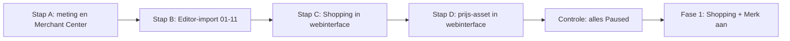

# Bline Google Ads: importbestanden (versie 7 oktober 2026)

Gebouwd op `research_notes/Bline advertenties/google_strategie_2026-10-07.md` (campagne-opzet, teksten, uitsluitingen), `google_zoekwoorden_universum.csv` (zoekwoorden) en `concurrentie_2026-10-07.md` (boodschappen). Account: Google Ads **860-535-9447** (zie `reports/Bline meetplan.md`).

> **Alles staat op pauze.** Campagnes, advertentiegroepen, zoekwoorden en advertenties hebben status `Paused`. Er gaat niets live en er wordt niets uitgegeven tot je zelf iets aanzet. Zet niets aan voordat de meting werkt (stap A hieronder).

## Wat er anders is dan de vorige set

- Generiek nu op **NL en BE** (Vlaams zit erin: zetel, ruggesteun), met **handmatige CPC** per groep in plaats van Max. klikken.
- De vijf kleurgroepen en "Leeskussen algemeen" zijn vervangen door **10 thematische groepen**; kleuren zitten in één groep met een URL per zoekwoord.
- **107 zoekwoordregels** (prioriteit 1 en 2) in plaats van 44; prioriteit 3 staat apart voor later.
- **Vier gedeelde uitsluitingslijsten met 273 termen** in plaats van één lijst met 35.
- Nieuwe advertentieteksten met de boodschappen uit het concurrentieonderzoek: *koel katoen, geen fluweel*, *geen armleuningen, past bij je bed*, *één kussen dat blijft staan*, *hoes eraf, in de was*.
- Weg: "2 kussens: €9,99 voordeel" (geen bevestigde bundelprijs), "Bel of app ons" (er is geen telefoonnummer meer), de hoes-sitelink naar de collectie.
- Nieuw: cadeaucampagne (13-11 t/m 21-12-2026), prijs-asset, meer sitelinks en highlights, bodplan voor Shopping.

## Aangemaakt op 7 oktober 2026 via de API (Explorer-toegang)

De drie campagnes hieronder staan in Bline 860-535-9447, op **pauze**, aangemaakt met `scratchpad/gads_bouw.py` (zelfde inhoud als het script). Het script `campagnes_aanmaken.js` is alleen nog nodig als de API niet werkt; het stopt vanzelf omdat de campagnes al bestaan.

### Script `campagnes_aanmaken.js` (reserve)

In plaats van de CSV's via Editor te importeren: plak `campagnes_aanmaken.js` in **Google Ads > Tools > Bulkacties > Scripts**, klik eerst op **Voorbeeld** en dan op **Uitvoeren**. Het maakt in Bline 860-535-9447 aan, alles op **pauze**:

| Campagne | Budget | Inhoud |
|---|---|---|
| 00 Search \| Merk \| NL+BE | €1 | groepen Merk en Hoes |
| 01 Shopping \| Leeskussen \| NL+BE | €5 | Merchant Center 5871227119, item-ID's `shopify_zz_...`, kleur €0,45, wit €0,40, België -10%, hoezen en sets uitgesloten |
| 02 Search \| Generiek \| NL+BE | €4 | 10 groepen |

Zoekwoorden prioriteit 1 aan, prioriteit 2 op pauze; 12 advertenties; 4 uitsluitingslijsten (273); sitelinks, highlights en fragmenten. De cadeaucampagne (03) zit er bewust niet in: die komt half november. Landingspagina's zonder `www` (direct op blinesleep.nl). Het script is gemaakt met `scratchpad/maak_gads_script.py` uit de CSV's hierboven.

## Bestanden

| Bestand | Regels | Wat | Importeren? |
|---|---|---|---|
| `bline-google-01_campagnes.csv` | 3 | 00 Merk, 02 Generiek, 03 Cadeau: Search, budget, handmatige CPC, alleen Google Zoeken, taal Nederlands, locatie-optie "aanwezigheid", Cadeau met start- en einddatum | Editor |
| `bline-google-02_locaties.csv` | 6 | Nederland en België per Search-campagne | Editor |
| `bline-google-03_advertentiegroepen.csv` | 13 | Advertentiegroepen met Max CPC per groep | Editor |
| `bline-google-04_zoekwoorden_prio1.csv` | 40 | 34 startzoekwoorden (6 als exact én woordgroep), label `Bline prio 1` | Editor |
| `bline-google-05_zoekwoorden_prio2.csv` | 67 | 67 zoekwoorden voor week 3-6 en de cadeaucampagne, label `Bline prio 2` | Editor |
| `bline-google-06_advertenties.csv` | 13 | Eén responsieve zoekadvertentie per groep: 15 koppen, 4 beschrijvingen, 2 paden | Editor |
| `bline-google-07_uitsluitingslijsten.csv` | 273 | Vier gedeelde lijsten (A Algemeen 184, B Merk 5, C Concurrenten 45, D Productmismatch 39) | Editor (of webinterface) |
| `bline-google-08_uitsluitingslijsten_koppeling.csv` | 9 | Welke lijst aan welke Search-campagne hangt | Editor (of webinterface) |
| `bline-google-09_sitelinks.csv` | 24 | 8 sitelinks, op elk van de 3 Search-campagnes | Editor |
| `bline-google-10_highlights.csv` | 45 | 15 highlights (callouts), op elk van de 3 Search-campagnes | Editor |
| `bline-google-11_fragmenten.csv` | 6 | 2 gestructureerde fragmenten (Stijlen, Typen), op elk van de 3 Search-campagnes | Editor |
| `bline-google-12_prijs.csv` | 21 | Prijs-asset met 7 items (5 kussens, 2 hoezen), per Search-campagne | Webinterface (invoerlijst) |
| `bline-google-13_shopping_bodplan.csv` | 15 | Productgroepen en biedingen voor 01 Shopping (hoezen uitgesloten) | **Niet importeren**: invullen in de webinterface |
| `bline-google-later_zoekwoorden_prio3.csv` | 75 | 74 zoekwoorden met prioriteit 3, met opmerking per woord | **Niet importeren** (later) |
| `bline-google-later_advertenties.csv` | 2 | Teksten voor de latere groepen "Bookseat en wigkussen" en "Hoes (alleen voor Bline)" | **Niet importeren** (later) |
| `merchant_aanvullende_feed.csv` | 20 | Aanvullende feed voor Merchant Center (bestond al, ongewijzigd) | Merchant Center |
| `export_account_script.js` | | Exportscript voor accountgegevens (bestond al, ongewijzigd) | Google Ads-scripts |

Alle CSV's zijn UTF-8, met komma als scheidingsteken en een punt als decimaalteken (budget `4.00`, bod `0.45`). Kolomnamen zijn de Engelse namen van Google Ads Editor.

## Campagnes

| Campagne | Type | Budget per dag | Bieden | Locatie en taal | Netwerk | Looptijd |
|---|---|---|---|---|---|---|
| 00 Search \| Merk \| NL+BE | Search | €1 | handmatige CPC, €0,30 | NL + BE (aanwezigheid), Nederlands | alleen Google Zoeken | altijd |
| 01 Shopping \| Leeskussen \| NL+BE | Standaard Shopping, prioriteit laag | €4 (meetweek), daarna €7-8 | handmatige CPC per product: kleur €0,45, wit €0,40, BE 10% lager, hoezen uitgesloten | NL + BE (aanwezigheid) | geen zoekpartners | altijd; aanmaken in de webinterface |
| 02 Search \| Generiek \| NL+BE | Search | €4 (vanaf fase 2, mag naar €5) | handmatige CPC per groep, "leeskussen" exact €0,55 | NL + BE (aanwezigheid), Nederlands | alleen Google Zoeken | vanaf week 2 |
| 03 Search \| Cadeau \| NL+BE | Search | €2 | handmatige CPC, €0,40 | NL + BE (aanwezigheid), Nederlands | alleen Google Zoeken | 13-11-2026 t/m 21-12-2026 (staat in het bestand) |

**Later, nu niet aangemaakt:**
- **04 Search | Generiek | BE-FR**: pas als er een Franse productpagina en een Franse feed zijn. Zoekwoorden staan in `later_zoekwoorden_prio3.csv`, de Franse teksten in hoofdstuk 6 van het strategierapport (laten nakijken door een Franstalige).
- **05 PMax | Feed | NL+BE**: pas bij 30+ aankopen per maand, twee maanden op rij. Dan als test naast Shopping, met merk uitgesloten.

### Advertentiegroepen en Max CPC

| Campagne | Groep | Max CPC | Landingspagina | Zoekwoorden prio 1 / 2 |
|---|---|---|---|---|
| 00 Merk | Merk | €0,30 | homepage | 8 / 2 |
| 00 Merk | Hoes | €0,30 | /products/hoes-beige | 3 / 1 |
| 02 Generiek | Leeskussen | €0,50 ("leeskussen" exact €0,55) | /products/leeskussen-beige | 3 / 4 |
| 02 Generiek | Leeskussen bed | €0,50 | idem | 4 / 5 |
| 02 Generiek | Leeskussen bank en zetel | €0,45 | idem | 5 / 2 |
| 02 Generiek | Rugkussen bed | €0,45 | idem | 6 / 9 |
| 02 Generiek | Rugkussen bank en zetel | €0,35 | idem | 0 / 4 |
| 02 Generiek | Rugsteun bed | €0,40 | idem | 6 / 8 |
| 02 Generiek | Rechtop zitten in bed | €0,40 | idem | 4 / 3 |
| 02 Generiek | Lezen en tv in bed | €0,35 | idem | 0 / 6 |
| 02 Generiek | Kenmerken | €0,40 | idem | 1 / 7 |
| 02 Generiek | Kleuren | €0,40 | per zoekwoord /products/leeskussen-&lt;kleur&gt; | 0 / 5 |
| 03 Cadeau | Cadeau voor lezers | €0,40 | /products/leeskussen-beige | 0 / 11 |

(Aantallen = regels; een zoekwoord als exact én woordgroep telt twee keer.) De biedingen volgen de rekenregel uit het rapport: maximale CPC = conversieratio × €34. Bij 1,5% conversie is dat €0,51.

## Stap A: eerst doen (vóór je iets importeert of aanzet)

Volg `reports/Bline meetplan.md`. Kort:

1. **Shopify > Apps > Google & YouTube** installeren. Koppel het Google-account met toegang tot Google Ads 860-535-9447, maak een **nieuw Merchant Center** voor Bline, koppel Google Ads 860-535-9447 en zet **conversiemeting** en **Enhanced Conversions** aan.
2. **Google Ads > Doelen > Conversies:** alleen de aankoopactie van de Shopify-app op **Primair**. Winkelwagen, checkout en paginaweergave op **Secundair**. Geen GA4-import als conversie, geen oude tags. Noteer of de waarde incl. of excl. btw is (open beslissing 1).
3. **Account-instellingen:** automatische tagging aan (gclid; geen UTM's in Google Ads).
4. **Testbestelling** volgens de testprocedure in het meetplan (kortingscode 100%, daarna annuleren). Klaar als de aankoopactie binnen 24-48 uur van "Niet geverifieerd" naar "Geen recente conversies" of "Conversies worden geregistreerd" gaat.
5. **Toestemming testen** in een privévenster: na "Weigeren" geen marketingcookies.
6. **Merchant Center:** alle 10 producten goedgekeurd voor NL en BE; verzending (gratis, 0-1 dag verwerking, 1-2 dagen vervoer) en retourbeleid (30 dagen) ingevuld; **gratis vermeldingen** aan; `merchant_aanvullende_feed.csv` als extra gegevensbron (Google Spreadsheet) toegevoegd. Controleer in de productlijst dat `custom_label_0` op **leeskussen** of **hoes** staat; de Shopping-opzet leunt daarop.

## Stap B: importeren in Google Ads Editor

1. Open Google Ads Editor, download account 860-535-9447 (of haal recente wijzigingen op).
2. Importeer de bestanden **in deze volgorde**, telkens via **Account > Importeren > Uit bestand** (CSV):
   `01_campagnes` → `02_locaties` → `03_advertentiegroepen` → `04_zoekwoorden_prio1` → `05_zoekwoorden_prio2` → `06_advertenties` → `07_uitsluitingslijsten` → `08_uitsluitingslijsten_koppeling` → `09_sitelinks` → `10_highlights` → `11_fragmenten`.
3. Editor toont bij elke import welke kolom bij welk veld hoort. Klopt een kolom niet (de namen verschillen soms per versie), kies dan het juiste veld of "Niet importeren". Herkent Editor de kolom `Labels` niet, sla die over; de bestanden 04 en 05 laten zelf al zien wat prioriteit 1 en 2 is.
4. Klik **Wijzigingen controleren**, los meldingen op, en daarna **Posten**.
5. Controleer daarna in de **webinterface** bij elke Search-campagne (Instellingen):
   - status **Onderbroken** (Paused);
   - netwerken: **zoekpartners uit, Display-netwerk uit**;
   - locaties: Nederland en België, optie **Aanwezigheid** (niet "aanwezigheid of interesse");
   - taal: Nederlands (zet het met de hand als Editor `nl` niet heeft overgenomen);
   - **AI Max uit**, **automatisch gemaakte assets uit**, **uitbreiding van de uiteindelijke URL uit**;
   - 03 Cadeau: start 13-11-2026, eind 21-12-2026 (controleer de datumnotatie na import).
   - EU-politieke advertenties: "Nee".

### Uitsluitingen (bestand 07 en 08)

De vier lijsten komen uit hoofdstuk 5 van het rapport (plus `ergokussens` in lijst C, de grootste concurrent-adverteerder op Google). Koppeling:

| Lijst | Termen | Gekoppeld aan (bestand 08) | Ook koppelen aan 01 Shopping (webinterface) |
|---|---|---|---|
| A. Bline \| Algemeen | 176 woordgroep + 8 exact | 00, 02, 03 | ja |
| B. Bline \| Merk | 3 woordgroep + 2 exact | 02, 03 | ja |
| C. Bline \| Concurrenten | 45 woordgroep | 02, 03 | nee; na 2 weken beslissen op basis van het zoektermrapport |
| D. Bline \| Productmismatch Search | 39 woordgroep | 02, 03 | nee (Shopping toont het beeld, dus wie armleuningen zoekt klikt niet) |

Gedeelde lijsten in plaats van uitsluitingen per campagne: één plek om bij te houden, en een nieuwe campagne (PMax, BE-FR) koppel je met één klik.

**Lukt de Editor-import van gedeelde lijsten niet**, maak ze dan in de webinterface: **Tools > Gedeelde bibliotheek > Lijsten met uitsluitingszoekwoorden > +**. Plak per lijst de termen uit kolom `Keyword`: woordgroep tussen aanhalingstekens (`"gratis"`), exact tussen haken (`[bank]`). Daarna **Toepassen op campagnes** volgens de tabel hierboven.

Let op: uitsluitingen matchen niet op meervoud of synoniemen; die staan er daarom apart in. Voeg nieuwe rommel uit het zoektermrapport elke maandag toe aan de juiste lijst.

### Assets (bestand 09 t/m 12)

- **Sitelinks (8):** Vijf kleuren, Losse hoezen, Maten en details, Veelgestelde vragen, Verzending, 30 dagen proberen, Over Bline, Contact. Elke sitelink heeft een eigen pagina.
- **Highlights (15):** onder meer Gratis verzending NL/BE, 30 dagen proberen, Koel katoen, geen fluweel, Hoes eraf, in de was, Geen armleuningen. Google toont er maximaal 4 tegelijk.
- **Gestructureerde fragmenten:** Stijlen (Wit, Beige, Blauw, Grijs, Zwart) en Typen (Leeskussen, Rugkussen voor bed, Losse hoes). In het bestand staan de kopnamen in het Engels (`Styles`, `Types`), zoals Editor ze verwacht; Google toont ze in het Nederlands.
- **Prijs-asset (bestand 12): in de webinterface.** Editor gebruikt voor prijs-assets een ander kolomformaat per versie; met de hand is het in 3 minuten gedaan: **Advertenties en assets > Assets > + > Prijs**, type **Producten**, taal **Nederlands**, valuta **EUR**, prijskwalificatie **geen**, eenheid **geen**. Neem de 7 items over (kop, beschrijving, prijs, URL) en koppel de asset aan 00, 02 en 03 (of één keer op accountniveau).
- **Geen promotie-asset.** Alleen bij een echte actie die ook in de shop staat (zie open beslissing 3).
- **Afbeeldingsassets:** pas mogelijk als het account 60 dagen open is en Search-uitgaven had, dus waarschijnlijk begin december.
- Assets hebben geen eigen pauzestand nodig: ze tonen alleen als de campagne aan staat.

## Stap C: 01 Shopping in de webinterface

Een Standaard Shopping-campagne vraagt een gekoppeld Merchant Center (ID), en de productgroepen moeten exact op de item-ID's uit Merchant Center passen. Dat gaat betrouwbaarder in de webinterface dan via een CSV.

1. **Campagnes > + > Verkoop > Shopping**, kies het Merchant Center van Bline en **Standaard Shopping** (niet Performance Max).
2. Naam `01 Shopping | Leeskussen | NL+BE`, budget **€4** per dag, biedstrategie **Handmatige CPC**, campagneprioriteit **Laag**.
3. Netwerken: **zoekpartners uit**, **YouTube, Gmail en Discover uit**. Lokale producten uit. AI Max voor Shopping uit (als die optie verschijnt).
4. Producten: alle producten uit de feeds voor NL en BE. Locaties: Nederland en België, optie **Aanwezigheid**.
5. Advertentiegroep `Leeskussens`, standaardbod €0,45.
6. Productgroepen volgens `bline-google-13_shopping_bodplan.csv`:
   - Alle producten → onderverdelen op **Aangepast label 0**.
   - `leeskussen` → onderverdelen op **Item-ID**: per kleur NL €0,45 (wit €0,40), BE €0,41 (wit €0,36). De item-ID's komen uit `merchant_aanvullende_feed.csv`; vergelijk ze met Merchant Center voordat je biedt.
   - "Overig in leeskussen" €0,40 (vangnet als een ID afwijkt).
   - `hoes` → **uitgesloten**. Na 4 weken eventueel testen met €0,15.
   - "Overig" (producten zonder label) → uitgesloten.
7. Koppel uitsluitingslijsten **A en B** (Zoekwoorden > Uitsluitingen > Lijst toepassen).
8. **Zet de campagne direct op Onderbroken.** Voor de zekerheid kun je bij het aanmaken een startdatum in de toekomst kiezen.

Shopping-feed (titel, categorie 2700, highlights, custom labels): zie hoofdstuk 7 van het strategierapport en `merchant_aanvullende_feed.csv`.

## Livegang: wat aanzetten per fase

| Fase | Wanneer | Aanzetten | Budget per dag |
|---|---|---|---|
| 0. Meten | nu, vóór livegang | niets | €0 |
| 1. Meetweek | dag 1-7 na livegang | 01 Shopping (€4) en 00 Merk (€1): campagne, groepen Merk en Hoes, hun prio 1-zoekwoorden en advertenties | **€5** |
| 2. Test | week 2 tot ongeveer 12 november | 01 Shopping naar €7-8; 02 Generiek aan (€4-5) met alleen de groepen met prio 1: Leeskussen, Leeskussen bed, Leeskussen bank en zetel, Rugkussen bed, Rugsteun bed, Rechtop zitten in bed, Kenmerken | **€12-14** |
| 2b. Uitbreiden | na 2-4 weken, of als prio 1 het budget niet opmaakt | prio 2-zoekwoorden en de groepen Rugkussen bank en zetel, Lezen en tv in bed, Kleuren | idem |
| 3. Q4 | 13 november t/m 21 december | 03 Cadeau aan (€2), inclusief de groep en haar prio 2-zoekwoorden; vanaf 16 november +20-30% op 01 en 02 **alleen** als de kosten per aankoop onder €34 liggen | **€14-18** |
| 4. Opschalen | vanaf 30+ aankopen per maand | test 05 PMax (alleen feed, merk uitgesloten) naast Shopping; eventueel NL en BE splitsen | volgens resultaat |

**Geen euro boven €5 per dag** voordat de testbestelling als Aankoop met de juiste waarde in Google Ads staat én de eerste echte bestelling via een advertentieklik terugkomt (meetplan, stap 8 van de controlelijst in het rapport). In januari het budget terug naar het niveau van fase 2.

Aanzetten in Editor: filter op label `Bline prio 1` (of op groep), selecteer, zet status op **Enabled**; doe hetzelfde voor de advertentiegroep, de advertentie en de campagne. Kan ook door in bestand 04 de kolom `Status` op `Enabled` te zetten en dat bestand opnieuw te importeren.

**Biedstrategie per fase:** handmatige CPC tot 15+ aankopen in 30 dagen (per campagne) → Max. conversiewaarde zonder doel (2-4 weken) → doel-ROAS ongeveer 250% bij waarde incl. btw (210% bij excl. btw), daarna hooguit 10-15% per 2 weken bijstellen.

## Stopregels

| Niveau | Regel | Actie |
|---|---|---|
| Account | meting niet bevestigd | niet boven €5 per dag |
| Campagne | €150 uitgegeven zonder aankoop | pauzeren; meting en productpagina nalopen |
| Campagne | kosten per aankoop over 14 dagen boven €34 | biedingen 15% omlaag, slechtste zoektermen uitsluiten |
| Campagne | kosten per aankoop onder €25 over 14 dagen | budget +20% per week |
| Zoekwoord | €34 kosten zonder aankoop | bod 30% omlaag |
| Zoekwoord | €50 kosten zonder aankoop | pauzeren |
| Zoekwoord | CTR onder 2% na 300 vertoningen | tekst of zoekwoord herzien; Kwaliteitsscore 4 of lager na 2 weken: pauzeren |
| Zoekterm | past niet (zie lijsten A-D) | meteen uitsluiten, ook bij 1 klik |
| Zoekterm | past, 15+ klikken, 0 aankopen | als exact zoekwoord met lager bod, of uitsluiten |
| Product (Shopping) | €34 kosten zonder aankoop | bod op dat item 30% omlaag |
| Slim bieden | na de overstap | 2 weken niets wijzigen behalve uitsluitingen |

**Ritme:** dagelijks in de meetweek uitgaven, afkeuringen en conversiestatus (5 minuten). Elke maandag zoektermrapport Search en Shopping, uitsluitingen, biedingen, budget, Shopify-aankopen uit Google tegen Google Ads-aankopen (een verschil van meer dan 30% is een meetprobleem) en Merchant Center Diagnose (30 minuten). Elke 2 weken het asset-rapport: koppen met "Laag" na 2.000+ vertoningen vervangen. Maandelijks volumes vervangen door cijfers uit de Zoekwoordplanner en het fasebesluit nemen.

## Later (staat klaar, niet importeren)

- `later_zoekwoorden_prio3.csv`: 74 zoekwoorden (laag bod €0,30, met opmerking per woord). Twee botsen met de uitsluitingen: `leeskussen aanbieding` (lijst D: "aanbieding"; alleen bij een echte actie) en `kussensloop leeskussen` (lijst A: "kussensloop"). Haal die uitsluiting dan eerst weg of laat het zoekwoord vallen.
- `later_advertenties.csv`: teksten voor "Bookseat en wigkussen" (met "Niet om op te slapen") en "Hoes (alleen voor Bline)" (kop "Past op Bline, 65 x 50 x 45" vast op positie 2). Maak die groepen pas aan met de prio 3-zoekwoorden.
- Breed zoeken: pas bij 30+ aankopen per maand, als test in één groep met slim bieden.
- Hoezen in Shopping: na 4 weken testen met €0,15.

## Open beslissingen (hoofdstuk 10.7 van het rapport, stand nu)

1. **Conversiewaarde incl. of excl. btw?** Bepaalt het doel-ROAS (250% of 210%) en de break-even (2,3 of 1,95). Nog open.
2. **Komt er een Franse productpagina?** Zo ja: campagne 04 BE-FR en een Franse feed. Nog open.
3. **Echte bundelprijs (2 kussens, of kussen + hoes)?** Pas dan een promotie-asset en een bundeltekst. Tot die tijd staat er geen bundel of voordeel in de advertenties. Nog open.
4. **URL's van hoes en verzending/retour:** ingevuld als `/products/hoes-<kleur>`, `/pages/verzending` en `/pages/retourneren`. De hoesgroepen en de hoes-sitelink landen op `/products/hoes-beige`; controleer dat je daar ook de andere kleuren kunt kiezen. Zo niet, kies een andere landingspagina (niet de collectie: advertenties landen nooit op een collectie, volgens het funnelplan).
5. **Haalt ChannelDock "voor 5 december in huis" bij bestellingen tot 3 december?** Alleen dan mag dat in de cadeauteksten. Nu staat het er niet in.

Kleinere punten om na te lopen:
- De sitelink "Vijf kleuren" gaat naar `/#kleuren` op de homepage. Bestaat dat anker niet, dan opent gewoon de homepage; pas de URL aan als er een betere kleurpagina is.
- Er is geen telefoonnummer meer. De teksten zeggen daarom "echte klantenservice" en verwijzen naar `/pages/contact`, zonder "bel" of "app ons".
- "Een Nederlands merk uit Borne", "Betaal met iDEAL of Bancontact" en "4,5 uit 5 op bol.com" komen uit het rapport. Klopt een van die drie niet meer, haal die kop dan weg.
- Campagnenamen volgen het strategierapport (`00 Search | Merk | NL+BE`); het meetplan noemt `bl_google_...`. Met automatische tagging maakt dat voor de meting niet uit.
