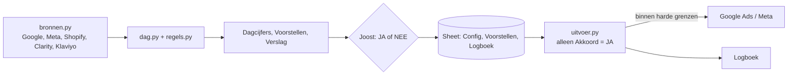

# Bline advertentiesturing

Uitwerking van het hoofdstuk architectuur in `reports/Bline AI advertentiesysteem en budgetplan.md`.
Vaste rekenregels in code; de agent schrijft alleen het verslag en beoordeelt zoektermen. Joost keurt elke wijziging goed in de Sheet.

| Bestand | Wat |
|---|---|
| `bronnen.py` | haalt de cijfers op (alleen lezen); Shopify-orders krijgen een kanaal via gclid of UTM |
| `regels.py` | KPI's, gamma-Poisson-kansen en de beslisregels (verliesgrenzen, kanaal zonder aankoop, campagne, zoekwoord, product, Meta-advertentie, signalen) |
| `dag.py` | dagelijkse run: leest de Sheet-export, maakt rijen voor Dagcijfers, Voorstellen en Verslag |
| `uitvoer.py` | voert goedgekeurde voorstellen uit; noodstop, +20%/-30%, plafond totaal dagbudget, 3 dagen rust per object, verouderde voorstellen vervallen |
| `test_sturing.py` | tests voor de kansen uit de beslistabel en de vangrails |

Sheet: "Bline advertentiesturing" in de Google Drive van Joost. De dagelijkse routine (08:46) leest de Sheet, draait eerst `uitvoer.py --echt` en daarna `dag.py`, en schrijft de uitkomst terug.
Zolang Config `automatisering_aan` op NEE staat, voert de uitvoerder niets uit, met één uitzondering: het biedmandaat.

Biedmandaat (Joost, 09-10): met Config `mandaat_biedingen` op JA krijgen voorstellen met actie `bod` vooraf Akkoord `MANDAAT` en voert de uitvoerder ze de volgende ochtend uit, ook als de noodstop op NEE staat. Joost kan per voorstel NEE zetten of het mandaat intrekken. Het doelbod is de (Bayesiaans afgevlakte) conversie per klik maal de bijdrage per order maal 0,9, pas vanaf 30 klikken per zoekwoord of product, in stappen van hooguit +20%/-30%, tussen €0,15 en €1,00, met 3 dagen rust per zoekwoord. Budget, status en live zetten vallen nooit onder het mandaat.

Meting: de zoekcampagnes 00 en 02 hebben als URL-achtervoegsel `utm_source=google&utm_medium=cpc&utm_campaign={campaignid}&utm_content={adgroupid}&utm_term={keyword}`. Shopping-klikken herkent het systeem aan de gclid. Meta-advertenties hebben `utm_medium=paid_social` en `utm_content={{ad.name}}`.

Sleutels komen uit de omgeving en staan nooit in deze map.
