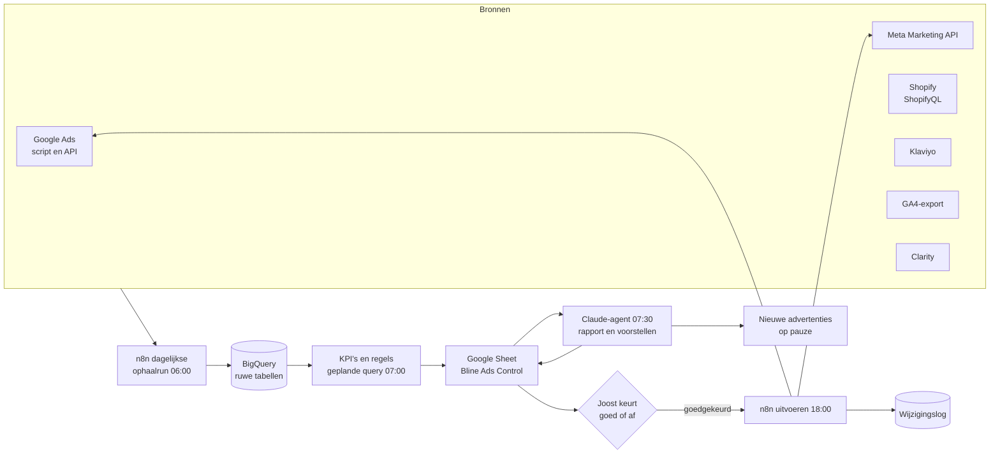

# Bline test klein, meet eerlijk, schaalt daarna

Start met **€20 per dag (€140 per week)**: €12 Google (Shopping €7, Generiek €4, Merk €1) en €8 Meta. Verwacht in het realistische scenario **4 tot 5 webshopverkopen per week, ongeveer €380 omzet en een klein verlies van ongeveer €20 per week** na advertentiekosten. Pessimistisch zijn dat 2 verkopen en €110 verlies per week, optimistisch 9 tot 10 verkopen en ongeveer €210 winst per week. De belangrijkste correctie in dit rapport: Bline houdt per bestelling geen €34 over maar realistisch **ongeveer €26**. Een retour bij 30 dagen proberen kost namelijk meer dan de vaste €3 uit het oude plan, en daarnaast tellen de 10%-welkomstcode en de Shopify-toeslag van 2% op Mollie-betalingen mee. Daardoor schuift de **break-even ROAS van 2,35 naar 3,15**. De eerder afgesproken drempels (test 1,5, daarna 2,35, opschalen bij 3,0) liggen dus alle drie onder break-even en worden **2,0 / 3,2 / 4,0**. Op dag 14 beslist het systeem op het aantal betaalde webshoporders: **15 of meer** betekent opschalen naar €25 per dag, **8 tot 14** doorgaan, **4 tot 7** Meta afschalen en **3 of minder** stoppen en de trechter nalopen. Een cumulatief verlies van €300 is altijd een harde stop. De markt is klein: Google kan buiten Q4 maar ongeveer €15 tot €25 per dag winstgevend opnemen. Elke euro daarboven moet op Meta renderen, en dat lukt alleen met bovengemiddelde advertenties. Het AI-systeem bouwen we op de bestaande stack voor ongeveer €20 tot €30 per maand plus de kosten van de Claude-agent. Het vervangt geen marketingtalent: het levert discipline en snelheid. Elke dag rekent het, stelt het voor en maakt het advertenties op pauze klaar, en Joost keurt elke wijziging in uitgaven goed. Hoe goed dit uitpakt, hangt vooral af van vijf open datapunten: kostprijs, retourpercentage, betaalroute, verzendtarief en het gebruik van de welkomstcode. Samen kunnen die de break-even ROAS tussen **2,4 en 4,6** laten uitkomen.

## Een kleine markt met goedkope klikken en dure vertoningen

De vraag naar leeskussens is in Nederland en Vlaanderen beperkt, maar wel stabiel. Google Trends laat zien dat de interesse in "leeskussen" tussen 2019 en 2023 sterk groeide en sindsdien vlak ligt: het jaarindexcijfer was 57,8 in 2023, 58,4 in 2024, 54,8 in 2025 en 59,8 in 2026 tot en met september ([Google Trends NL](https://trends.google.nl/trends/explore?date=2016-01-01%202026-10-06&geo=NL&q=leeskussen,rugkussen%20bed,rugsteun%20bed,bookseat,lezen%20in%20bed)). Er is nog steeds geen gemeten absoluut zoekvolume, want de Zoekwoordplanner werkt pas met een actief Ads-account. De beste schatting is **3.000 tot 6.000 Google-zoekopdrachten per maand naar "leeskussen" in NL en BE samen** (basis 4.500), en 5.000 tot 11.000 voor de hele kerngroep van zoektermen (leeskussen, rugkussen bed, rugsteun bed, bookseat). Daarvan is naar schatting **4.500 tot 5.500 per maand echt koopgericht en passend** bij het product. Vlaanderen is groter dan eerder aangenomen. Gecorrigeerd voor het aantal inwoners is het Belgische zoekvolume ongeveer de helft van het Nederlandse, dus **30 tot 37% van de vraag** in plaats van 20% ([Google Trends, NL tegenover BE](https://trends.google.nl/trends/explore?date=today%2012-m&q=leeskussen)). Dat past bij Bline's eigen bol-verkoop, waarvan 55% naar België ging (eigen bol-data, juni tot september 2026).

Het seizoen piekt in **november**, niet met een factor 2 à 2,5 in december zoals het eerdere plan aannam. De Trends-index (jaargemiddelde = 1,00, zonder drempelnullen) staat op 1,10 in oktober, **1,41 in november**, 1,14 in december en 1,07 in januari, met een dal van ongeveer 0,75 in mei en juni ([Google Trends NL](https://trends.google.nl/trends/explore?date=2016-01-01%202026-10-06&geo=NL&q=leeskussen,rugkussen%20bed,rugsteun%20bed,bookseat,lezen%20in%20bed)). Q4 ligt als geheel ongeveer 20 tot 30% boven het jaargemiddelde. Het aantal aankopen kan sterker stijgen dan het aantal zoekopdrachten, omdat de conversie in Q4 hoger ligt: Shopping-campagnes in Europa converteerden in het derde kwartaal van 2025 met ongeveer 3,5% en in Q4 met 4,5% ([smec Q4 2025](https://smarter-ecommerce.com/en/smec-market-observer/reports/Q4_2025/)). Merkzoekvolume is er voor geen enkele aanbieder van betekenis. De verkoop draait dus volledig op generieke zoektermen en op vraag die je zelf opwekt.

**De markt in stuks.** Online gaan er naar schatting 350 tot 700 leeskussens per maand over de toonbank in het laagseizoen en 500 tot 1.100 in november en december, verdeeld over alle verkopers en voor het grootste deel via bol in de prijsklasse €40 tot €55. Het segment van €70 tot €90, waar Bline zit met €69,99 en €79,99, is maar 10 tot 20% daarvan, dus **40 tot 120 kussens per maand**. Een realistisch aandeel voor Bline over alle kanalen samen is 35 tot 80 kussens per maand buiten Q4 en 60 tot 120 in november en december. Via Google op de eigen webshop gaat het om **10 tot 25 verkopen per maand**. Deze schattingen zijn eigen afleidingen uit Trends, bol-data en bol-reviews, met een brede marge. Ze bepalen wel de belangrijkste grens van het hele plan: boven ongeveer **€15 tot €25 per dag aan Google-budget** koopt Bline vooral duurdere en minder relevante klikken.

**Wat klikken en vertoningen kosten.** Google is goedkoop. De Europese mediaan voor e-commerce lag in juni 2026 op **€0,39 per klik voor Shopping, €0,41 voor Performance Max en €0,45 voor Search**, met een jaarlijkse prijsstijging van ongeveer 13 tot 16% op Shopping en ongeveer 15% extra in november en december ([smec Market Observer](https://smarter-ecommerce.com/en/smec-market-observer); [smec Q4 2025](https://smarter-ecommerce.com/en/smec-market-observer/reports/Q4_2025/)). Nederlandse accounts noemen €0,45 tot €1,20 per klik voor e-commerce ([Searchlab](https://searchlab.nl/blog/google-ads-kosten-per-branche-infographic)). Op Google NL adverteren maar een handvol partijen op leeskussens ([Google Ads Transparency Center](https://adstransparency.google.com/?region=NL)). Dat verklaart de lage klikprijzen. Meta is duurder dan het eerdere plan aannam (€6 tot €10 per 1.000 vertoningen). Het Nederlandse gemiddelde lag in 2025 rond **€11 per 1.000 vertoningen**, met juli als goedkoopste maand (ongeveer €7) en november als duurste (ongeveer **€15,50**) ([SuperAds NL CPM](https://www.superads.ai/facebook-ads-costs/cpm-cost-per-mille/netherlands)). In Q4 liggen CPM en CPC 30 tot 45% hoger ([Searchlab](https://searchlab.nl/statistieken/facebook-ads-statistieken-2026)) en in de Black Friday-week 2 tot 3 keer het jaargemiddelde ([Common Thread](https://commonthreadco.com/blogs/coachs-corner/meta-holiday-insights-center-2026-q4-ecommerce)). De belangrijkste benchmark voor de verwachtingen: het **gemiddelde merk in Home & Garden haalt op Meta een ROAS van 2,18** bij een CPA van ongeveer $46 ([Triple Whale](https://triplewhale.com/blog/facebook-ads-benchmarks)). Met Bline's marge zou een gemiddelde adverteerder op Meta dus verlies draaien. Ook op Google is Home & Garden de duurste branche per aankoop, met €21,74 voor Shopping en €26,72 voor Performance Max in Europa ([ppc.land over Channable-data](https://ppc.land/channable-data-shows-advertisers-lose-46-roas-as-google-clicks-cost-more/)).

**Planningswaarden per kanaal voor Bline.** Dit is een eigen synthese uit de bronnen hierboven, bijgesteld voor een nieuw merk zonder reviews op de eigen site:

| Kanaal | Klikprijs | Conversie bezoek naar aankoop | Kosten per aankoop | Vertrouwen |
|---|---|---|---|---|
| Google Standaard Shopping (geen merk) | €0,35-0,65 | 1,2-2,5% | €18-45 | middel |
| Google Search generiek | €0,45-0,90 | 1,0-2,5% | €25-60 | middel |
| Google Search merk | €0,10-0,35 | 5-15% | €3-8 (grotendeels niet extra) | middel |
| Meta Advantage+ Sales (koud) | €0,40-1,00 per linkklik | 1,0-2,0% | €30-55 | middel |
| Microsoft Shopping (import uit Google) | €0,25-0,45 | 1,5-2,5% | €15-35, maar 5-10% van het Google-volume | laag |
| Pinterest / TikTok | €0,20-0,60 | 0,5-1,5% | €30-80 | laag |

Microsoft (Bing) heeft in Nederland 4,6% van alle zoekopdrachten en 14% op desktop ([StatCounter NL](https://gs.statcounter.com/search-engine-market-share/all/netherlands); [StatCounter NL desktop](https://gs.statcounter.com/search-engine-market-share/desktop/netherlands)). Een klik is daar ongeveer een derde goedkoper ([Searchlab](https://searchlab.nl/statistieken/microsoft-ads-statistieken-2026)). Dat levert hooguit 1 tot 2 extra verkopen per maand op. Pinterest en TikTok zijn per vertoning goedkoper dan Meta, maar converteren voor een onbekend merk zonder video slecht. Ze horen niet in het startbudget.

## De echte break-even ligt op €26 per verkoop, niet op €34

De oude berekening (€79,99 bundel geeft €34 bijdrage, break-even ROAS 2,35) klopt rekenkundig, maar rust op aannames die niet meer gelden. Ze telt retouren als een vaste €3. Ze laat de 10%-welkomstcode weg, die combineerbaar is met andere kortingen. Ze negeert de **2% extra transactiekosten** die Shopify op het Basic-abonnement rekent over elke betaling via een externe provider zoals Mollie, bovenop de Mollie-kosten ([Flatline Agency](https://www.flatlineagency.com/blog/shopify-payments-vs-third-party-psps/); [Shopify Community](https://community.shopify.com/t/is-it-true-that-shopify-charges-an-extra-2-fee-for-klarna-via-mollie-payments/247385)). En ze gaat uit van de goedkoopste verzendprijs. Met "30 dagen proberen, gratis retour" is een retour duur: Bline mist de marge, betaalt het retourlabel en heeft een kussen terug dat niet altijd als nieuw verkocht kan worden. Elke 5 procentpunt extra retour kost ongeveer **€3,30 per bestelling**.

Het herberekende model gebruikt een gemiddelde orderwaarde met 80% gekleurde kussens (€79,99) en 20% witte (€69,99), plus een deel orders met twee kussens of een extra hoes. De betaalmix is aangenomen op 65% iDEAL, 15% Klarna, 10% kaart en 10% Bancontact, met Mollie-tarieven volgens de prijslijst ([Mollie pricing](https://www.mollie.com/pricing)). Verzendkosten volgen de PostNL-tarieven voor kleine volumes ([PostNL BE tarievenboekje 2026](https://www.postnl.be/api/assets/blt43aa441bfc1e29f2/bltf5fff75f34ce1741/tarievenboekje-2026-nederlands-be.pdf)). Het gemeten retourpercentage op bol was 11% (7 van 65) en het Nederlandse online gemiddelde ligt rond 18% ([Searchlab](https://searchlab.nl/statistieken/retouren-klantgedrag-webshops-statistieken-2026)).

| Per gemiddelde bestelling | Pessimistisch | Realistisch | Optimistisch |
|---|---|---|---|
| Aannames | retour 22%, welkomstcode 50%, kostprijs €19,27/€14,00, verzending €8 | retour 15%, code 35%, kostprijs €19,27/€14,00, verzending €7 | retour 10%, code 20%, kostprijs €15,41/€10,81, verzending €6,21 |
| Orderwaarde incl. btw na korting | €77,55 | €81,58 | €86,27 |
| Omzet excl. btw | €64,09 | €67,42 | €71,30 |
| Kostprijs product | −€19,15 | −€19,88 | −€16,56 |
| Verzending + pick en pack | −€10,56 | −€9,79 | −€9,20 |
| Betaalkosten (incl. 2% Shopify-toeslag op Mollie) | −€1,83 | −€1,91 | −€2,00 |
| Retouren (gemiste marge, afschrijving, label) | −€16,16 | −€9,90 | −€6,74 |
| **Bijdrage per bestelling = break-even CPA** | **€16,40** | **€25,93** | **€36,80** |
| **Break-even ROAS (omzet incl. btw)** | **4,73** | **3,15** | **2,34** |

De oude €34 / 2,35 is dus in feite het **optimistische** scenario. Herhaalaankopen veranderen dit nauwelijks. Een leeskussen is een eenmalige aankoop, en een losse hoes of een tweede kussen als cadeau voegt naar schatting €1,50 tot €3 per klant per jaar toe. Bline betaalt advertenties daarom terug op de **eerste bestelling**, niet op een hoopvolle klantwaarde. Het geld komt binnen 1 tot 5 werkdagen binnen ([Mollie pricing](https://www.mollie.com/pricing); [Shopify Help](https://help.shopify.com/en/manual/payments/shopify-payments/getting-paid-with-shopify-payments/view-payouts/schedule-payouts)). Een bestelling verdient zijn advertentiekosten dus direct terug, of niet.

### Gecorrigeerde doelen

De nieuwe fasedoelen volgen dezelfde verhouding als de oude afspraak (test = 0,64 × break-even, opschalen = 1,28 × break-even), maar dan op de realistische break-even. ROAS betekent hier overal: **Shopify-omzet incl. btw, na korting en vóór retouren, gedeeld door alle advertentiekosten**.

| Regel | Was (afgesproken 7 oktober) | Wordt (realistisch, break-even 3,15) | Als de open data gunstig uitvalt (break-even ±2,5) | Als de open data tegenvalt (break-even ±4,6) |
|---|---|---|---|---|
| Break-even CPA | €34 | **€26** | €33 | €17 |
| Test (week 1-4) | ROAS ≥ 1,5 | **ROAS ≥ 2,0** (CPA ≤ €41) en weekverlies ≤ €75 | ROAS ≥ 1,6 | ROAS ≥ 3,0 |
| Optimaliseren / break-even | ROAS ≥ 2,35 | **ROAS ≥ 3,2** (CPA ≤ €26) | ROAS ≥ 2,5 | ROAS ≥ 4,6: product-economie eerst herzien |
| Opschalen | ROAS ≥ 3,0, twee weken | **ROAS ≥ 4,0 (CPA ≤ €20) én ≥ 15 orders in 14 dagen** | ROAS ≥ 3,2 (CPA ≤ €26) | niet opschalen |
| "Te duur" | CPA > €34 | **CPA > €26** | CPA > €33 | CPA > €17 |
| Kanaal zonder aankoop | €150 | **€125** | €150 | €100 |
| Google doel-ROAS (later) | 250-300% | **±320%** als Google de waarde incl. btw krijgt (±265% bij excl. btw) | ±250% | n.v.t. |

Het systeem rekent deze tabel niet met de hand uit. Alle invoer staat in een configuratietabblad (kostprijs, verzending, betaalkosten, retourpercentage, codegebruik, hoes-attach). Break-even en drempels worden daar automatisch uit afgeleid en elke maand bijgewerkt met de werkelijke cijfers uit Shopify.

### De vijf open datapunten die de getallen het meest verschuiven

| Datapunt | Nu aangenomen | Effect op break-even (realistisch scenario) | Hoe het systeem het meet | Wanneer bekend |
|---|---|---|---|---|
| **Kostprijs**: €10,81 (EAN-master) of €14,00 (bankbetaling batch 2) per wit kussen; €15,41 of €19,27 gekleurd | €14,00 / €19,27 | bij €10,81: bijdrage +€3,73, break-even ROAS **3,15 → 2,75** | Joost legt per batch inkoopfactuur plus vracht, inklaring en invoerrecht vast in de config. Waarschijnlijk is €10,81 de prijs af fabriek en €14,00 de prijs inclusief transport en invoer; dan geldt €14,00 | week 1 |
| **Retourpercentage** webshop met 30 dagen proberen | 15% | 10%: ROAS 2,79; 20%: 3,60; 25%: **4,22** | Shopify-terugbetalingen plus het formulier "Retour aanmelden" met reden, gekoppeld aan `utm_content` (welke advertentie). Bayesiaanse schatting met bol (11%) als startpunt | eerste schatting na 6 tot 8 weken (30 dagen proberen plus terugzenden), betrouwbaar na ±50 orders |
| **Betaalroute**: iDEAL via Mollie (+2% Shopify-toeslag) of via Shopify Payments | Mollie + toeslag | via Shopify Payments: +€1,08 per order, ROAS **3,02** | Joost controleert Instellingen > Betalingen; daarna leest het systeem de transactiekosten per order uit de uitbetalingen | week 1 |
| **Verzendtarief** NL/BE per pakket en retourlabel | €7,00 en €6,50 | €6,21: ROAS 3,05; €8,00: 3,28 | eerste factuur van de fulfilmentpartij, per land, maandelijks in de config | eerste maandfactuur |
| **Welkomstcode-gebruik** | 35% van de orders | 0%: ROAS 3,02; 60%: 3,24 | ShopifyQL: aandeel orders met de code, per kanaal | na ±20 orders (week 3-4) |

Twee punten liggen ernaast. Het eerste: welke orderwaarde de Shopify-apps aan Google en Meta doorgeven, incl. of excl. btw. Dat bepaalt of het doel-ROAS in Google 3,2 of 2,6 moet zijn, en de eerste testbestelling laat het zien. Het tweede: wat Bline overhoudt aan een extra bol-order. Dat is nodig om het bol-effect van advertenties mee te tellen. Gunstige uitkomsten stapelen op: kostprijs €10,81, retour 10% en iDEAL via Shopify Payments samen geven een bijdrage van **€34,15 en een break-even ROAS van 2,39**. Ongunstige ook: retour 25%, codegebruik 50% en verzending €8 geven **€17,50 en 4,59**. De snelste winst ligt bij de betaalroute: die kost niets, staat niet in de weg van de klant en levert meteen ongeveer €1 per bestelling op.

## Google draagt, Meta leert: structuur per fase

De verwachting per kanaal is duidelijk. In het realistische scenario kost een Google-verkoop ongeveer **€25**, net onder de break-even van €26. Een koude Meta-verkoop kost ongeveer **€44**. Google is dus de motor. Meta is bij €8 per dag vooral betaald leren: welke advertentie werkt, hoe de productpagina converteert, en hoeveel extra bol-orders er uit Vlaanderen komen. Er is goed (maar door leveranciers betaald) bewijs dat advertenties buiten een marktplaats ook de verkoop **op** die marktplaats verhogen. Fospha meet dat 42% van de Amazon-verkopen van merken gedreven wordt door media buiten Amazon ([MarTech Series over Fospha](https://martechseries.com/sales-marketing/programmatic-buying/fospha-unveils-the-halo-report-groundbreaking-research-reveals-the-real-impact-of-dtc-ads-on-amazon-sales/)). Voor bol is dat niet onafhankelijk gemeten. Het rechtvaardigt wel een klein Meta-budget, maar geen groot verlies.

Het alternatief is eerst alleen Google draaien. Dat is goedkoper, want Google alleen op €10 per dag draait realistisch quitte. Maar dan heeft Bline bij de novemberpiek nul geleerde Meta-advertenties, en juist in november is de koopbereidheid voor een cadeau het hoogst. Een Benelux-panel van Meta-adverteerders zag november als beste maand (ROAS 5,86) en september als slechtste ([Hunch](https://www.hunchads.com/blog/hunch-bench-the-ultimate-meta-ads-ecommerce-report-for-benelux)). Daarom start Meta klein en met een eigen harde stopgrens.

Meta haalt bij geen enkel budget tot €150 per dag de leerdrempel van ongeveer 50 aankopen per week per advertentieset ([ppc.land](https://ppc.land/learning-phase/)). "Leren beperkt" is bij Bline dus de normale toestand en geen reden om in te grijpen ([Jon Loomer](https://pubcast.jonloomer.com/the-learning-phase-is-just-a-label/)). Google's doel-ROAS vraagt minstens 15 conversies in 30 dagen ([Google Ads Help](https://support.google.com/google-ads/answer/6268637)). Performance Max vraagt volgens Google een dagbudget van minstens 3 keer de CPA, voor Bline dus ongeveer €80 tot €100 per dag ([Google SA360 Help](https://support.google.com/sa360/answer/12331331)). Daarom blijven PMax en Demand Gen voorlopig uit.

### Fasen en datums

| Fase | Wanneer | Budget per dag | Verdeling | Doel | Naar de volgende fase als |
|---|---|---|---|---|---|
| **0. Meetfase** | 3 tot 7 dagen, zodra de testbestelling klopt (verwacht rond 13 oktober) | **€10** | Google zoals klaargezet: 00 Merk €1, 01 Shopping €5, 02 Generiek €4. Meta staat klaar op pauze | eerste echte bestelling via een advertentie zichtbaar in Shopify én Google Ads met de juiste waarde | meting klopt; Meta-pixel en Conversions API tonen Purchase met waarde |
| **1. Test** | 4 weken (±half oktober tot ±10 november) | **€20** (€140/week) | Shopping €7-8, Generiek €4, Merk €1, Meta €7-8 (1 Advantage+ Sales-campagne, 1 set, Aankoop) | leren welke advertenties en zoektermen verkopen; ROAS ≥ 2,0 binnen de verlieslimiet | besluit dag 14 en dag 28 (volgende hoofdstukken) |
| **2. Q4-piek** | 13 november tot 21 december | **€20-25** realistisch, tot €40 alleen als opschaalcriteria gehaald worden | +03 Cadeau €2 vanaf 13 nov; Shopping +20-30% vanaf 16 nov als Google-CPA ≤ €26; Meta **niet** verhogen in de Black Friday-week (23-30 nov) | volume tegen dezelfde CPA | n.v.t. |
| **3. Na de piek** | 22 december tot eind januari | terug naar het basisniveau van fase 1 of het laatst bewezen niveau | cadeau uit op 21 dec | eerste echte retourcijfers inlezen, break-even herberekenen, structureel budget voor 2027 kiezen | januari is nog steeds bovengemiddeld (index 1,07): niet volledig stoppen |

### Structuur bij hogere budgetten

Deze structuur geldt alleen als de opschaalcriteria aantoonbaar gehaald worden en de voorraad per kleur het toelaat. Eind september waren er 248 kussens op voorraad, met het risico dat beige vóór eind november op is (eigen voorraaddata). Boven €40 per dag eerst een voorraadcheck.

| Dagbudget | Google | Meta | Overig | Voorwaarde om hier te komen |
|---|---|---|---|---|
| €20 | Shopping €7-8, Generiek €4, Merk €1 | 1 set, €7-8, 6 advertenties | Klaviyo-flows doen het "retargeten" | startpunt |
| €40 | Shopping €14-16 (Max. conversiewaarde zodra 15+ aankopen in 30 dagen), Generiek €5-6, Merk €1, Cadeau €2-3 in seizoen | 1 set, €15-18 | eventueel retargetset €3 bij 1.000+ bezoekers per 30 dagen | 14 dagen blended CPA ≤ €20 en marginale CPA van elke stap ≤ €26 |
| €75 | Shopping €18-22 (doel-ROAS ±320%), Generiek €7-9, Merk/Cadeau €1-3 | hoofdset €30-35 + testset (ABO) €5-8 voor nieuwe batches | Microsoft-import €3-4 | Shopping twee maanden op rij 15+ aankopen per 30 dagen, blended CPA ≤ €21 |
| €150 | Shopping €25-30, PMax alleen als 50/50-experiment tegen Shopping €20-30, Search €10-12 | hoofdset €55-65, testset €10, retarget €5 | één van Pinterest of TikTok €10-15, alleen met echte makersvideo's | pas in 2027, en alleen als Meta zelf onder €26 CPA blijft |

Wat niet aangaat in 2026: Performance Max (pas bij 30+ aankopen per maand en Google-budget ≥ €50 per dag), Demand Gen, YouTube, TikTok (campagneminimum ongeveer $50 per dag, meer dan het hele budget), betaalde Pinterest, een aparte Meta-testcampagne en een aparte Meta-retargetset. Met Advantage+ doelgroep gaat al 25 tot 35% van het Meta-budget naar mensen die al betrokken waren ([Jon Loomer](https://www.jonloomer.com/qvt/is-remarketing-still-relevant/)). Retargeting is bovendien het minst extra segment ([Seer Interactive](https://www.seerinteractive.com/insights/we-tested-metas-new-incremental-attribution-setting-on-1m-in-ad-spend.-heres-how-it-works)). De mail voor verlaten checkouts in Klaviyo doet dat werk bijna gratis. Klaviyo meet daar gemiddeld $3,65 omzet per ontvanger, en ongeveer $6 in Home & Garden ([Klaviyo](https://www.klaviyo.com/marketing-resources/abandoned-cart-benchmarks)).

## €20 per dag levert realistisch vier tot vijf verkopen per week op

Het budgetmodel rekent per kanaal. Google is lineair tot een plafond: realistisch €15 per dag buiten Q4, daarboven raakt de zoekvraag op. Meta heeft afnemende meeropbrengst: 2 keer zoveel budget geeft ongeveer 1,74 keer zoveel orders. Dat is een modelkeuze, want er bestaat geen gepubliceerde schaalcurve voor kleine Nederlandse shops. De vorm zelf is wel goed onderbouwd: bij hoge uitgaven daalt de opbrengst van elke extra euro ([Recast](https://research.getrecast.com/report-template-library/saturation-curves/); [WorkMagic](https://www.workmagic.io/blog/marginal-roas-optimize-every-ad-dollar)). Onderzoek naar 751 schattingen vond een gemiddelde korte-termijn-advertentie-elasticiteit van 0,12 ([Sethuraman, Tellis & Briesch](https://www.Gwern.net/doc/economics/advertising/2011-sethuraman.pdf)).

| Kanaalinvoer | Pessimistisch | Realistisch | Optimistisch |
|---|---|---|---|
| Google: klikprijs / conversie / kosten per verkoop | €0,65 / 1,2% / €54 | €0,50 / 2,0% / €25 | €0,40 / 3,0% / €13 |
| Google-plafond buiten Q4 | €10/dag | €15/dag | €20/dag |
| Meta: CPM / link-CTR / conversie / kosten per verkoop bij €10/dag | €10 / 0,8% / 1,0% / €125 | €8 / 1,2% / 1,5% / €44 | €6 / 1,5% / 2,2% / €18 |
| Orderwaarde / bijdrage per order | €77,55 / €16,40 | €81,58 / €25,93 | €86,27 / €36,80 |

### Wat je per week mag verwachten (buiten Q4)

| Dagbudget (Google/Meta) | Scenario | Orders/week | Kussens/week | Kosten/week | Omzet incl. btw/week | CPA | ROAS | **Bijdrage na advertenties/week** |
|---|---|---|---|---|---|---|---|---|
| €10 (alleen Google) | pess. / real. / opt. | 1,3 / 2,8 / 5,2 | 1,3 / 3,0 / 5,7 | €70 | €100 / €228 / €450 | €54 / €25 / €13 | 1,4 / 3,3 / 6,5 | **−€49 / +€3 / +€123** |
| **€20 (12/8)** | pess. / **real.** / opt. | 1,9 / **4,7** / 9,4 | 1,9 / **5,0** / 10,4 | **€140** | €144 / **€382** / €815 | €76 / **€30** / €15 | 1,0 / **2,7** / 5,8 | **−€110 / −€19 / +€208** |
| €25 (15/10) | pess. / real. / opt. | 2,0 / 5,8 / 11,7 | 2,1 / 6,2 / 12,9 | €175 | €158 / €471 / €1.012 | €86 / €30 / €15 | 0,9 / 2,7 / 5,8 | **−€142 / −€25 / +€256** |
| €30 (15/15 tot 18/12) | pess. / real. / opt. | 2,2 / 6,4 / 14,0 | 2,3 / 6,8 / 15,4 | €210 | €171 / €520 / €1.207 | €95 / €33 / €15 | 0,8 / 2,5 / 5,8 | **−€174 / −€45 / +€305** |
| €40 (15/25 tot 20/20) | pess. / real. / opt. | 2,5 / 7,5 / 17,7 | 2,6 / 8,0 / 19,5 | €280 | €194 / €610 / €1.526 | €112 / €37 / €16 | 0,7 / 2,2 / 5,5 | **−€239 / −€86 / +€371** |
| €75 | pess. / real. / opt. | 3,4 / 10,8 / 28,4 | 3,5 / 11,6 / 31,2 | €525 | €261 / €881 / €2.446 | €156 / €49 / €19 | 0,5 / 1,7 / 4,7 | **−€470 / −€245 / +€519** |
| €150 | pess. / real. / opt. | 4,8 / 16,8 / 49,2 | 5,0 / 18,0 / 54,1 | €1.050 | €376 / €1.373 / €4.247 | €217 / €62 / €21 | 0,4 / 1,3 / 4,0 | **−€971 / −€613 / +€762** |

Over de vier testweken op €20 per dag (€560 advertentiekosten) betekent dat realistisch **ongeveer 19 orders, €1.530 omzet en €75 verlies** na advertenties. Pessimistisch zijn het ongeveer 8 orders en €440 verlies (de stoplimiet van €300 grijpt dan rond week 3 in). Optimistisch zijn het ongeveer 38 orders en €830 winst. Organische verkopen, mail en extra bol-orders zitten niet in deze tabel. De gemeten totale MER valt daardoor hoger uit.

De belangrijkste les zit in de **marginale opbrengst**. In het realistische scenario levert de stap van €20 naar €40 per dag maar €1,63 omzet per extra advertentie-euro op (extra kosten per extra order €50). De stap van €75 naar €150 levert minder dan €1 omzet per euro op, terwijl de gemiddelde ROAS dan nog 1,3 lijkt. Sturen op gemiddelde ROAS verbergt dit. Daarom stuurt het systeem op de marginale CPA per budgetstap. Er is ook een gunstige variant. Als de kostprijs €10,81 blijkt en het retourpercentage 10% (bijdrage €33), dan draait het realistische scenario op €20 tot €25 per dag **licht winstgevend (ongeveer +€15 per week)**. Boven €30 verdwijnt dat weer.

### Q4-piekweken (13 november tot ±20 december)

In Q4 stijgen klikprijzen en vertoningsprijzen ongeveer even hard als de conversie, dus een verkoop wordt niet goedkoper. Het voordeel is meer volume tegen ongeveer dezelfde prijs. Het model hieronder gebruikt realistisch CPM ×1,25, CPC ×1,25 en conversie ×1,2. Het Google-plafond gaat ×1,4 omhoog, volgens de gemeten novemberpiek in Trends en niet de ×2 uit het eerdere plan, want die was te optimistisch.

| Dagbudget | Pessimistisch: orders / bijdrage per week | Realistisch: orders / bijdrage per week | Optimistisch: orders / bijdrage per week |
|---|---|---|---|
| €20 | 1,5 / −€115 | 4,5 / −€24 | 11,0 / +€263 |
| €25 | 1,8 / −€146 | 5,5 / −€31 | 13,6 / +€325 |
| €30 | 1,9 / −€179 | 6,6 / −€39 | 16,2 / +€386 |
| €40 | 2,1 / −€245 | 8,2 / −€68 | 21,4 / +€507 |

### Kas

Omzet komt binnen enkele werkdagen binnen. Advertentiekosten gaan dagelijks of per drempel van de rekening af. Terugbetalingen bij retour volgen 2 tot 6 weken later. Reken op een kasbuffer van ongeveer **€215 (realistisch) tot €580 (pessimistisch)** bij €20 per dag: ongeveer één week voorfinanciering plus het verlies over vier weken. Bij €40 per dag is dat €625 tot €1.240. Daarbij komt herinkoop van voorraad als die wordt aangevuld. Het vooraf betaalde Meta-saldo van €150 is bij €8 per dag na ongeveer 19 dagen op. Wekelijkse uitbetaling door Mollie is gratis: 5 uitbetalingen per maand zijn gratis, daarna kost elke uitbetaling €0,25 ([Mollie pricing](https://www.mollie.com/pricing)).

## Vier beslismomenten met harde getallen

Bij 5 tot 10 verkopen per week is toeval groot. Als een advertentie precies op de doel-CPA van €26 presteert, is er na €26 uitgave nog **37% kans op nul verkopen**, na €52 13,5%, na €78 5% en na €104 1,8%. Dat volgt uit de Poisson-rekenregel (kans op nul = e tot de macht −uitgave/CPA). De oude regel "advertentie uit na €35 zonder verkoop" doodt dus ongeveer 1 op de 4 goede advertenties. Het systeem rekent daarom Bayesiaans, met een gamma-Poisson-model op uitgave. Het startpunt is break-even (CPA €26) met het gewicht van één verkoop. Elke dag werkt het systeem de kans bij dat de werkelijke ROAS boven een drempel ligt ([Evan Miller](https://www.evanmiller.org/bayesian-ab-testing.html)). Stoppen gebeurt snel, opschalen langzaam. Te vroeg stoppen kost een gemiste kans, maar te vroeg opschalen kost direct geld. Dagelijks meekijken is in dit kader verantwoord, omdat de beslisgrenzen vooraf vastliggen.

### Beslistabel voor het account (betaalde webshoporders, €20 per dag)

| Moment | Uitgave | Orders | Kans dat ROAS > 2,0 / > 3,15 | **Besluit** |
|---|---|---|---|---|
| Dag 7 | €140 | 0-1 | ≤ 9% / ≤ 1% | **Rode vlag**: meting, productpagina en checkout nalopen; Meta pauzeren als die zelf €60+ zonder winkelwagen heeft. Google laten lopen tot de kanaalgrens |
| Dag 7 | €140 | 2-7 | 23-94% / 5-69% | niets wijzigen (te weinig data) |
| Dag 7 | €140 | 8+ | ≥ 98% / ≥ 80% | goed teken, maar nog niet opschalen: wachten op dag 14 |
| **Dag 14** | **€280** | **0-3** | ≤ 6% / 0% | **Stoppen**: Meta uit, Google terug naar €10 (fase 0), eerst conversie verbeteren (reviews, productpagina) |
| **Dag 14** | **€280** | **4-7** | 13-52% / 1-10% | **Afschalen**: Meta naar €3 of pauze; Google houden als Google zelf CPA ≤ €35 heeft |
| **Dag 14** | **€280** | **8-14** | 66-99% / 17-79% | **Doorgaan** op €20: verliezers eruit, budget naar winnaars binnen hetzelfde totaal |
| **Dag 14** | **€280** | **15+** | 100% / ≥ 86% | **Opschalen** naar €25 (stap 2 hieronder) |
| Dag 28 | €560 | 0-9 | ≤ 9% / 0% | stoppen en aannames herzien |
| Dag 28 | €560 | 10-16 | 15-72% / ≤ 9% | afschalen naar Google-only €10-15 |
| Dag 28 | €560 | 17-27 | 80-100% / 14-85% | doorgaan, Q4 op €20-25 |
| Dag 28 | €560 | 28+ | 100% / ≥ 89% | opschalen volgens de stappen |

Het realistische scenario landt op dag 14 bij 9 tot 10 orders: "doorgaan". Het optimistische landt bij ongeveer 19 orders: "opschalen". Het pessimistische landt bij ongeveer 4 orders: "afschalen". Zelfs met 20 orders is de onzekerheid over de CPA nog ongeveer ±22% (1/√20), en met 10 orders ±32%. Beslissingen op dag 14 zijn dus grof. Daarom zit er steeds een veiligheidsmarge in de drempels.

### Verliesgrenzen die altijd gelden

Een weekverlies van meer dan **€75** (berekend als orders × €26 − advertentiekosten) twee weken achter elkaar betekent: Meta terug naar €2 tot €3 per dag of op pauze, en eerst de conversie verbeteren. Google blijft lopen zolang Google zelf onder €26 CPA zit. Een **cumulatief verlies van €300** stopt alles behalve campagnes die zelf aantoonbaar onder break-even zitten, en de aannames worden herzien. Een kanaal dat **€125 uitgeeft zonder één aankoop** in Shopify gaat op pauze. Bij de test-CPA van €41 is dat 3 keer de CPA, en de kans dat zo'n kanaal toch boven ROAS 2,0 zit is dan nog maar 2%.

### Opschalen in stappen

| Stap | Dagbudget | Google / Meta | Voorwaarde |
|---|---|---|---|
| 1 | €20 | 12 / 8 | start fase 1 |
| 2 | €25 | 15 / 10 | dag 14: 15+ orders, of 14 dagen blended CPA ≤ €20 |
| 3 | €30 | 18 / 12 | 7 dagen later: CPA over 7 dagen ≤ €21 én marginale CPA van stap 2 ≤ €26 |
| 4 | €36 | ±20 / ±16 | idem; Google pas verder omhoog als "vertoningsaandeel verloren door budget" > 20% is |
| 5 | €40-45 | Q4: cadeau erbij | idem, plus voorraadcheck per kleur |

Google mag sneller bewegen, want met handmatige CPC is er geen leerfase. De grens is het zoekvolume. Bij Meta geldt maximaal +20% per stap en hooguit één wijziging per 3 tot 4 dagen. Een grotere stap mag alleen als Meta zelf een budgetverhoging voorstelt ([Jon Loomer](https://www.jonloomer.com/updates-to-meta-ads-budgeting/)). Afschalen gaat met −20 tot −30% per stap. Bij een kans van minder dan 10% dat ROAS > 2,0 wordt er niet afgebouwd maar gepauzeerd. Meta nooit langer dan 7 dagen pauzeren: liever verlagen tot de helft. Google mag op sommige dagen tot 2 keer het dagbudget uitgeven ([Google Ads Help](https://support.google.com/google-ads/answer/6268637)). Het systeem bewaakt daarom dagbudget × 30,4 als maandplafond.

### Regels per advertentie, zoekwoord en product (doel-CPA €26)

| Niveau | Wanneer beoordelen | Stoppen of verlagen als | Houden of versterken als |
|---|---|---|---|
| Meta-advertentie, aandacht | ≥ 1.000 vertoningen of ≥ €8 | video: 3-secondenratio < 20%; alle: link-CTR < 0,6% | 3-secondenratio ≥ 30% of link-CTR ≥ 1,2% |
| Meta-advertentie, klikkwaliteit | ≥ €15 of ≥ 25 linkklikken | CPC > €1,00 én CTR < 0,8% | CPC < €0,50 |
| Meta-advertentie, interesse | ≥ €20 | 0 winkelwagens terwijl de set > 3% winkelwagen per klik haalt | ≥ 5% winkelwagen per klik |
| Meta-advertentie, aankoop | ≥ €52 (2× CPA) | 0 aankopen én < 2 winkelwagens | ≥ 1 aankoop: door tot €78 |
| Meta-advertentie, plafond | ≥ €78 (3× CPA) | 0 aankopen in Shopify (UTM) | CPA ≤ €26 over 14 dagen: varianten maken |
| Google-zoekwoord of -product | ≥ €52 zonder aankoop | bod −30% | |
| Google-zoekwoord of -product | ≥ €78 zonder aankoop, of ≥ 200 klikken zonder aankoop (3 / conversie) | pauzeren | |
| Zoekterm | niet passend | direct uitsluiten, ook bij 1 klik | |
| Meta-optimalisatie | €125 zonder aankoop maar ≥ 8 winkelwagens | één keer overstappen op Toevoegen aan winkelwagen, 14 dagen laten staan | |

De drempels voor 3-secondenratio, CTR en winkelwagen komen uit bureau- en leveranciersdata. De mediaan 3-secondenratio is ongeveer 21% ([Biddy](https://www.biddyco.com/blog-posts/hook-rate-benchmarks-meta)). Onder 25% is volgens Motion werk nodig, boven 35% is sterk ([Motion](https://motionapp.com/blog/key-creative-performance-metrics)). Een winkelwagenratio onder 2% wijst op een probleem met de productpagina ([Triple Whale](https://www.triplewhale.com/blog/ecommerce-benchmarks.md)). De getrapte CPA-multiples volgen gangbare praktijkregels ([Practical Ecommerce](https://www.practicalecommerce.com/Pay-Per-Click-Advertising-Bid-Management-Strategies); [Opteo](https://help.opteo.com/en/articles/900649-pause-keyword)). Het systeem vergelijkt ze vooral met het eigen accountgemiddelde zodra er data is.

### Testregister: wat doorloopt en wat stopt

| Test | Start | Loopt door zolang | Stopt als |
|---|---|---|---|
| Meta Advantage+ Sales, 1 set, Aankoop | fase 1 | Meta-CPA (Shopify, UTM) ≤ €41 in de test, ≤ €26 daarna | €125 zonder aankoop; of dag 14 met kans < 10% op ROAS > 2,0 |
| Google 01 Shopping en 02 Generiek | fase 0 | CPA ≤ €26 (na de test) | kanaalregel €125 zonder aankoop |
| Google 00 Merk (€1) | fase 0 | altijd, klein en apart | na 6 weken 2 weken uit als test: vangt organisch het merkverkeer op, dan uit laten |
| Google 03 Cadeau (€2) | 13 november | CPA ≤ €26 | 21 december |
| Welkomstcode 10% | loopt | gebruik < 50% van de advertentie-orders | bij gebruik > 50% voorleggen aan Joost: lager bedrag of alleen via e-mailaanmelding (geen automatische wijziging) |
| Microsoft-import Shopping | na 4 weken stabiele Google Shopping ≤ €26 | CPA ≤ €26 | €78 zonder aankoop |
| Bol-effect van Meta (Vlaanderen) | januari | n.v.t. | 3-4 weken Meta uit in België, aan in NL, bol- en shopverkoop per land vergelijken |
| Retargetset Meta, PMax, Demand Gen, TikTok, betaalde Pinterest | niet in 2026 | | |

## Elke twee weken drie tot vier nieuwe ideeën

Meta's selectiesysteem Andromeda kiest per persoon uit een enorme voorraad advertenties. Adverteerders met Advantage+ creative zagen gemiddeld 22% hogere ROAS ([Meta Engineering](https://engineering.fb.com/2024/12/02/production-engineering/meta-andromeda-advantage-automation-next-gen-personalized-ads-retrieval-engine/)). Advertenties die er voor de modellen hetzelfde uitzien, worden als één geheel behandeld. Wat telt is dus verschil in concept, niet het aantal advertenties ([Jetfuel](https://jetfuel.agency/meta-ads-strategy-for-dtc-ecommerce-brands-in-2026-the-andromeda-playbook/)). Dat raakt Bline direct. De 14 statische advertenties die klaarstaan zijn vrijwel allemaal **sfeerfoto's met een tekstregel**. In de grootste dataset (550.000+ advertenties) is dat een van de zwakkere beeldtypes: 6,1% van zulke advertenties wordt een winnaar. Tekst-only haalt 11,6%, productbeeld met tekst 8,75%. Demo, unboxing en founder-video's zitten op 8 tot 10% ([Motion Creative Benchmarks 2026](https://motionapp.com/thumbstop-pulse/creative-benchmarks-2026/)). Gemiddeld wordt maar ongeveer 5% van alle advertenties een winnaar, en ongeveer de helft krijgt nooit serieus budget (zelfde bron). Bij €8 per dag krijgen 14 advertenties elk vrijwel niets. Het advies: start met de **6 onderling meest verschillende** van de 14 en houd de rest in reserve. Het eerdere plan noemde ook al 6 als ondergrens. Elke 14 dagen komt er een batch van 3 tot 4 echt nieuwe concepten bij.

| Wanneer | Batch | Concepten | Waarom |
|---|---|---|---|
| Start fase 1 (±13-15 okt) | 1 | 6 van de 14 statische advertenties, zoveel mogelijk verschillend in persoon, omgeving en boodschap | ze staan klaar zodra de Meta-app gepubliceerd is, of handmatig via Ads Manager |
| ±27 oktober | 2 | demo "drukken en leunen" (video 9:16, 10-15 s); "kussenstapel tegen Bline"; **"maat en stevigheid eerlijk"** (65 cm breed, je zakt er niet in); brief/post-it (tekst-only) | demo en tekst-only scoren hoog; de verwachtingsadvertentie remt de retourredenen "te groot" en "te stevig" |
| ±10 november | 3 | unboxing (telefoon, 15-20 s); founder-video van Joost (20-40 s); "aanbod eerst" (30 dagen proberen, gratis verzending NL en BE, prijs); productbeeld met tekst | unboxing 9,8% en founder 8,6% winnaarskans; founder kost niets |
| 16 november | 4 | 4 cadeau-advertenties met echte besteldeadlines (Sinterklaas 5 december NL, Sint-Niklaas 6 december BE, kerst) | cadeaumoment; geen nepkorting |
| ±1 december | 5 | eerste makersvideo's als partnershipadvertentie + varianten van de winnaars | partnershipadvertenties: 19% hogere CTR en 5% lagere CPA dan dezelfde content vanaf het merkaccount ([Martechvibe](https://martechvibe.com/article/creator-ads-deliver-19-higher-ctr-on-meta-partnership-ads)) |
| januari | 6 | nieuwe concepten plus varianten; seizoensadvertenties uit | |

Bij €10 tot €50 per dag is vermoeidheid zelden het probleem. Een advertentie geldt pas als "moe" bij een weekfrequentie boven 2,5 én een link-CTR die meer dan 25% onder de eigen eerste week ligt ([Superads](https://www.superads.ai/blog/creative-ad-fatigue); [Segwise](https://segwise.ai/blog/ad-fatigue-early-warning-signals.md)). Het echte risico is dat een advertentie nooit budget krijgt. Vervang daarom pas na 14 dagen met minder dan €3 uitgave. Aparte testsets (ABO, €10-15) komen pas vanaf ongeveer €35 per dag aan Meta. Daaronder halveren ze het signaal ([Foxwell Digital](https://www.foxwelldigital.com/blog/the-meta-creative-testing-frameworks-top-brands-use-in-2026)).

**Echte makers.** De goedkoopste route naar echte video is 3 makers via een Nederlandse UGC-marktplaats, elk 1 tot 2 video's van 15 tot 30 seconden, voor €60 tot €150 per video plus een kussen. Leg daarbij vast dat de video 12 maanden in advertenties gebruikt mag worden. Gemiddelde makers vragen €100 tot €300 ([UGC4you](https://ugc4you.nl/wat-kost-ugc-creator-nederland)). Advertentierechten zijn vaak een aparte post: een voorbeeld is €150 voor de video plus €300 voor gebruik in Meta-advertenties ([Your Social Agency](https://yoursocialagency.com/wat-kost-ugc-content-laten-maken-prijzen-en-factoren-uitgelegd/)). Bestel eind oktober, dan zijn de video's er begin december. Bij €8 per dag Meta is een maker van €250+ zelden terug te verdienen. Daarnaast kunnen 8 tot 10 boekenliefhebbers op Instagram (NL en Vlaanderen) een kussen krijgen, zonder verplichting maar met de vraag om toestemming voor een partnershipadvertentie.

**Waar AI helpt en waar niet.** De Claude-agent en de beeldtools zijn het nuttigst voor werk rond echt productbeeld: tekstvarianten en hooks (door Joost gecontroleerd op verboden woorden), uitsneden van echte foto's naar 9:16, 4:5 en 2:3, statische formats in Figma (brief, tekst-only, productbeeld met aantekeningen), storyboards om een idee te testen vóór een opname, ondertitels, en makersbriefings die verwachtingen over maat en stevigheid bewaken. Vermijden: fotorealistische AI-mensen die als klant of maker een ervaring vertellen, en AI-beelden waarin het kussen anders oogt dan in werkelijkheid. Sinds 2 augustus 2026 geldt artikel 50 van de AI-verordening. Er is **geen algemene plicht om AI-gebruik in reclame te melden**, maar wel een duidelijke melding bij deepfakes: realistische AI-mensen, -plekken of -gebeurtenissen die voor echt kunnen doorgaan. En een AI-beeld dat het product mooier voorstelt dan het is, kan misleidend zijn onder artikel 8 van de Nederlandse Reclame Code ([Stichting Reclame Code](https://www.reclamecode.nl/nieuws-agenda/nieuws/nieuwe-europese-regels-voor-ai-content-in-reclame/)). Staat er in een bestaand beeld een realistisch AI-persoon, zet dan de AI-melding in Ads Manager aan of vervang het beeld door een echte opname. Zet ook Meta's automatische herschrijving van tekst in beelden uit. Die staat sinds 27 juli 2026 standaard aan ([Common Thread](https://commonthreadco.com/blogs/coachs-corner/meta-advantage-plus-creative-image-text-rewriting-ecommerce-2026)). Dat geldt ook voor gegenereerde achtergronden en de AI-tekstsuggesties, zodat er geen medische woorden of verkeerde prijzen in advertenties sluipen.

## Shopify-omzet is de scheidsrechter

Platformcijfers zijn bij Bline structureel onvolledig. Google modelleert conversies van bezoekers zonder toestemming pas boven **700 advertentieklikken per dag per land**, 7 dagen lang ([Google Ads Help](https://support.google.com/google-ads/answer/10548233?hl=en)). Bline zit op 30 tot 60 klikken per dag, dus Google Ads ziet alleen de aankopen van bezoekers die "Accepteren" klikken. Google meldt zelf dat zulke bezoekers 2 tot 5 keer vaker converteren dan weigeraars (zelfde bron). In West-Europa accepteert ongeveer 56% van de bezoekers aan wie een banner getoond wordt ([Didomi](https://www.didomi.io/blog/benchmark-average-consent-rate-europe)). Een dekking van 65 tot 85% van de werkelijke orders is plausibel, maar onzeker. Meta rapporteert sinds 12 januari 2026 geen 7- en 28-dagen-view-vensters meer. Opvragen geeft lege velden zonder foutmelding ([Meta for Developers](https://developers.facebook.com/blog/post/2025/10/16/ads-insights-api-metric-availability-updates/)). Het systeem vraagt daarom expliciet 7 dagen klik plus 1 dag view op en legt die keuze vast.

Het systeem stuurt op vier getallen, in deze volgorde. **Bijdrage na advertenties in euro's** (orders × bijdrage per order − advertentiekosten) is de echte noordster. **MER**: Shopify-omzet incl. btw na korting gedeeld door alle advertentiekosten, dagelijks en over 7 en 14 dagen. Omdat Bline net begint, is de basislijn zonder advertenties bijna nul, dus MER is in de eerste maanden vrijwel gelijk aan de advertentie-ROAS. **aMER**: alleen omzet van nieuwe klanten. **Dekkingsratio** per kanaal: platformaankopen gedeeld door Shopify-orders met die bron. Platform-ROAS dient alleen om binnen een kanaal te verdelen, gecorrigeerd met die dekkingsratio. Dit volgt de praktijk dat bijdrage en MER zwaarder wegen dan ROAS ([Common Thread](https://commonthreadco.com/blogs/coachs-corner/loftie-founder-contribution-margin-changed-everything)).

De inrichting blijft zoals in het meetplan: alleen **Aankoop** als primaire conversie, met de echte orderwaarde. De officiële Shopify-apps (Facebook & Instagram met Conversions API, Google & YouTube met Enhanced Conversions en Consent Mode v2), geen losse code en geen dubbele bronnen. Doel voor Meta's Event Match Quality is 7 of hoger. Derde partijen noemen 6 tot 7 goed, en de meeste Shopify-winkels zitten op 4 tot 6 ([WeltPixel](https://weltpixel.com/blogs/news/meta-event-match-quality-on-shopify-how-to-get-to-8-or-higher-in-2026)). Betaalde server-side tracking (Elevar, Littledata, ongeveer $150 tot $300 per maand) is bij deze volumes te duur. Goedkope opties zoals TagFly of WeltPixel (ongeveer $10 tot $40) komen pas in beeld boven €3.000 tot €5.000 advertentiekosten per maand ([WeltPixel](https://weltpixel.com/blogs/news/shopify-server-side-tracking-apps-compared-2026)). Server-side tracking omzeilt bovendien geen weigering van cookies.

Drie aanvullingen maken de meting eerlijker. Ten eerste een **vraag na de aankoop** op de bedankpagina: "Hoe heb je ons gevonden?", met de opties Instagram/Facebook, Google, bol, vriend of familie, en anders. Die vangt wat pixels missen, zoals een advertentie gezien en later direct gezocht. Ten tweede **retouren per advertentie**: elke retour wordt via de order gekoppeld aan `utm_content`. Een advertentie met veel verkopen maar ook veel "te groot"-retouren is duurder dan hij lijkt. Het systeem rekent daarom maandelijks een netto-CPA per advertentie uit. Ten derde **bol per land per week** naast de Meta-uitgave per land, gecorrigeerd voor bol-advertentiekosten. Echte geo-experimenten vragen 20+ regio's en tienduizenden euro's ([Single Grain](https://www.singlegrain.com/blog-posts/analytics/incrementality-testing-playbook-math-types-runbook/)). Wat wel kan, is een grove aan-uitproef in januari: Meta 3 tot 4 weken uit in Vlaanderen en aan in NL. Die zegt alleen of Meta veel of weinig bijdraagt. Gelijke prijzen in shop en op bol blijven belangrijk. De welkomstcode maakt de shop wel 10% goedkoper dan bol. Dat mag, maar het kost bijdrage.

## Een advertentiemachine voor ongeveer €25 per maand

Bij €600 tot €4.500 advertentiekosten per maand vallen de bekende tools af of zijn ze duur in verhouding. Attributieplatforms kosten vanaf ongeveer $720 (Polar) tot $1.500 (Northbeam) per maand ([eightx over Polar](https://eightx.co/blog/compare/how-much-does-polar-analytics-cost); [eightx over Northbeam](https://eightx.co/blog/compare/how-much-does-northbeam-cost)). Regeltools zoals Madgicx en Bïrch kosten ongeveer $45 tot $100 en Optmyzr ongeveer $209 tot $299 per maand, maar die prijzen zijn niet officieel bevestigd. Bline heeft de bouwstenen al: Google Ads API (Explorer-toegang, 2.880 operaties per dag) ([Google Ads API](https://developers.google.com/google-ads/api/docs/api-policy/access-levels)), Google Ads-scripts zonder operatiequotum maar met 30 minuten looptijd per run ([Google Ads Scripts](https://developers.google.com/google-ads/scripts/docs/limits)), de Meta Marketing API, ShopifyQL via de Admin API ([shopify.dev](https://shopify.dev/docs/api/admin-graphql/latest/queries/shopifyqlQuery)), Klaviyo, GA4 met BigQuery-export, Clarity, n8n Starter (ongeveer €20 tot €24 per maand, 2.500 runs) ([Jetadmin](https://www.jetadmin.io/blog/n8n-pricing/)) en Google Sheets. Zelf bouwen kost dus ongeveer €20 tot €30 per maand plus de kosten van de dagelijkse Claude-run. Die laatste zijn niet onderzocht en moeten de eerste maand gemeten worden. Een gratis tweede mening, zoals het gratis dashboard van Triple Whale, kan ernaast zonder binding ([Triple Whale](https://kb.triplewhale.com/en/articles/8195139-free-plan-mobile-apps)).

Praktijkmensen die al met AI-agents in advertentieaccounts werken, zijn eensgezind over de opzet. Eerst vaste scripts en regels voor de cijfers, pas daarna een taalmodel voor uitleg en voorstellen. Smalle taken, alles loggen, en autonomie die de agent stap voor stap verdient. Een van hen noemt agents "interns with terrifying confidence" ([Optmyzr PPC Town Hall](https://www.optmyzr.com/ppctownhall/can-ai-agents-really-manage-google-ads-accounts/)). Bij Bline is de grootste faalwijze voorspelbaar: overreageren op één slechte dag bij weinig verkopen. Het Bayesiaanse model en de regel "hooguit één wijziging per 3 tot 4 dagen per campagne" zijn daarom de belangrijkste vangrails.

| Onderdeel | Wat het doet | Belangrijke grens |
|---|---|---|
| n8n "Dagelijkse ophaalrun" (06:00, 1 run) | haalt gisteren plus correctie van de laatste 3 dagen op uit Meta Insights, Google Ads (GAQL), ShopifyQL, Klaviyo en Clarity, en schrijft naar BigQuery en de Sheet | Clarity: 10 aanvragen per dag en alleen de laatste 1 tot 3 dagen, dus dagelijks opslaan ([Microsoft Learn](https://learn.microsoft.com/en-us/clarity/clarity-data-export-api)) |
| Google Ads-script "Dagelijkse QA" (06:30) | afgekeurde advertenties, kapotte links, budgettempo, zoektermen met kosten zonder aankoop naar de Sheet | geen quotum, 30 minuten per run |
| BigQuery (betaalaccount aan, verlooptermijn uit) | ruwe tabellen per bron, view met dag-KPI's | de sandbox wist tabellen na 60 dagen; met een gekoppeld betaalaccount blijft het vrijwel zeker gratis, met een budgetalarm van €5 ([Google Cloud](https://cloud.google.com/bigquery/docs/sandbox)) |
| Geplande query (07:00) | MER, aMER, bijdrage na advertenties, CPA en ROAS per campagne, advertentie en zoekwoord over 7, 14 en 28 dagen; Bayesiaanse kansen; kandidaten voor stoppen, houden en opschalen met reden | vaste rekenregels, geen taalmodel |
| Google Sheet "Bline Ads Control" | tabbladen Config (alle aannames, berekende break-even en drempels), KPI dag en week, Voorstellen, Wijzigingslog, Testregister, Creatives; plus de cel `AUTOMATION_ENABLED` als noodstop | leesbaar op de telefoon |
| Claude-agent (07:30, dagelijkse geplande run) | schrijft een kort Nederlands rapport (gisteren, 7 dagen, wat werkt, wat weg moet), zet voorstellen met kans en reden in de wachtrij, classificeert zoektermen, maakt briefings en tekstvarianten, maakt nieuwe advertenties **op pauze** aan, controleert teksten op verboden woorden, en stelt maandelijks een config-update voor | bevestigt nooit zelf uitgaven |
| Joost | keurt voorstellen goed of af in de Sheet: ongeveer 10 tot 15 minuten per dag, 30 minuten op maandag | elke wijziging in budget, bod, status en live zetten |
| n8n "Uitvoeren" (18:00, 1 run) | voert alleen goedgekeurde regels uit, binnen de harde limieten, en schrijft oud, nieuw, reden, goedkeurings-ID en API-antwoord naar het log | geen budgetwijzigingen midden op de dag |

Een paar vangrails staan **in de code** en niet alleen in de instructies voor de agent. Per campagne gaat het budget hooguit +20% of −30% per keer. Het totale dagbudget gaat nooit boven het plafond in de config: €25 in fase 1. Meta krijgt daarnaast een account-uitgavelimiet als vangnet. Elke voorgestelde wijziging heeft een uniek ID, zodat dubbele uitvoering onmogelijk is. Er geldt hooguit één budgetwijziging per 3 tot 4 dagen per Meta-campagne, ruim binnen Meta's technische maximum van 4 per uur per advertentieset. Het systeem bewaakt Meta's limietheaders en stopt boven 75% gebruik ([Meta rate limiting](https://developers.facebook.com/docs/marketing-api/overview/rate-limiting)). Zolang de Meta-app op het "Limited"-niveau staat (60 punten per 5 minuten, een schrijfactie kost 3), worden uploads van nieuwe advertenties over de tijd gespreid. Na 500+ aanroepen in 15 dagen met minder dan 15% fouten komt de app op het "Full"-niveau (zelfde bron). Nieuwe campagnes gebruiken de huidige Advantage+-structuur, want de oude Advantage+ Shopping kan via de API niet meer worden aangemaakt of bijgewerkt ([Meta for Developers](https://developers.facebook.com/blog/post/2026/02/13/asc-and-aac-deprecation-mapi-v25/)).

Autonomie groeit alleen waar het geen extra uitgaven betekent. In **niveau 0** (de eerste 4 weken) is alles een voorstel. In **niveau 1**, na 4 weken waarin minder dan 10% van de voorstellen werd afgewezen of gecorrigeerd, mag de agent zelf zoektermen uitsluiten die hij met hoge zekerheid als niet passend beoordeelt, en kapotte of afgekeurde advertenties pauzeren. Hij meldt dat achteraf in het rapport. Budget verhogen, advertenties live zetten, biedstrategie wijzigen, conversiemeting aanpassen, prijs, aanbod en claims blijven altijd bij Joost. Meta's eigen automatische regels kunnen daarnaast in de modus "alleen melden" draaien als tweede alarm ([Cropink](https://cropink.com/meta-automated-rules)). n8n Starter heeft mogelijk een grens van 5 actieve workflows. Dat is niet bevestigd, en daarom staan ophalen, wekelijkse herverdeling en rapportage samen in een paar grote workflows. Met de bestaande wekelijkse voorraadsync en het weekrapport blijft het gebruik op ongeveer 150 tot 250 runs per maand.

## Conclusie

Het nieuwe inzicht is dat het advertentiesysteem niet in de eerste plaats een technisch probleem is maar een economisch probleem. Bij de realistische aannames verdient Google net zijn kosten terug, verliest koude Meta-reclame geld, en is de markt te klein om met budget alleen te groeien. De eerste vier weken koop je dus vooral informatie, voor een verwacht leergeld van ongeveer €75 (realistisch) en hooguit €300 (de harde stop). Wat daarna winst oplevert, ligt grotendeels buiten de advertentieaccounts. Een webshopconversie richting 2,5 tot 3% (eigen reviews op de site, verwachtingen over maat en stevigheid in advertenties en op de productpagina), een lager retourpercentage, iDEAL via Shopify Payments en duidelijkheid over de kostprijs kunnen samen de break-even ROAS van 3,15 naar ongeveer 2,4 brengen. Dat effect is groter dan elke bied- of budgettruc. Het systeem moet die cijfers in de eerste weken zo snel mogelijk scherp krijgen, met de vijf open datapunten als eerste opdracht.

De waarde van AI zit hier in discipline, niet in slimmer bieden. Google en Meta bieden zelf al automatisch. De agent voegt toe wat een eigenaar van een kleine webshop zelden volhoudt: elke dag dezelfde eerlijke rekensom op Shopify-omzet, vooraf vastgelegde grenzen in plaats van onderbuikgevoel na één slechte dag, en elke twee weken nieuwe advertentie-ideeën die echt verschillen. Groei boven €25 tot €40 per dag komt pas als Meta zelf onder €26 per verkoop zakt. Lukt dat niet, dan is de volgende stap geen hoger budget maar een nieuwe markt (Franstalig België, Duitsland) of een ander aanbod.
