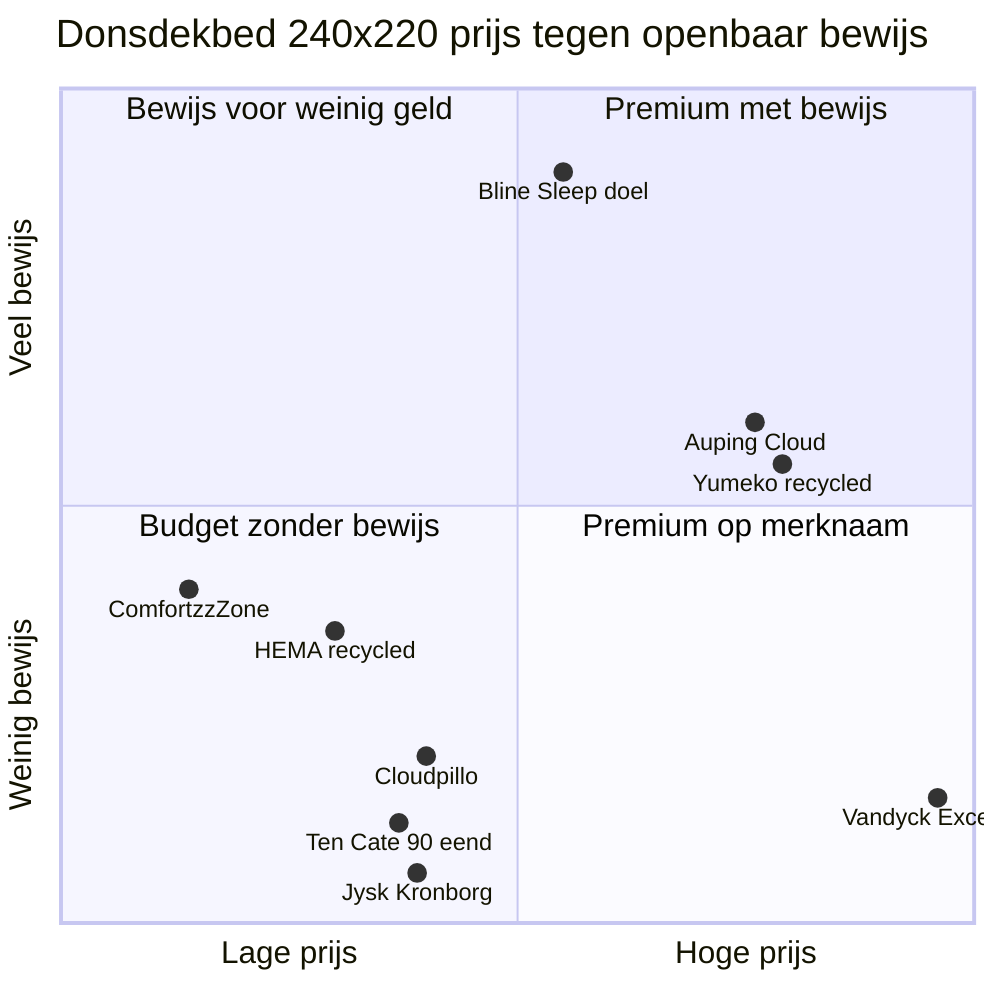
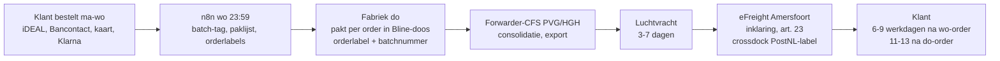

# Bline Sleep verkoopt bewijs vóór voorraad

Bline Sleep kan binnen 12 maanden een winstgevend premium slaapmerk worden, mits het merk één ding consequent doet dat in Nederland en België nog niemand doet: per product de volledige specificatie, een labrapport per batch en controleerbare certificaatnummers publiceren, en daar een prijs tegenover zetten die past bij echt premium materiaal. Het grootste nieuwe inzicht is dat premium dons duurder is dan de eerdere stukken aannamen. 90% wit ganzendons kostte in mei 2026 circa RMB 1.000 per kg (ongeveer US$141), dus alleen de vulling van een 240x220-winterdekbed kost al circa US$130 en een premium FOB-prijs begint rond US$150 tot 220. Daarom moet het hero-dekbed niet op €399-449 maar op **€549 (240x220)** staan. Daar ligt ook precies het open gat in de markt: tussen €450 en €650 biedt niemand 90%+ ganzendons met gepubliceerde vulkracht, vulgewicht, tijkspecificatie, certificaatnummer en proefslapen. Het model "klant betaalt, fabriek houdt voorraad, wekelijks één luchtvracht naar eFreight" houdt stand: per luchtvracht blijft er circa **€215 bijdrage vóór advertenties** per dekbed over (47% van de netto-omzet), per zee circa €245. In het basisscenario haalt Bline Sleep in 2027 circa €288k omzet exclusief btw en €515k in 2028. Het maximale kapitaalbeslag is circa **€50k in september 2027**, en de cumulatieve kas wordt positief in maart 2028. Drie dingen zijn harde voorwaarden voordat de eerste klant betaalt: een betaalmethode waarbij de klant hooguit 50% vooraf betaalt (Klarna achteraf via Shopify Payments), een herroepingsknop, en een GPSR-dossier waarin Shop4You zelf als fabrikant optreedt. De verzwaringsdeken komt pas in oktober 2027, uitsluitend per zee. Twee acties hebben deze week voorrang: blinesleep.com verloopt op 22 november 2026, en de merknaam "Bline" is nog niet gecontroleerd tegen bestaande merken.

*Leeswijzer.* **[Feit]** is met een bron of offerte controleerbaar. **[Claim]** is wat een bedrijf over zichzelf zegt. **[Inschatting]** is eigen rekenwerk of oordeel, met de aannames erbij. Peildatum is 4 oktober 2026. Omrekening: US$1 = €0,87 (aanname). Bedragen zijn exclusief btw, tenzij er "incl. btw" staat. Zoekvolumes van bol zijn bol-API-data over 12 maanden NL en BE, aangeleverd door Joost.

---

## Duurder dons en strengere regels herschrijven negen eerdere aannames

De eerdere stukken (`D2C slaapkamertextiel uit China`, `Strategie premium slaapmerk`, `Productkeuze en logistiek Bline Sleep`) blijven op hoofdlijnen overeind: eigen shop als hoofdkanaal, bol als etalage, fabriekspartnerschap, luchtvracht in bulk naar eFreight en nooit losse pakketjes uit China. Op negen punten corrigeert het nieuwe onderzoek ze wel. Dit zijn de wijzigingen die doorwerken in prijs, marge of planning.

| # | Onderwerp | Eerder aangenomen | Nu vastgesteld | Gevolg |
|---|---|---|---|---|
| 1 | FOB donsdekbed 240x220, 90-95% dons | US$70-120 (Strategie), US$90 als rekenbasis (Productkeuze) | **[Feit]** 90% wit ganzendons RMB 1.000/kg en eenddons RMB 579/kg in mei 2026 ([Yongjin](https://www.yongjinbiotech.com/news/down-market-price-trend-2nd-week-of-may2026-85535900.html)); eenddons steeg 34% in 2025 naar een 12-jaarshoogte ([Yicai](https://www.yicaiglobal.com/news/chinas-duck-down-prices-surge-amid-tight-supply-this-year)). **[Inschatting]** FOB-banden: instap (80/20 eend) US$50-80, midden (90/10 wit eend, RDS) US$90-130, premium (90-95% wit gans, 750-800+ cuin, RDS) US$150-220+ | US$90 koopt alleen eend. Met echte ganzenspec daalt de bijdrage bij €429 naar €117 (33%). Prijs naar **€549** |
| 2 | Prijszone dons | €399-449, "net onder Ten Cate" | **[Feit]** Cloudpillo verkoopt 15% dons/85% veren voor €395 ([Cloudpillo](https://cloudpillo.com/nl-nl/products/cloudpillo-down-feather-duvet)); Ten Cate 100% gans €609,95 ([vergelijk.nl](https://www.vergelijk.nl/dekbedden/ten_cate_home/4-seizoenen_dekbed_ganzendons_katoen_wit_220x240_cm_dekbedden_naduvi_594780861/)); Auping €759+ en Yumeko gans €899+ | €399-449 zit in de drukke middenmoot met Ten Cate eend en Jysk; het gat ligt op €450-650 |
| 3 | Vooruitbetaling | "Max. de helft, laten toetsen" | **[Feit]** Art. 7:26 lid 2 BW letterlijk: max. de helft vooruit ([BW 7](https://wetten.overheid.nl/BWBR0005290/2026-01-01)). De ACM legde een dwangsom op aan een webshop die alleen iDEAL en Bancontact bood ([ACM-besluit](https://www.acm.nl/system/files/documents/openbaar-besluit-spelcomputerkopen.nl_.pdf)) | Klarna achteraf is verplicht onderdeel van de checkout, niet optioneel. Riverty is niet nodig |
| 4 | Herroeping en hygiëne | "Proefslapen alleen op dekbed en deken met hoes" | **[Feit]** Het HvJ EU oordeelde dat een matras zonder folie niet onder de hygiëne-uitzondering valt ([C-681/17](https://eur-lex.europa.eu/legal-content/EN/TXT/?uri=celex%3A62017CJ0681)). Sinds juni 2026 is de herroepingsknop verplicht ([art. 6:230oa BW](https://wetten.overheid.nl/BWBR0005289/2026-07-16)) | 14 dagen herroeping geldt voor álle producten, ook geopende slopen en dekbedden. De 100-nachtenproef komt daar bovenop |
| 5 | Verzwaringsdeken | €179, eerste zeezending "rond februari", invoerrecht "3,7-12%, checken" | **[Feit]** Emma Hug kost €199 met 100 nachten en 10 jaar garantie ([Emma](https://www.emma-sleep.nl/dekbedden/verzwaringsdeken/)). TARIC 9404 40 90 is 3,7% ([TARIC](https://ec.europa.eu/taxation_customs/dds2/taric/measures.jsp?Lang=en&SimDate=20261004&Taric=9404409000&LangDescr=en&Area=CN)), maar de indeling als "deken" (6301) is omstreden ([CBP H305101](https://rulings.cbp.gov/ruling/H305101)) | Prijs €229. BTI aanvragen. Zeezending in juli, lancering oktober 2027: in februari aankomen betekent buiten het seizoen landen |
| 6 | €3-douaneheffing | "Per pakket" | **[Feit]** €3 per artikelsoort (tariefindeling), alleen bij B2C-afstandsverkoop tot €150 ([Europese Commissie](https://taxation-customs.ec.europa.eu/news/guidance-and-legal-text-temporary-flat-fee-low-value-imports-which-will-apply-until-1-july-2028-2026-06-08_en); [Douane](https://www.douane.nl/onderwerpen/invoer-en-uitvoer/invoer/aangifte-doen/aangifte-doen-bij-e-commerce/invoerrechten-betalen-voor-e-commerce/)) | Geldt niet voor de wekelijkse B2B-bulkimport. Bulk naar eFreight blijft de juiste route |
| 7 | UPV Textiel | "Registratie vóór eerste zending" voor alles | **[Feit]** De reikwijdte is bedlinnen onder code 6302; dekens (6301) vallen er niet onder ([Afval Circulair](https://afvalcirculair.nl/uitgebreide-producentenverantwoordelijkheid-upv/overzicht-upv/upv-textiel/faq-upv-textiel/faq-reikwijdte-upv-textiel/)) | Alleen lyocell-beddengoed en zijden slopen; dekbedden (9404) vermoedelijk niet |
| 8 | RDS en TENCEL als bewijs | "Certificaatnummer dat je zelf kunt checken" | **[Feit]** Voor een RDS-claim op het eindproduct moet de certificering doorlopen tot de merkhouder of laatste B2B-verkoper, en moet de certificatie-instelling de claim goedkeuren ([TE-301](https://textileexchange.org/app/uploads/2022/02/TE-301-V1.3-Standards-Claims-Policy.pdf)). "TENCEL" vraagt een product- en een marketinglicentie van Lenzing ([UKFT](https://ukft.org/tencel-lenzing-ecovero-trademarks/)) | Zonder licentie schrijf je "lyocell". Of Bline zelf een RDS-certificaat nodig heeft, moet de certificatie-instelling bevestigen |
| 9 | Merk "Bline" | "EU-registratie bestaat al via SME Fund 2023 (checken)" | **[Feit]** Er bestaan B-Line Beauty, Bliné Skincare, Bline Clothing en bline/TSR ([B-Line Beauty](https://www.b-linebeauty.com/about/the-bline-story); [Maha Home](https://mahahome.com/collections/brand-bline-tsr)). blinesleep.com verloopt op 22-11-2026 ([RDAP](https://rdap.org/domain/blinesleep.com)) | Dit is niet bevestigd en vraagt een registeronderzoek vóórdat er verpakking wordt gedrukt |

Kleinere bijstellingen: de luchtvracht per dekbed valt iets lager uit dan eerder geschat (4-4,5 kg belastbaar na vacuüm, circa €27 plus vaste kosten, in plaats van 5,5 kg en €36), en Chinees Nieuwjaar (6 februari 2027) onderbreekt de wekelijkse drop. Daar is een buffer voor nodig (zie module 6).

---

## Drie kopers zoeken zekerheid, geen korting (module 1)

### Klantprofielen

De motieven per product zijn helder, maar harde Nederlandse demografie (leeftijd, inkomen) is niet openbaar. De profielen hieronder combineren motieven uit bronnen met een eigen afleiding van leeftijd en inkomen (**[Inschatting]**).

| | **A. De kwaliteitszoeker** | **B. De warme slaper** | **C. De cadeau- en beautykoper** |
|---|---|---|---|
| Product | Donsdekbed 4-seizoenen, later Slaapset | Lyocell-overtrek en -hoeslaken, zomerdekbed, zijde | Zijden kussensloop, duo-set |
| Wie (inschatting) | 35-60 jaar, bovenmodaal, eigen woning, nieuw bed of verhuizing | 35-60 jaar, vaak vrouwen rond de overgang of stellen met verschillend warmtegevoel | Vrouwen 25-45 voor zichzelf, of een partner die een cadeau zoekt |
| Motief | Licht, warm, vochtregulerend, eerlijk label, "het beste uit de test" | Koel en droog slapen, glad en zacht | Haar en huid, luxe gevoel, cadeau |
| Bewijs uit bronnen | **[Feit]** De Consumentenbond test op warmte-isolatie, vochtdoorlaatbaarheid, gewicht en wasduurzaamheid ([Beddingbusiness](https://www.beddingbusiness.nl/consumentenbond/)) | **[Feit]** Cura-klanten met warmteklachten stappen over op de lyocellvariant ([Trustpilot Cura](https://www.trustpilot.com/review/www.curaofsweden.com)); koeling is bij Cloudpillo een expliciet koopargument ([Trustpilot](https://nl.trustpilot.com/review/cloudpillo.com?page=3)) | **[Feit]** Vergelijkers noemen haar, huid, cadeau en temperatuur als motieven ([Slimgetest](https://slimgetest.nl/beste-zijden-kussenslopen/)) |
| Twijfel | Allergie, dierenwelzijn, "klopt het label?" | Kreuken, pilling, "is het echt Tencel?" | "Is het echte zijde, welke momme?" |
| Aankoopmoment | Sep-dec (kou), januari | Mei-aug (bol: "zomerdekbed" en "tencel" pieken in de zomer) | Valentijn, Moederdag (9 mei 2027), Sinterklaas, Kerst |
| Kanaal | Google (informatief), eigen shop, reviews | Meta, Google, eigen shop | Bol en Instagram ter oriëntatie, eigen shop voor cadeauverpakking |

Een vierde profiel, de onrustige slaper of de ouder die een verzwaringsdeken zoekt, hoort bij de tweede stap. Voor dat profiel bestaat er medisch bewijs: **[Feit]** in een Zweedse RCT met 120 psychiatrische patiënten daalde de ISI-score met ongeveer 50% bij een deken van 8 kg ([Tijdschrift voor Psychiatrie](https://www.tijdschriftvoorpsychiatrie.nl/nl/artikelen/article/50-13160_Verzwaringsdekens-voor-insomnia-bij-patienten-met-psychiatrische-aandoeningen)). Bline mag dat bewijs juridisch niet als productclaim gebruiken (zie module 4).

### Top 10 pijnpunten en hoe product en shop ze oplossen

De klachten bij de grote spelers gaan opvallend vaak over service en eerlijkheid, niet over het product zelf. In een eigen telling van één pagina 1- en 2-sterrenreviews van Cloudpillo (**[Feit]**, kleine steekproef van circa 20-25 reviews) kwamen kwaliteit 6 keer voor, klantenservice 5, levering 4, retour 4, temperatuur 3 en maat 3 ([Trustpilot](https://nl.trustpilot.com/review/cloudpillo.com?stars=1&stars=2)). Bij Gravity gaan de klachten over levertijd boven de 14 dagen, verschuivende vulling, een onvindbaar telefoonnummer en retourkosten voor eigen rekening ([Trustpilot Gravity](https://nl-be.trustpilot.com/review/gravity-deken.nl?page=3)).

| # | Pijnpunt | Bron | Oplossing in het product | Oplossing in de shop |
|---|---|---|---|---|
| 1 | Vage specificatie: geen vulkracht, vulgewicht of tijkdichtheid | Bijna geen NL-aanbieder publiceert cuin ([ComfortzzZone](https://www.comfortzzzone.nl/donzen-dekbed/) is de uitzondering) | Vaste spec: donspercentage, cuin, gram per maat, TC, garen | Specificatiekaart boven de vouw, gelijk voor elk product |
| 2 | Klopt het label? | Stiftung Warentest: gedeclareerde vulling klopte vaak niet ([t-online](https://www.t-online.de/ratgeber/id_88788814/stiftung-warentest-prueft-daunendecken-keine-decke-kann-im-test-ueberzeugen-.html)); "satijn" is meestal polyester ([Slimgetest](https://slimgetest.nl/beste-zijden-kussenslopen/)) | EN 12934-labtest per donsbatch, momme-weegtest per zijdelot | Labrapport als PDF per batch, batchnummer op het label |
| 3 | Dierenwelzijn bij dons | Warentest: dierenwelzijn vaak onvoldoende ([test.de](https://www.test.de/Bettdecken-im-Test-Kuschlig-warm-dank-Tierquaelerei-4622395-5665875/)) | Alleen RDS- of Downpass-dons | Certificaatnummer met link naar de database (na goedkeuring van de claim) |
| 4 | Te warm of te koud | Cloudpillo: temperatuur 3x; Cura-klanten wisselen naar lyocell | 4-seizoenen (twee lagen), zomervariant, lyocell-tijk of -overtrek | Warmte-keuzehulp per slaper en seizoen, 100 nachten proefslapen op dons |
| 5 | Allergie | Longfonds: liever geen dons, maar met allergeendichte hoes maakt het niet uit ([Longforum](https://www.longforum.nl/gespreksthemas/deskundigen/vraag-de-longfonds-advieslijn/dekbed)) | Gewassen dons met getoetste reinheid (troebelheid, zuurstofgetal), dichte tijk | Eerlijke FAQ: huisstofmijt tegenover dons, wassen op 60 graden |
| 6 | Zakt in of klontert na korte tijd | Cloudpillo: "Zakt snel in, na paar dagen al" | Hoge vulkracht, cassettes met tussenwanden, gouden sample | Garantie op naden en tijk, review-foto's na 30 en 100 nachten |
| 7 | Levertijd onduidelijk of te lang | Gravity: meer dan 14 dagen, langer dan vermeld | Fabrieksvoorraad met wekelijkse drop | Exacte leverdatum per besteldag op de productpagina en bij de checkout, statusmails per stap |
| 8 | Retour is moeizaam | Cloudpillo: "Wacht al dagen op een retourlabel"; Gravity: retour op eigen kosten | n.v.t. | Herroepingsknop, retourlabel direct in de mail, retour naar eFreight |
| 9 | Klantenservice onbereikbaar | Cloudpillo: klantenservice 5x; Gravity: geen telefoon of KvK zichtbaar | n.v.t. | Telefoon, WhatsApp, KvK en adres zichtbaar; antwoord binnen 1 werkdag |
| 10 | Maat of uiterlijk wijkt af van de foto | Cloudpillo: kussenhoezen "een andere maat", "totaal niet zoals op de foto's" | NL-maten (60x70, 240x220), tolerantie in de spec | Maten in cm met tolerantie, daglichtfoto's, gratis kleurstalen |

De conclusie (**[Inschatting]**): de "met bewijs"-belofte lost pijnpunten 1 tot en met 3 op, die geen concurrent adresseert. De servicelaag (pijnpunten 7 tot en met 10) is waar Cloudpillo en Gravity punten verliezen, en die laag kost Bline weinig geld.

### Zoekwoordenkaart

Premium-materiaaltermen zijn op bol klein. "Dekbed dons" (1.845 per jaar) is 2,4% van "dekbed" (75.985), en "tencel dekbedovertrek" (970) is 0,8% van "dekbedovertrek" (117.752). "Zijden kussensloop" (12.873) en "verzwaringsdeken" (23.475) zijn juist groot voor nicheproducten (**[Feit]**, bol-API). Op Google NL wordt "dekbed" circa 425k keer per maand gezocht en "dekbedovertrek" circa 630-650k, met november als piekmaand (12,6% van het jaarvolume) ([InteriorBusiness](https://www.interiorbusiness.nl/dit-zijn-de-meest-gezochte-maten-dekbedovertrekken/)). De premium donskoper zoekt dus via Google en koopt op vertrouwen, wat de keuze voor de eigen shop bevestigt.

| Product | Koopintentie (categorie- en productpagina, Shopping) | Oriëntatie (gids, blog, FAQ) | Seizoen |
|---|---|---|---|
| Donsdekbed | donsdekbed kopen, dekbed dons, ganzendons dekbed, 4 seizoenen dekbed dons, donzen dekbed 240x220, zomerdekbed dons; DE: Daunendecke kaufen | beste donzen dekbed, dekbed consumentenbond, dons allergie, warmteklasse dekbed, RDS dons betekenis, vulkracht cuin | Sep-jan; zomerdons mei-aug |
| Lyocell | tencel dekbedovertrek, tencel hoeslaken, lyocell beddengoed, verkoelend dekbedovertrek; DE: Tencel Bettwäsche | nachtzweten beddengoed, wat is tencel, tencel vs katoen vs linnen | Mei-sep |
| Zijden kussensloop | zijden kussensloop, zijden kussensloop 60x70, moerbeizijde 22 momme, zijden kussensloop cadeau; DE: Seidenkissenbezug | echte zijde herkennen, satijn of zijde, momme betekenis, zijde wassen | Hele jaar, pieken rond Valentijn, Moederdag, december |
| Verzwaringsdeken (stap 2) | verzwaringsdeken, verzwaringsdeken 7 kg, verzwaringsdeken verkoelend; DE: Gewichtsdecke | welk gewicht verzwaringsdeken, verzwaringsdeken nadelen, wetenschap | Nov-jan |

Let op bij de lyocellstrategie (**[Inschatting]**): consumenten zoeken op "tencel", niet op "lyocell". Zonder Lenzing-licentie mag Bline dat woord niet gebruiken, en dan mist het merk de belangrijkste zoekterm. Dat is het sterkste argument om de TENCEL-licentie te halen (zie module 3 en 4). Google- en Duitse zoekvolumes zijn in dit onderzoek niet opgehaald; dat kost een uur in Keyword Planner of Trends.

---

## Niemand publiceert vulkracht, momme-meting en certificaatnummer tegelijk (module 2)

Het patroon is bij alle vier de producten hetzelfde. Concurrenten beloven veel (proefslapen, testwinnaar, "klinisch aangetoond"), maar publiceren weinig dat controleerbaar is. Prijzen zijn momentopnames van 4 oktober 2026. Bol, Swiss Sense en de Meta Ad Library blokkeerden geautomatiseerd ophalen, dus advertentiestijl per merk is niet vastgesteld.

### Donsdekbed 240x220

| Merk | Prijs | Vulling | Cuin / vulgewicht | Certificaat | Proef / retour | Garantie | Bron |
|---|---|---|---|---|---|---|---|
| Cloudpillo Dons & Veren | €395 (1+1 actief) | 15% eendendons / 85% veren | niet vermeld | OEKO-TEX, RDS [claim] | 100 nachten | 2 jaar | [Cloudpillo](https://cloudpillo.com/nl-nl/products/cloudpillo-down-feather-duvet) |
| Ten Cate 4-seizoenen 90% eend | €331,55 (van €409,99) [snippet] | 90% eendendons | niet gevonden | n.b. | bol-retour | n.b. | [bol](https://www.bol.com/nl/nl/p/ten-cate-donzen-lits-jumeaux-4-seizoenen-dekbed-240x220-cm-extra-lang-90-eendendons-geschikt-voor-alle-seizoenen-zomer-winter-dekbed-anti-huisstofmijt-ventilerend-absorberend/9200000102271388/) |
| Jysk Kronborg Beito | €385 (van €499) [snippet] | ganzendons | n.b. | n.b. | n.b. | n.b. | [Jysk](https://jysk.nl/slaapkamer/dekbedden/donzen-dekbedden/ganzendons-dekbed-240x220-kronborg-beito-extra-warm) |
| HEMA gerecycled dons | €299 | 70% gerecycled dons / 30% veren | 430 g/m² | BCI (katoen) | standaard | n.b. | [HEMA](https://www.hema.nl/wonen-slapen/slapen/dekbedden/dekbed-240x220-gerecycled-dons-4-seizoenen--5590021.html) |
| Tukker 90% gans (Betternights) | €479 (van €619) [snippet] | 90% ganzendons | n.b. | n.b. | n.b. | n.b. | [Betternights](https://www.betternights.nl/donzen-dekbed/ganzendons/240x220cm/) |
| Ten Cate 100% gans | €609,95 [snippet] | 100% ganzendons [claim] | n.b. | n.b. | n.b. | n.b. | [vergelijk.nl](https://www.vergelijk.nl/dekbedden/ten_cate_home/4-seizoenen_dekbed_ganzendons_katoen_wit_220x240_cm_dekbedden_naduvi_594780861/) |
| Auping Cloud 4-seizoenen | €759 | 100% Mazurisch ganzendons [claim] | 240 g/m² | **RDS CU833051**, Nomite | 30 dagen retour | 5 jaar | [Auping](https://www.auping.com/nl/beddengoed/dekbedden/auping-cloud-dekbed-4-seizoenen) |
| Yumeko gerecycled all seasons | €789 [snippet], adviesprijs €750 | 70% gerecycled dons / 30% veren | niet vermeld | GRS, GOTS, Nomite [claim] | 30 dagen, ongebruikt | 2 jaar | [Yumeko](https://www.yumeko.nl/dekbed-recycled-dons-all-seasons) |
| Yumeko ganzendons | €899 (lente/herfst) | ganzendons | n.b. | Downpass [claim] | 30 dagen | 2 jaar | [Yumeko](https://www.yumeko.nl/donzen-dekbedden/ganzendons) |
| Vandyck Excellent Duo | €999 [snippet] | 95% ganzendons | n.b. | n.b. | n.b. | n.b. | [Vandyck](https://vandyckstore.amsterdam/product/dekbed-excellent-4-seizoenen-dons/) |
| ComfortzzZone Bold/Essence | €115-145 | 60% gans / 80% eend | **660-680 cuin** | RDS/Downpass, niet per product | n.b. | n.b. | [ComfortzzZone](https://www.comfortzzzone.nl/donzen-dekbed/) |
| DE: Billerbeck Nena 306 | €1.169 [snippet] | 100% ganzendons | n.b. | Downpass [claim] | n.b. | n.b. | [bettwaren-shop](https://www.bettwaren-shop.de/Bettdecken/in-240x220-cm/aus-Daunen/von-Billerbeck/) |

Yumeko won meerdere keren "Beste uit de Test" van de Consumentenbond en Castella Sirius (90% eend) werd "Beste Koop" ([Beddingbusiness](https://www.beddingbusiness.nl/consumentenbond/)). Dat is de sterkste sociale bewijskracht in de markt, en Bline kan daar bij de lancering niet tegenop. Wat Bline wel kan, is eigen labbewijs leveren. Een lyocell-tijk op een donsdekbed heeft geen enkele onderzochte concurrent. Hefei Charming bood wel 50% Tencel/50% katoen-batist aan (offerte december 2025, Gmail). Of dat donsdicht genoeg is, moet een labtest uitwijzen.

*De x-as is de prijs voor 240x220 op een schaal van €0-1.000. De y-as is een eigen score (**[Inschatting]**) voor openbaar bewijs: gepubliceerde cuin, vulgewicht, TC, certificaatnummer, labrapport en een onafhankelijke test.*

### Lyocell-beddengoed

| Merk | Prijs set 240x220 | Hoeslaken | Vezel | Binding / TC | Bewijs | Proef / retour | Bron |
|---|---|---|---|---|---|---|---|
| Walra Classy Tencel | €139,95 (bol €111,99) | n.b. | 65% Tencel / 35% katoen | percal 215 | n.b.; reviews over pilling en kreuken | 30 dagen | [Walra](https://www.walra.nl/products/dekbedovertrek-classy-tencel-off-white-beige) |
| Koala Hug | vanaf €119,95 | €64,95 (180x200) | 100% TENCEL | satijn 300 | geen textielcertificaat genoemd | n.b. | [Koala Hug](https://koalahug.eu/beddengoed/) |
| Wocha | €149 | n.b. | 100% TENCEL | 300 | OEKO-TEX, FSC [claim] | 14 dagen | [Wocha](https://www.wocha.nl/products/dekbedovertrekset-tencel-grijs) |
| Coco & Cici | n.b. | satijn vanaf €109,95 | TENCEL | satijn/twill | niet vermeld | **30 nachten** | [Coco & Cici](https://www.coco-cici.com/collections/tencel-hoeslakens) |
| Yumeko katoen-TENCEL | €199,95 [snippet] | n.b. | 40% TENCEL / 60% bio-katoen | n.b. | bio/fairtrade | 30 dagen | [Yumeko](https://www.yumeko.nl/bedlinnen/katoen-tencel-collectie) |
| Cloudpillo beddengoed | €156 [snippet] | n.b. | niet bevestigd | n.b. | klachten over maat van slopen | n.b. | [Cloudpillo](https://cloudpillo.com/nl-nl/collections/beddengoed) |
| DE: Hessnatur Silky Touch | €169-189 [snippet] | n.b. | TENCEL + bio-katoen | dobby | n.b. | n.b. | [Hessnatur](https://www.hessnatur.com/de/bettwaesche-set-silky-touch-aus-tencel%E2%84%A2-lyocell-und-bio-baumwolle/p/5798360) |
| DE: Traumschlaf Uni Tencel | €139,99 (200x200) | jersey bestaat | 100% lyocell | glanzend | n.b. | n.b. | [Bettwaren-Shop](https://www.bettwaren-shop.de/Bettwaesche/Traumschlaf-Uni-Tencel-Lyocell-Bettwaesche.html) |

Geen enkele aanbieder publiceert g/m² of een Lenzing-licentienummer. De prijsband voor een 100% TENCEL-set ligt rond €119-149; een complete set met hoeslaken komt op €185-310.

### Zijden kussensloop 60x70

| Merk | Prijs | Momme / grade | Maat | Bewijs | Retour | Bron |
|---|---|---|---|---|---|---|
| Slip Silk Queen | €90,85-112 | 22 / 6A | **51x76** (past slecht om NL-kussens) | "klinisch aangetoond" [claim] | n.b. | [Bijenkorf](https://www.debijenkorf.nl/slip-silk-queen-kussensloop-van-zijde-1192090646-119209064700000) |
| Silvana Silky Beauty | €89,95 [snippet] | 22 | n.b. | n.b. | n.b. | [Bijenkorf](https://www.debijenkorf.nl/d/silvana-silky-beauty-pillowcase-kussensloop-van-moerbei-zijde-7613090004-761309000422607) |
| Beauty by Silk | €48,95; 4-pack €36,70 per stuk | 22 / 6A | 60x70 | OEKO-TEX klasse 1, "SGS ISO-9001", eigen enquête [claim] | 60 dagen, 1 jaar garantie | [Beauty by Silk](https://www.beautybysilk.nl/products/60x70cm-wit-100-moerbei-zijden-kussensloop-22-momme) |
| Silkora | €53,95 [snippet] | 22 / 6A | 60x70, 40x80, 50x70 | OEKO-TEX | n.b. | [Silkora](https://www.silkora.nl/en/products/silk-pillowcase-60x70-white-22-momme) |
| Wocha zijde | €49-69 [snippet] | 22 / 6A | 60x70 | n.b. | 14 dagen | [Slimgetest](https://slimgetest.nl/beste-zijden-kussenslopen/) |
| Bol-label 25 momme "jumbo" | n.b. | **25** / 6A | 60x70 | n.b. | bol | [bol](https://www.bol.com/nl/nl/p/100-zijden-25-momme-kussensloop-wit-60x70cm-jumbo/9300000181593689/) |
| Silk Heaven | €40,49-44,24 [snippet] | 22 | n.b. | n.b. | n.b. | [Silk Heaven](https://www.zijdendekbed.nl/kussenslopen/zijden-kussensloop/) |
| Dore & Rose (bol) | n.b. | 23 | 60x70 | 4,9/5 uit 31 reviews | bol | [bol](https://www.bol.com/nl/nl/l/kussenslopen-zijde/14199/4285329381/) |

Een 22 momme-sloop van 60x70 kost op bol en bij NL-labels €40-70. Niemand onderbouwt de momme met een onafhankelijke meting, en bijna niemand vermeldt of beide zijden van zijde zijn. "SGS ISO-9001" is een certificaat voor het kwaliteitsmanagement van de fabriek, geen producttest. Dat is een goede invalshoek voor educatieve content.

### Verzwaringsdeken 7-9 kg (stap 2)

| Merk | Prijs | Gewicht / maat | Hoes | Proef | Garantie | Bron |
|---|---|---|---|---|---|---|
| Action | €14,95 NL | 7 kg, 140x200 | polyester, handwas | nee | n.b. | [Action](https://www.action.com/nl-nl/p/3010192/verzwaringsdeken/) |
| Slome | €84,99 | 5-9 kg | biokatoen | n.b. | n.b. | [Matrassencheck](https://www.matrassencheck.nl/review/verzwaringsdeken) |
| Cura Pearl Classic | €92,95 (7 kg) tot €139,95 (9 kg) [snippet] | 5-11 kg | **geen hoes inbegrepen** | n.b. | n.b. | [bol](https://www.bol.com/nl/nl/p/cura-of-sweden-verzwaringsdeken-pearl-classic-150x210-9kg/9300000017165891/) |
| CozySense Tencel | n.b. | 8 kg, 135x200 | 100% Tencel | n.b. | n.b. | [Rustige Nacht](https://rustigenacht.nl/blogs/testen-en-reviews/beste-verzwaringsdeken) |
| Novaline | n.b. | 8 kg, 140x200 | bamboe | 100 dagen | n.b. | [Novaline](https://novaline-dekens.nl/products/verzwaringsdeken-8-kg-140x200-cm-hoes-wit-bamboe) |
| Emma Hug | €199 | 7 kg, 150x200 | katoen | **100 nachten** | **10 jaar** | [Emma](https://www.emma-sleep.nl/dekbedden/verzwaringsdeken/) |
| Gravity bundel | €316 (normaal €351) | 8-10 kg | velours of biokatoen | 31 nachten, retour op eigen kosten | n.b. | [Gravity](https://gravity-deken.nl/en/products/gravity-blanket-set-volwassenen) |

Glasparels, een Tencel-hoes en proefslapen zijn al gangbaar. Wat wel ontbreekt (**[Inschatting]**, niet volledig geverifieerd door de blokkade op bol): lyocell voor zowel de binnendeken als de hoes, met OEKO-TEX-nummer, plus een gepubliceerde lek- en naadtest en een vaste, eerlijke prijs zonder permanente "korting" zoals bij Gravity.

### De plek van Bline Sleep

| Product | Combinatie die niemand biedt | Concurrerend prijsanker | **Bline-prijs (besluit)** | Hoe zeker is het gat |
|---|---|---|---|---|
| Dons 4-seizoenen 240x220 | 90-95% gans, 750-800 cuin, vulgewicht per maat, TC, RDS-nummer, labrapport per batch, 100 nachten | Ten Cate eend €330-410; Auping €759; Yumeko gans €899 | **€549** (200x220 €479, 140x220 €349, inschatting) | Middel-hoog |
| Zomerdekbed gans | idem, licht vulgewicht gepubliceerd | Vandyck €329; Yumeko €419+ | **€349** | Middel (weinig datapunten) |
| Lyocell-overtrekset en hoeslaken | 100% lyocell, licentie zichtbaar, g/m², TC, pillingtest, 30+ nachten | TENCEL-sets €119-149, hoeslaken €65-110 | **€159 set, €79 hoeslaken, €219 samen** | Hoog voor bewijs, laag voor prijs |
| Zijden sloop 60x70 | 22 momme met gewogen labmeting per lot, beide zijden zijde, 60x70 | €40-70; Slip €90-112 | **€59** | Hoog voor bewijs |
| Verzwaringsdeken 7 kg | Lyocell binnen én buiten, lek- en naadtest, vaste prijs | Emma €199; Gravity €316 | **€229** (9 kg €249) | Middel |

**Positionering in één zin:** Bline Sleep is in Nederland en België het enige slaapmerk dat bij elk product de volledige specificatie, het labrapport van de batch en controleerbare certificaatnummers publiceert, rechtstreeks uit de fabriek die het maakt. De prijs ligt tussen de middenmoot en de gevestigde luxemerken.

---

## Premium dons begint bij US$150 FOB, zijde en lyocell zijn goedkoop (module 3)

### Wat de grondstof kost en wat dat betekent per tier

De vulling bepaalt het grootste deel van de kostprijs van een dekbed. Een premium winterdekbed van 240x220 met 940 g vulling (de spec van Hefei Charming, Gmail december 2025) kost bij RMB 1.000/kg aan ganzendons al **circa US$130** aan vulling (**[Inschatting]** op basis van [Yongjin](https://www.yongjinbiotech.com/news/down-market-price-trend-2nd-week-of-may2026-85535900.html)). Marketplace-listings voor RDS-dons van 800 cuin liggen op US$129-159 per kg ([Made-in-China](https://www.made-in-china.com/products-search/hot-china-products/Goose_Down.html)). Listings als "90% ganzendons dekbed voor US$15" ([Yintex](https://yintex.en.made-in-china.com/product/KSQEBNYbAhkH/China-90-White-Goose-Down-Duvet-Better-Than-Down-Comforter.html)) zijn daarom een rode vlag: het vulgewicht is dan te laag, het donspercentage klopt niet of er is eend door het dons gemengd. De markt is krap. In maart 2026 meldde een vakbron "renewed upward price momentum" en in juli een korte correctie onder "tight supply constraints" ([EmergingTextiles](https://www.emergingtextiles.com/fiber-market-prices/goose-duck-down-reports/)). Een flinke daling op korte termijn ligt daarom niet voor de hand. Leg in de inkoopafspraak een prijsformule vast die gekoppeld is aan de GB/T 14272-notering.

Zijde en lyocell zijn veel minder kapitaalintensief. **[Claim]** Listings voor een 22 momme 6A-sloop met OEKO-TEX liggen op US$7,99-12,99 afhankelijk van de oplage ([Alibaba](https://www.alibaba.com/product-detail/22-momme-100-Custom-Package-100_1601168614658.html)); 25 momme op US$16,50-23 ([silkhome](https://silkpillowcasewholesale.com/collections/25-momme-silk-pillowcase)). Chinese lyocellvezel is door overcapaciteit goedkoop: circa RMB 13.000 per ton, zelfs onder de prijs van viscose ([Swarajya](https://swarajyamag.com/business/how-india-is-losing-the-fibre-europe-wants-most)). Het prijsverschil tussen een goedkope en een premium lyocellset zit dus in het garen, het weefsel, de afwerking en de licentie, niet in de vezel. "6A" is een graad van ruwe zijde onder GB/T 1797 en is op de stof zelf niet te controleren ([SilkSilky](https://silksilky.com/blogs/silk-benefits-guide/6a-grade-silk-meaning)). Momme kun je wel controleren: 1 momme is circa 4,34 g/m², dus een lap van 10x10 cm uit een 22 momme-sloop weegt circa 0,95 g ([Ursilk](https://ursilk.com/what-is-momme/)).

### Shortlist: drie fabrieken per product

De beoordeling gebruikt een scorekaart (echte fabriek, productcertificaat, sociale audit, EU-export, capaciteit, labtest, bereidheid tot voorraad en afroep, communicatie). Niemand op deze lijst is al volledig geverifieerd. De eerste stap is per fabriek een gratis controle in het Chinese handelsregister GSXT, waar de Unified Social Credit Code de bron van waarheid is ([Hicom Asia](https://www.hicom-asia.com/how-to-check-chinese-company-necips/)).

| Product | Fabriek | Waarom | Zwakte of open punt | Oordeel |
|---|---|---|---|---|
| **Dons** | **Zhejiang Samsung Down** (Xiaoshan) | **[Claim/Feit]** Opgericht 1988, 518 medewerkers, circa US$130 mln omzet, RDS, Downpass, OEKO-TEX, BSCI ([globon](https://globon.co/blogs/news/the-profile-of-company-zhejiang-samsung-down-co-ltd)); 262 zeezendingen naar de VS, de laatste in april 2026 ([ImportYeti](https://www.importyeti.com/supplier/zhejiang-samsung-down)); MOQ circa 50 per maat (Gmail) | Offerte van december 2025 zit in een bijlage die nog niet gelezen is | **Partner 1** |
| | **Hefei Charming / Anhui Feathergroup** (Tongcheng) | Eigen donsfabriek, sample tegen bulkprijs, kleine testorder akkoord, spec 800+ cuin met 50/50 Tencel-katoen-tijk (Gmail) | RDS niet bevestigd, geen BSCI, AQL "5-10%" is te ruim voor premium | **Partner 2**, alleen na een RDS-check en strengere AQL |
| | **Zhejiang Shengli Down** (Xiaoshan) | **[Claim]** 600 ton dons, 1,5 mln sets per jaar ([LinkedIn](https://www.linkedin.com/company/zhejiang-shengli-down-products-co-ltd-)) | Geen contact, geen certificaatcheck | Reserve; bezoeken tijdens de reis |
| **Zijde** | **Suzhou Stitch Textile** | **[Claim]** 22 momme 6A OEKO-TEX, US$9,89 bij 500 stuks, US$7,99 vanaf 1.000, MOQ 2 ([Alibaba](https://www.alibaba.com/product-detail/22-momme-100-Custom-Package-100_1601168614658.html)) | Mogelijk handelshuis | Sample plus weegtest |
| | **Huzhou Sangli Silk** | **[Claim]** 19-22 momme 6A, US$8-15, MOQ 50, zit in het Huzhou-cluster ([Alibaba](https://www.alibaba.com/supplier/silk-pillow-cases-manufacturer.html)) | Idem | Sample plus weegtest |
| | **Wujiang Xinyue** (Shengze) | **[Claim]** 19/22/25/30 momme met OEKO-TEX ([Made-in-China](https://wjxytextile.en.made-in-china.com/product/TBuQvlVEbdYy/China-Oeko-Tex-100-Natural-Pure-19mm-6A-Mulberry-Custom-19-22-25-30-Momme-Silk-Pillowcase-Mulberry-Silk-Pillow-Cases.html)) | Idem | Sample plus weegtest. Jiangsu Serica (bestaand contact, Xuzhou) alleen als het weefatelier bekend is |
| **Lyocell** | **Hangzhou Sine Textile** | Werkt al met "Lenzing Tencel", OEKO-TEX op alle onderdelen, eerlijk over Q-max (Gmail augustus 2026) | Verzwaringsdekenspecialist; beddengoed is niet zijn kernproduct. Lenzing-certificaatnummer opvragen | Stofbron en eerste offerte |
| | **Hangzhou Mosheng Textiles** | **[Claim]** 100% lyocell- en linnensets ([Made-in-China](https://mosheng-textile.en.made-in-china.com/product/uampRzEjItVw/China-100-Lyocell-Natural-Bedsheets-Lyocell-Bedding-Set.html)) | MOQ (300 sets bij linnen) en Lenzing-status onbekend | Offerte op EU-maten |
| | **Weverij met Lenzing-certificaat in Keqiao/Nantong** | Stockkleuren (wit, ivoor, steen) maken snijrondes van 100-300 sets per kleur mogelijk | Nog te vinden (Canton Fair, Heimtextil 12-15 januari 2027) | Zoeken |
| **Verzwaringsdeken** | **Hangzhou Sine Textile** | **[Feit]** US$27,20 (7 kg) en US$27,90 (9 kg) FOB Ningbo, lyocell, glasparels; levert aan Cura en Action; samples goedgekeurd (Gmail, Drive) | Vakken van 15x15 cm zijn grover dan premium (10-12 cm) | **Partner 1** |
| | **Hangzhou Yintex** | **[Claim]** Glasparels van 0,8 en 1 mm, ISO 9001, OEKO-TEX, BSCI ([Made-in-China](https://yintex.en.made-in-china.com/product/qerEMKUJgYDs/China-0-8mm-1mm-Glass-Beads-Weighted-Blanket.html)) | Dezelfde fabriek adverteert "dons voor US$15"; extra kritisch zijn | Partner 2-kandidaat |
| | **Hangzhou Tangjin / Zhejiang Wanxiang** | **[Claim]** OEKO-TEX, BSCI ([Tangjin](https://www.tangjin-hometex.com/)); Wanxiang staat op de Canton Fair | Geen prijs | Reserve |

### Onderhandelingsinzet: het partnerschap op papier

Quince is het enige gedocumenteerde voorbeeld van "de fabriek houdt voorraad tot verkoop". Het werkt met meer dan 100 fabrieken en voorspelt wekelijks per SKU ([Sacra](https://sacra.com/c/quince/)). Voor een klein merk is het gangbare contract een raamorder (blanket order) met afroepen tegen vooraf vastgelegde prijzen ([Wikipedia](https://en.wikipedia.org/wiki/Blanket_order)). Daarin staan aparte plafonds voor materiaal, onderhanden werk en gereed product, plus afspraken over restvoorraad ([Haward Razor](https://www.hawardrazor.com/will-variable-demand-leave-you-with-stockouts-and-obsolete-razor-inventory)). Opslagtarieven of consignatievoorwaarden van Chinese textielfabrieken voor kleine merken zijn nergens openbaar gevonden. De inzet hieronder is daarom een **[Inschatting]**.

| Wat Bline vraagt | Wat Bline biedt | Grens |
|---|---|---|
| Gereed product met Bline-label en -verpakking op voorraad bij de fabriek | Rollende prognose van 12 maanden, 4 weken bevroren horizon | Niet meer dan 4 weken vast |
| Wekelijkse afroep (1 afroep per week), per order ingepakt met orderlabel, op vaste dag bij de CFS van de forwarder | 30% aanbetaling op de eerste gereserveerde batch (bijvoorbeeld 100-150 dekbedden) | Max. circa €5.000 voor dons |
| Vaste prijs voor 12 maanden, bij dons gekoppeld aan de GB/T 14272-index (±10% band) | Kleine toeslag of opslagvergoeding | Max. 5-8% op de FOB |
| Snijrondes van 50 per maat (dons) en 100-300 per kleur (lyocell) | Buy-out van onverkochte gereserveerde voorraad na 120-180 dagen | Alleen voor de afgesproken plafonds |
| Gouden sample, batchlabtest, inspectie vóór verzending, recht op audit | Jaarvolume, zichtbaarheid in content ("onze fabriek") met toestemming | Geen exclusiviteit in jaar 1 |

Als de fabriek geen gereed product wil aanhouden, zijn er twee terugvalopties: een reservering met aanbetaling en wekelijkse afroep, of kleine partijen (50-100 stuks) die bij een agent in Shanghai of Ningbo liggen. Dat model is realistischer voor zijde en lyocell op stockstof dan voor dons, omdat de donsgrondstof duur en volatiel is (**[Inschatting]**).

### Kwaliteitsprocedure

| Stap | Wat | Wanneer | Wie |
|---|---|---|---|
| 1 | GSXT- en Qichacha-check: "生产" (productie) in de business scope, headcount volgens de sociale verzekering, bankrekening op exact dezelfde naam ([Jing Sourcing](https://jingsourcing.com/verify-suppliers-are-factories-not-trading-companies/)) | Vóór de offerte-aanvraag | Sourcing-agent, Claude |
| 2 | Certificaten online: RDS via Textile Exchange "Find a Certified Company" ([TE](https://textileexchange.org/find-certified-company/)); OEKO-TEX Label Check; Lenzing-certificaatnummer per stofbatch | Vóór de sample | Claude, Joost |
| 3 | Videocall met een live rondgang door productie en wasserij | Vóór de reis | Joost, agent |
| 4 | Betaalde samples plus onafhankelijke labtest (zie de spec hieronder) | Oktober-november 2026 | Agent, lab (IDFL of Hohenstein voor dons; SGS, Intertek of QIMA voor zijde en lyocell) |
| 5 | Gouden sample per product en kleur, verzegeld, één bij de fabriek en één bij Bline | Tijdens de reis | Joost |
| 6 | Fabrieksaudit door een derde vóór de eerste bulk (QIMA US$290-360, V-Trust US$200-280 per dag, eerdere notitie) | Vóór de eerste PO | Agent |
| 7 | Inspectie vóór verzending, AQL 0 / 2,5 / 4,0, bij elke zending in de eerste 3-6 maanden; daarna steekproefsgewijs | Per batch | Agent |
| 8 | Batchlabtest per nieuwe donspartij (EN 12934, vulkracht); per zijdelot een weegtest; rapport online | Per lot | Agent, Claude (publicatie) |

**Specificatie voor de labtest en de inkoopovereenkomst**

| Product | Specificatie | Toets |
|---|---|---|
| Dons 4-seizoenen | **Vulling:** 90-95% wit ganzendons, klasse I volgens EN 12934 ("puur gans" alleen bij 90% of meer van één soort), 750-800 cuin (IDFB, steam conditioned) én EN 12130 in cm³/g; vulgewicht per maat vast (bijvoorbeeld zomer 240x220 480 g volgens de Charming-spec, totaal 4-seizoenen te bepalen); RDS of Downpass met scope "finished products". **Tijk:** 100% katoenbatist 300-400 TC enkeldraads 60S/80S, of 50/50 lyocell-katoen alleen na een donsdichtheidstest; cassettes met tussenwanden; Nomite alleen met certificaat | EN 12934 (samenstelling), EN 12130 en IDFB (vulkracht), EN 1164 (troebelheid), EN 1162 (zuurstofgetal) ([Textination](https://textination.de/en/downcheck/normen/filling-goods-specification-din-en-12934); [IDFL](https://idfl.com/info/conditioning-methods-evaluation/)). Streefwaarden troebelheid ≥ 500 mm en zuurstofgetal ≤ 10 mg/100 g zijn branchekennis, niet geverifieerd |
| Zijden sloop | 100% moerbeizijde, beide zijden, 22 momme charmeuse ±1 momme, 60x70, verborgen rits, OEKO-TEX op het eindproduct | Massa per oppervlakte plus vezelsamenstelling (lab); brandproef en weegtest per lot |
| Lyocell-set | 100% lyocell (TENCEL™ alleen met licentie), satijn of percal, TC en g/m² vast, EU-maten, hoeslaken met 30 cm hoek | Krimp < 3%, kleurechtheid ≥ 4, pilling (ISO 12945), REACH |
| Verzwaringsdeken | Glasparels 0,8-1,2 mm met OEKO-TEX; vakken 10x10 tot 12x12 cm; dubbel stiksel met 4-5 steken per cm; vulling per vak ±5%, totaalgewicht ±3%; lusjes en bindlinten | Lektest na 5 wasbeurten (ISO 6330, 40 °C), naad- en scheurtest, gewichtsmeting |

---

## Eenentwintig punten moeten rond zijn voordat de eerste klant betaalt (module 4)

De wet laat de wekelijkse drop toe, maar alleen in één bepaalde vorm. Art. 7:26 lid 2 BW staat vooruitbetaling van **hooguit de helft** toe. Volgens de ACM voldoet een webshop daaraan met "minimaal één betalingsmethode ... waarbij hij minimaal de helft achteraf kan betalen"; alleen iDEAL en Bancontact aanbieden is een overtreding, met een dwangsom tot €25.000 ([ACM](https://www.acm.nl/system/files/documents/openbaar-besluit-spelcomputerkopen.nl_.pdf); [Thuiswinkel](https://www.thuiswinkel.org/kennisbank/kennisartikelen/moet-achteraf-betalen-altijd-mogelijk-zijn/)). Een levertijd van 8-12 werkdagen past binnen de wettelijke termijn van 30 dagen ([art. 7:9 lid 4 BW](https://wetten.overheid.nl/BWBR0005290/2026-01-01)), mits die vooraf is gemeld. Dat de hygiëne-uitzondering na het slewo-arrest geen uitweg biedt, staat al in de correcties hierboven. De **[Inschatting]** is dat Klarna "achteraf betalen" via Shopify Payments de 50%-regel oplost: de klant betaalt pas na levering, terwijl Shopify het bedrag in de volgende uitbetaling meeneemt en Klarna het risico draagt ([Shopify NL](https://www.shopify.com/nl/blog/wat-is-klarna)). De ACM heeft niet formeel bevestigd dat BNPL voldoet. Laat dat toetsen in de juridische check van Thuiswinkel.

Onder de GPSR is Shop4You, dat onder het eigen merk Bline Sleep verkoopt, juridisch zowel **fabrikant** als importeur ([GPSR art. 3 en 9](https://eur-lex.europa.eu/eli/reg/2023/988/oj/eng)). Dat brengt plichten mee: een risicoanalyse en een technisch dossier dat 10 jaar bewaard moet blijven, een batchnummer op het product, naam en post- en e-mailadres op het label, en dezelfde gegevens plus waarschuwingen in de webshop (art. 19). Het batchnummer is ook een kans (**[Inschatting]**): de weekdrop wordt het batchnummer ("Drop 07"), dat terugroepen mogelijk maakt, aan het labrapport koppelt en in content als ritme dient.

| # | Onderdeel | Wat er klaar moet zijn | Bron | Eigenaar | Wanneer |
|---|---|---|---|---|---|
| 1 | Betaalmethoden | iDEAL, Bancontact, kaart **en Klarna achteraf** (≤ 50% vooraf); geen extra kosten voor achteraf betalen | [BW 7:26](https://wetten.overheid.nl/BWBR0005290/2026-01-01); [ACM](https://www.acm.nl/system/files/documents/openbaar-besluit-spelcomputerkopen.nl_.pdf) | Joost | Vóór eerste verkoop |
| 2 | Leverdatum | Verwachte en uiterste leverdatum per besteldag op de productpagina, bij de checkout en in de bevestiging; proactief melden bij vertraging; direct terugbetalen bij ontbinding | [BW 6:230m sub g](https://wetten.overheid.nl/BWBR0005289/2026-07-16); [BW 7:19a](https://wetten.overheid.nl/BWBR0005290/2026-01-01); [ACM](https://www.acm.nl/nl/verkoop-aan-consumenten/leveren-en-bezorgen) | Claude (n8n), marketingexpert (tekst) | Vóór eerste verkoop |
| 3 | Herroeping | 14 dagen, modelformulier, **herroepingsknop** met bevestigingsstap die ook vóór levering werkt; terugbetaling binnen 14 dagen inclusief heenzending; geen hygiëne-uitzondering in de AV | [BW 6:230o-s, 6:230oa](https://wetten.overheid.nl/BWBR0005289/2026-07-16); [C-681/17](https://eur-lex.europa.eu/legal-content/EN/TXT/?uri=celex%3A62017CJ0681) | Joost, Claude | Vóór eerste verkoop |
| 4 | Proefslapen | Aparte voorwaarden voor 100 nachten (alleen dekbedden, met hoes gebruikt, 1 per huishouden per jaar, retourlabel); begint ná de wettelijke 14 dagen | [BW 6:193d](https://wetten.overheid.nl/BWBR0005289/2026-07-16) (misleidende omissie) | Joost | Vóór verkoop van dons |
| 5 | AV en keurmerk | AV met KvK, btw, contact, klachtenprocedure; aanvraag **Thuiswinkel Waarborg** (€75 eenmalig + €390/jaar + contributie vanaf €150; 4-6 weken; juridische toets door ICTRecht) | [Thuiswinkel](https://www.thuiswinkel.org/lid-worden/kosten-lidmaatschap/) | Joost | Aanvragen in week 2 |
| 6 | GPSR-dossier | Risicoanalyse en technisch dossier per product; batchnummer per drop; "Bline Sleep / Shop4You, adres, e-mail" op label of verpakking; productinformatie en waarschuwingen online; melden via Safety Business Gateway | [GPSR art. 9, 16, 19, 20](https://eur-lex.europa.eu/eli/reg/2023/988/oj/eng) | Claude (opzet), Joost (eigenaar) | Vóór eerste verkoop |
| 7 | Textieletiket | EU-vezelnamen ("zijde", "lyocell", "katoen") in NL en FR (BE), later DE; samenstelling ook online vóór aankoop; "100%" alleen bij één vezel | [EC FAQ 1007/2011](https://single-market-economy.ec.europa.eu/document/download/34fcf863-59ef-4352-8489-a2577102fd8f_en?filename=revised+FAQs+on+Regulation+1007-2011+-+published.pdf) | Agent (label), Claude (tekst) | Vóór productie |
| 8 | Dons-etiket | "Vulling: 90% witte ganzendons, 10% veertjes, klasse I"; "Bevat niet-textieldelen van dierlijke oorsprong / Contient des parties non textiles d'origine animale"; tijksamenstelling | [EC FAQ 5.2](https://single-market-economy.ec.europa.eu/document/download/34fcf863-59ef-4352-8489-a2577102fd8f_en?filename=revised+FAQs+on+Regulation+1007-2011+-+published.pdf); [Textination EN 12934](https://textination.de/en/downcheck/normen/filling-goods-specification-din-en-12934) | Agent | Vóór productie |
| 9 | REACH | Test per product op formaldehyde (≤ 75 mg/kg) en azokleurstoffen; voor zijde ook zware metalen; rapport in het GPSR-dossier | [SATRA](https://www.satra.com/spotlight/article.php?id=594); [ECHA](https://echa.europa.eu/documents/10162/bd51087b-9917-b018-69ac-d7594315e2a9) | Agent, lab | Bij de sampletest |
| 10 | OEKO-TEX-claim | Alleen met een geldig certificaat- of labelnummer dat het eindproduct of de componenten dekt; niet als "eco" presenteren | [OEKO-TEX](https://www.oeko-tex.com/en/our-standards/oeko-tex-standard-100/) | Claude | Vóór publicatie |
| 11 | TENCEL | Zonder licentie: "100% lyocell". Met licentie: "100% lyocell (TENCEL™ Lyocell)"; product- én marketinglicentie via Lenzing E-Branding; minimaal circa 30% TENCEL [claim] | [UKFT](https://ukft.org/tencel-lenzing-ecovero-trademarks/); [Fabricsight](https://www.fabricsight.com/blogs/posts/tencel%E2%84%A2-and-lyocell-improved-fibres-powerful-rewards) | Joost | Vóór lancering lyocell (april 2027) |
| 12 | RDS / Downpass | Claim en logo laten goedkeuren door de certificatie-instelling; vaststellen of de fabriek de laatste gecertificeerde B2B-schakel kan zijn of dat Bline zelf een scope certificate nodig heeft | [TE-301](https://textileexchange.org/app/uploads/2022/02/TE-301-V1.3-Standards-Claims-Policy.pdf); [RDS-claimgids](https://icea.bio/wp-content/uploads/2019/07/RDS-Logo-and-Claim-Guide-2.1.pdf) | Joost, agent | Vóór verkoop van dons |
| 13 | ACM-claims | Geen "duurzaam", "eco", "groen" of eigen keurmerken (sinds 27-09-2026); geen "zelfde fabriek als merk X"; "zonder tussenhandel" alleen als het feitelijk klopt; geen fictieve van-voor-prijzen; geen nep-aftelklokken | [ACM](https://www.acm.nl/nl/publicaties/vanaf-27-september-2026-strengere-eisen-aan-duurzaamheidsclaims); [BW 6:194a](https://wetten.overheid.nl/BWBR0005289/2026-07-16); [ACM aftelklokken](https://www.acm.nl/en/publications/acm-confronts-online-stores-using-misleading-countdown-timers-their-practices) | Marketingexpert, Claude (check) | Doorlopend |
| 14 | Verzwaringsdeken | GPSR-risicoanalyse voor verstikking; waarschuwingen in NL, FR en DE (niet onder 3 jaar, kinderen alleen als ze de deken zelf kunnen verwijderen, circa 10% van het lichaamsgewicht); **geen medische claims** | [ComplianceGate](https://www.compliancegate.com/gpsr-warnings-safety-information/); [CPSC](https://www.cpsc.gov/SafeSleep); [STAT News](https://www.statnews.com/2017/05/12/gravity-blanket-anxiety-fda/) | Joost, Claude | Vóór lancering (oktober 2027) |
| 15 | Douane | EORI; directe vertegenwoordiging via eFreight; één aangifte per week op naam van Shop4You | [Douane](https://www.douane.nl/onderwerpen/invoer-en-uitvoer/invoer/aangifte-doen/aangifte-doen-bij-e-commerce/invoerrechten-betalen-voor-e-commerce/) | eFreight, Joost | Vóór eerste zending |
| 16 | Artikel 23 | Vergunning aanvragen, zodat invoer-btw in de aangifte wordt verlegd | [Belastingdienst](https://www.belastingdienst.nl/wps/wcm/connect/bldcontentnl/belastingdienst/zakelijk/btw/zakendoen_met_het_buitenland/zakendoen_buiten_de_eu/aangifte_doen_als_u_zakendoet_buiten_de_eu/aangifte_doen_als_u_goederen_importeert_uit_niet_eu_landen/vergunning_artikel_23_aanvragen) | Joost | Week 1 (controleren of Shop4You die al heeft) |
| 17 | TARIC | Dons 9404 40 10: 3,7%; lyocell 6302 32 90 en zijde 6302 39 90: 12%; geen antidumping; **BTI** voor de verzwaringsdeken (9404 40 90 3,7% of 6301) | [TARIC 9404](https://ec.europa.eu/taxation_customs/dds2/taric/measures.jsp?Lang=en&SimDate=20261004&Taric=9404401000&LangDescr=en&Area=CN); [TARIC 6302 32](https://ec.europa.eu/taxation_customs/dds2/taric/measures.jsp?Lang=en&SimDate=20261004&Taric=6302329000&LangDescr=en&Area=CN); [TARIC 6302 39](https://ec.europa.eu/taxation_customs/dds2/taric/measures.jsp?Lang=en&SimDate=20261004&Taric=6302399000&LangDescr=en&Area=CN) | eFreight, Joost | BTI in Q1 2027 |
| 18 | UPV Textiel | Aansluiten bij Stichting UPV Textiel voor 6302-producten (lyocell, zijde); verwachte kilo's melden vóór 1 april; €0,24/kg [secundair]; informatie over inname op de site | [Ondernemersplein](https://ondernemersplein.overheid.nl/wetten-en-regels/inzamelen-recyclen-textiel-upv/); [Neweco](https://www.neweco.nl/blogs/meer-over-microvezel/aangesloten-bij-stichting-upv-textiel/) | Joost | Vóór 1 april 2027 |
| 19 | Verpakking | NL: geen aangifte onder 50.000 kg per jaar, wel administratie bijhouden; BE: Fost Plus-drempel (300 kg) is mogelijk vervallen per 12-08-2026, dus via een compliance-dienst regelen | [Verpact](https://www.verpact.nl/nl/moet-ik-aangifte-doen-0); [Staxxer](https://staxxer.com/nl/epr-in-belgie/) | Joost | Vóór verkoop in BE |
| 20 | Merk | TMview-zoektocht op BLINE, B-LINE en varianten in klassen 20, 24, 35 (plus 3 en 25); daarna direct een EU-merk (EUR 850 + 50 voor 2 klassen, + 150 voor klasse 35); Benelux kost EUR 244 + 27 | [EUIPO-klassen](https://euipo.europa.eu/ec2/classheadings); [tarieven](https://intellectueeleigendomsrechten.nl/merkregistratie/kosten/) | Joost (merkenbureau) | Zoeken vóór 15 okt, deponeren vóór de verpakkingsorder |
| 21 | Domein en creators | blinesleep.com verlengen (verloopt 22-11-2026), .be en .de plus social handles vastleggen; creatorcontracten volgens de Reclamecode Social Media | [RDAP](https://rdap.org/domain/blinesleep.com) | Joost | Deze week |

Twee punten zijn niet geverifieerd en gaan mee naar de jurist: of België een vergelijkbare 50%-regel kent (vermoedelijk niet), en de Belgische taalregels voor textieletiketten. Privacy- en cookiebeleid zijn niet onderzocht en horen wel in de AV-check.

---

## Fabrieksbewijs wordt advertentie: zes maanden marketing voor circa €37k (module 5)

### Merkverhaal

De Nederlandse winnaars groeiden op drie dingen: een eenvoudig verhaal, een zeer hoog creatief testvolume en de oprichter voor de camera. **[Claim]** Cloudpillo maakt circa twintig videoadvertenties per week en noemt het moment dat de oprichters zelf voor de camera gingen staan "een explosie van omzet" ([Wonen360](https://www.wonen360.nl/article/9816756/cloudpillo-oprichters-laten-europese-expansie-exploderen/)). Een externe bevestiging (Consumentenbond, Duitse tv-test) werkte als versneller. Quince bouwde zijn bereik met circa 300 creators per maand, vooral via gifting. 66% van de vermeldingen kwam van nano- en microcreators ([Influencer Marketing Hub](https://influencermarketinghub.com/how-quince-turns-creator-product-reviews-into-scalable-marketing-strategy/)). Slip positioneerde de zijden sloop als beautyproduct, met beautyredacteuren en een kapper als ambassadeur ([Slip](https://www.slip.com/pages/about-us)).

Het merkverhaal voor Bline Sleep: **"Topkwaliteit rechtstreeks van de fabriek. Zonder tussenhandel, met bewijs."** In de praktijk betekent dat drie lagen. De eerste laag is **bewijs**: per product een specificatiekaart, het labrapport van de batch en klikbare certificaatnummers. De tweede is **rechtstreeks**: wekelijkse video's van Joost in de fabriek, met vulling wegen, vulkracht meten en momme wegen. De derde is **Nederlands**: service, retour en een duidelijke leverdatum. Niet doen: "eco", "duurzaam" of "zelfde fabriek als ...", en geen kostprijs-plus-marge als prijsverhaal. Transparantie gaat over kwaliteit, niet over marge (zie het eerdere rapport).

### Kanaalmix en budget (november 2026 tot en met april 2027)

| Kanaal | Rol | Budget 6 mnd | Benchmark |
|---|---|---|---|
| Meta (Instagram, Facebook) | Koude vraag, founder-video's, retargeting van de wachtlijst | €12.500 | **[Feit]** Benelux e-commerce: CPM €4,40, aankoopconversie 1,55-1,86%, ROAS het hoogst in november (5,86) en het laagst in september ([Hunch](https://www.hunchads.com/blog/hunch-bench-the-ultimate-meta-ads-ecommerce-report-for-benelux)); andere bronnen noemen een NL-CPM van US$8,58-9,20 [claim] ([Lebesgue](https://lebesgue.io/facebook-ads/facebook-cpm-by-country)) |
| Google Search en Shopping | Bestaande vraag oogsten op koopintentie-termen | €6.000 (vanaf januari circa €1.000-1.500 per maand) | **[Claim]** CPC wonen circa €1,30; minimaal €1.000 per maand voor bruikbare data ([Empowers](https://www.empowers.nl/blogs/google-ads/sea-cpc-benchmarks-per-branche-nederland)); Shopping-CPC €0,45-0,85 ([Searchlab](https://searchlab.nl/blog/google-ads-statistieken-2026)) |
| Creators en seeding | Bewijs door anderen, content voor ads | €4.000 plus producten (60 zijden slopen, 10 dekbedden uit de setup) | **[Claim]** Micro-Reel €300-2.000, nano €75-300; ad-rechten +25-100% ([Searchlab](https://searchlab.nl/kosten/wat-kost-influencer-marketing)) |
| PR en testers | Vakmedia (Emerce, Twinkle, RetailTrends), wonen- en beautymedia, samples naar de Consumentenbond en Kassa | €1.000 plus samples | Emma's testoverwinning werd breed opgepikt ([WONEN.nl](https://www.wonen.nl/slaapkamer/matras/nieuws/emma-matras-best-beoordeeld-door-consumentenbond)) |
| bol (etalage) | Alleen de zijden sloop, sponsored products | €1.500 | Commissie beddengoed 14,1% ([Boloo](https://www.boloo.co/blog/commissies-bol-com)) |
| E-mail (Klaviyo) | Wachtlijst, dropmails, statusmails, cross-sell | In de vaste kosten | **[Feit]** Home & Garden: open rate 32,5%, placed order rate 0,13% ([Klaviyo](https://www.klaviyo.com/products/email-marketing/benchmarks)); flows leveren 41% van de e-mailomzet [claim] ([Darkroom](https://www.darkroomagency.com/observatory/email-marketing-benchmarks-ecommerce-2026)) |
| **Totaal media en creators** | | **€25.000** | November €1.500, december €2.500, januari €6.000, februari tot en met april €5.000 per maand |
| Marketingexpert en contentproductie | Strategie, campagnes, montage | €12.000 (€2.000 per maand, aanname) | Vergoeding nog af te spreken |

Daarnaast komt de fotoshoot (packshots en één sfeershoot, €2.500-4.000 eenmalig ([Oase Creative](https://oasecreative.nl/kennisbank/productfotografie-kosten-2026))), die in het setupbudget zit.

Waarom CAC hier rond €85-120 ligt en niet rond €9 (**[Inschatting]**): het Hunch-cijfer van €9,21 per aankoop geldt voor volwassen accounts met lage orderwaarden. Voor een product van €549 op koud verkeer geeft CPM €8 bij een CTR van 1,2% een CPC van circa €0,67. Bij 0,6-0,8% conversie op de landingspagina is dat €85-110 per aankoop. De conversie in wonen ligt volgens bronnen op 1,4-3% ([Searchlab](https://searchlab.nl/statistieken/webshop-statistieken-nederland-2026)). De wachtlijst en e-mail drukken de blended CAC.

### KPI's

| KPI | Nov-dec 2026 | Jan-mrt 2027 | Apr 2027 |
|---|---|---|---|
| Wachtlijst | 500 eind november, 1.500 bij de launch | n.v.t. | n.v.t. |
| Kosten per lead | ≤ €3 | n.v.t. | n.v.t. |
| Wachtlijst naar koper (48 uur early access) | n.v.t. | ≥ 3% ([Waitlister](https://waitlister.me/growth-hub/blog/waitlist-and-product-launch-statistics): 2-5% bij gratis lijsten) | n.v.t. |
| Blended CAC eerste order | n.v.t. | ≤ €120 in januari, ≤ €100 in maart | ≤ €90 |
| Orders per maand (basis) | 50-80 zijden slopen in december | 55-65 | 60+ |
| Orderwaarde | n.v.t. | ≥ €350 | ≥ €280 (met lyocell) |
| Conversie site | n.v.t. | ≥ 1,0% koud, ≥ 1,8% blended | idem |
| Reviews | n.v.t. | 25+ op dons, gemiddeld ≥ 4,5 | 25+ op zijde |
| Retour (incl. proef) | n.v.t. | < 10% | < 10% |
| Levertrouw (op of vóór de beloofde datum) | n.v.t. | ≥ 95% | ≥ 95% |
| Content | 4 lange video's, 20 shorts | 1 lange video en 5-10 shorts per week; 10-20 ad-varianten per maand | idem |

### Contentkalender

| Maand | Thema en haak | Held | Formats | Momenten |
|---|---|---|---|---|
| Nov 2026 | "Nederlander in de fabriek": de reis, de keuze van de fabriek, vulkracht meten | Dons (wachtlijst), zijde | YouTube 8-15 min per week, Reels/TikTok, wachtlijst-ads | Canton Fair (31 okt-4 nov); Black Friday 27 nov als "Batch 01 aangekondigd" zonder korting |
| Dec 2026 | "Echte zijde of satijn?": weegtest en brandproef | Zijden sloop (uit NL-voorraad) | Creators-seeding (60 kits), cadeau-ads, e-mail | Sinterklaas, Kerst; de cadeaugidsen van 2026 zijn al gesloten, dus richten op 2027 |
| Jan 2027 | "Batch 01": genummerde run van 150 dekbedden, labrapport live | Dons 4-seizoenen | Launchvideo, early access voor de wachtlijst, ads met founder-creatives | Heimtextil (12-15 jan) als content; vakmedia-pitch "eerste drop" |
| Feb 2027 | "Warm zonder zweten": dons tegenover synthetisch | Dons, zijde | Reviews en UGC, keuzehulp-content | Valentijn 14 feb (zijde duo); Chinees Nieuwjaar (6 feb) als content over de buffer |
| Mrt 2027 | "Wat betekent een certificaat echt?" (RDS, OEKO-TEX, ISO 9001) | Dons, zijde | Uitlegvideo's, e-mailreeks | Go/no-go B2; persmoment met de eerste cijfers |
| Apr 2027 | "Koel slapen": lyocell gemaakt van hout, krimp- en pillingtest | Lyocell-set, zomerdekbed | Fabrieksvideo van de weverij, launch-ads | Lancering zomerlijn; aanloop naar Moederdag (9 mei) |

**Launchmechaniek.** "Batch 01" is een werkelijk beperkte, genummerde productierun. De resterende voorraad staat waarheidsgetrouw op de site. De wachtlijst krijgt 48 uur eerder toegang en de tijd tussen aanmelden en verkoop blijft onder een maand: bij gratis aanmeldingen zakt de conversie sterk naarmate de wachttijd langer wordt ([Lenny's Newsletter](https://www.lennysnewsletter.com/p/what-is-good-waitlist-conversion)). Er komen geen permanente kortingen. Bundels nemen die rol over. Parachute houdt twee sales per jaar ([The Quality Edit](https://www.thequalityedit.com/articles/parachute-sale)). Black Friday wordt bij Bline een "Batchdag" met een nieuwe drop en gratis cadeauverpakking, niet met procenten korting.

---

## Een Shopify-shop van circa €60 per maand en één wekelijkse luchtvracht (module 6)

### Inrichting

| Onderdeel | Keuze | Kosten | Bron |
|---|---|---|---|
| Platform | Shopify Basic, jaarbetaling; Grow pas bij 300+ orders per maand | €21-28 per maand | [Flatline](https://www.flatlineagency.com/blog/shopify-costs) |
| Thema | Prestige (rustig, editorial, premium) | US$400 eenmalig | [Avada](https://avada.io/blog/prestige-theme-shopify/) |
| Betalen | **Shopify Payments**: iDEAL €0,29, Bancontact €0,39, kaart 1,9% + €0,25, **Klarna 2,99% + €0,35**; geen externe PSP (die kost op Basic 2% extra) | per transactie | [Flatline](https://www.flatlineagency.com/blog/shopify-payments-vs-third-party-psps) |
| Reviews | Judge.me, gratis; later Awesome | €0, later US$15 | [WiserReview](https://wiserreview.com/blog/judge-me-review/) |
| E-mail | Klaviyo, gratis tot 250 profielen | €0, later US$20-30 | [Emailtooltester](https://www.emailtooltester.com/en/reviews/klaviyo/pricing/) |
| Leverdatum | Eigen theme-snippet met een shop-metafield dat n8n wekelijks bijwerkt; terugval: STOQ | €0 (STOQ US$10) | [STOQ](https://www.stoqapp.com/pricing) |
| Klantenservice | Gmail of Shopify Inbox plus WhatsApp Business; Gorgias Starter vanaf circa 50 tickets per maand | €0, later US$10-60 | [Chatarmin](https://chatarmin.com/en/blog/gorgias-pricing) |
| Retouren | Eerst navragen of eFreight een retourportaal heeft; anders Sendcloud of een retourlabel via n8n | €0-87 | [Sendcloud](https://www.sendcloud.com/pricing/) |
| Boekhouding | Moneybird via de bestaande n8n-flows (uitbetalingen en kosten apart boeken) | €0-15 | [Riverflows](https://riverflowsbv.com/koppelingen/shopify-moneybird) |
| EAN | GS1-pakket van 100 codes + bijdrage | circa €120 per jaar | [GS1](https://www.gs1.nl/producten-services/digital-identity/tarieven/) |
| **Vaste kosten** | | **circa €50-125 per maand lean; €230-450 bij groei** | eigen optelling (M6) |

**De productpagina** bevat, van boven naar beneden: prijs inclusief btw met de leverdatum ("Bestel vóór woensdag 23:59, verwacht di 19 tot vr 22 januari"), een specificatiekaart (vulling, cuin, gram per maat, tijk, TC, maat met tolerantie), een bewijsblok (labrapport van de batch als PDF, certificaatnummers met link, video uit de fabriek), een warmte-keuzehulp, de 100-nachtenproef, de verplichte informatie (vezelsamenstelling, fabrikant en verantwoordelijke, waarschuwingen, herroeping) en een FAQ over allergie, wassen en geur.

### Orderflow en kosten per stap

E-Freight Forwarding biedt luchtvracht, zeevracht, consolidatie, fulfilment en inklaring aan ([E-Freight](https://www.efreightforwarding.com/en)). In september 2026 huurde het bedrijf circa 20.000 m² extra in Amersfoort voor China-vracht, opslag en fulfilment ([Nieuwsblad Transport](https://www.nt.nl/logistiek/2026/09/23/e-freight-forwarding-huurt-20-000-m%C2%B2-logistieke-ruimte-in-amersfoort/)). Tarieven publiceert E-Freight niet. Daarom is de offerte de belangrijkste openstaande actie.

| Stap (donsdekbed 240x220, €549) | Bij circa 15 orders/week | Bij circa 35 orders/week | Bron en status |
|---|---|---|---|
| FOB premium tier (US$185) | €160,95 | €160,95 | [Inschatting] midden van de band US$150-220 |
| Sourcing-agent 5% | €8,05 | €8,05 | 5-10% is gangbaar ([Dark Horse](https://darkhorsesourcing.com/news-detail/-china-sourcing-agent-fees-guide-2026)) |
| Vacuümzak, doos, labels | €4,00 | €4,00 | [Inschatting] |
| Luchtvracht 4,5 kg belastbaar × €6/kg | €27,00 | €27,00 | Flexport US$6,29-6,51/kg ([Flexport](https://www.flexport.com/rates/shanghai-china/amsterdam-netherlands)); index US$4,14 ([Freightos](https://www.freightos.com/freight-resources/china-us-truce-to-reduce-some-tariffs-and-likely-postpone-port-fees-september-30-2026-update/)) |
| Inklaring en afhandeling (circa €175 per week) | **€11,70** | €5,00 | €100-250 per aangifte [claim] ([Illustrify](https://illustrify.nl/inzichten/inklaringskosten/)) |
| Invoerrecht 3,7% over CIF | €7,14 | €7,14 | [TARIC](https://ec.europa.eu/taxation_customs/dds2/taric/measures.jsp?Lang=en&SimDate=20261004&Taric=9404401000&LangDescr=en&Area=CN) |
| Crossdock + PostNL | €9,40 | €9,40 | PostNL €7,40 bij 100-250 pakketten per jaar ([PostNL](https://www.postnl.nl/api/assets/blt43aa441bfc1e29f2/blt1ea4757b14457356/zakelijke-pakkettarieven-2026.pdf)); crossdock €2 [Inschatting] |
| Betaling (mix) | €5,97 | €5,97 | Shopify-tarieven, 60% iDEAL / 25% Klarna / 15% kaart [Inschatting] |

Zonder vacuümverpakking weegt een dekbed volumetrisch circa 9 kg (deler 6.000 cm³/kg). De luchtvracht stijgt dan naar circa €59 en de bijdrage zakt met €30. Vacuüm is dus de grootste kostenhefboom. In de eerste weken, met circa 15 orders per week, kost de vaste inklaring per order bijna €12. Combineer de drop daarom met de aanvulling van zijde en samples.

**Chinees Nieuwjaar.** Op 6 februari 2027 ligt de productie in China circa 2-3 weken stil (**[Inschatting]**). Laat daarom vóór circa 20 januari een bulkzending met 3 weken verwachte verkoop (circa 25-40 dekbedden, €5-8k) naar eFreight komen. Op de site wordt de leverdatum in die weken "1-2 werkdagen".

### Klantenservice, retour en B-keus

Een helder service-niveau lost de meeste concurrentieklachten op (**[Inschatting]**). Antwoord binnen 1 werkdag, in het Nederlands, via e-mail, telefoon en WhatsApp. Proactieve statusmails per drop (verzonden uit de fabriek, aangekomen en ingeklaard, track & trace) voorkomen de meeste "waar is mijn bestelling"-vragen. Retouren gaan naar eFreight. Ongeopende zijde en lyocell gaan terug in de voorraad. Een dekbed dat na een proef retour komt, wordt beoordeeld, professioneel gereinigd en als "B-keus, gebruikt en gereinigd" op een outletpagina verkocht, of gedoneerd. Er is in Nederland geen specifiek verbod op de verkoop van gereinigd gebruikt beddengoed gevonden, maar het moet duidelijk als gebruikt worden aangeduid (open punt voor de jurist). De UPV Textiel geldt alleen voor nieuw textiel ([Afval Circulair](https://afvalcirculair.nl/uitgebreide-producentenverantwoordelijkheid-upv/overzicht-upv/upv-textiel/faq-upv-textiel/faq-reikwijdte-upv-textiel/)). Shopify betaalt de transactiekosten bij een refund niet terug ([Shopify NL](https://www.shopify.com/nl/blog/wat-is-klarna)). Die kosten zitten in het retourbedrag in module 7.

### Wat n8n als eerste automatiseert

De Shopify-node en de Shopify Trigger zitten in de n8n-repository (`packages/nodes-base/nodes/Shopify/`). Voor Moneybird, Klaviyo en PostNL bestaat geen eigen node, daar is een HTTP Request-node nodig. De volgorde (**[Inschatting]**):

| Prioriteit | Flow | Trigger |
|---|---|---|
| 1 | Wekelijkse batch: betaalde, onverzonden orders taggen met "batch-2027-W02"; SKU-totalen en paklijst naar de agent; pre-alert met commerciële factuur naar eFreight | Cron wo 23:59 |
| 2 | Leverdatum: shop-metafield "volgende verzenddatum" en het levervenster bijwerken, inclusief feestdagen (Koningsdag, Chinees Nieuwjaar, Golden Week) | Cron do 06:00 |
| 3 | Klantstatus: events "verzonden", "ingeklaard" en "track & trace" naar Klaviyo | Mail of API van eFreight |
| 4 | Boekhouding: uitbetalingen, Shopify-kosten en eFreight-facturen naar Moneybird | Dagelijks |
| 5 | Retouren: verzoek, label, refund na ontvangst, B-keusvoorraad | Formulier |

---

## Dons op €549 laat €215 per stuk over, ook per luchtvracht (module 7)

### Aannames

| Aanname | Waarde | Status |
|---|---|---|
| Wisselkoers | US$1 = €0,87 | Aanname |
| Luchtvracht | €6,00 per belastbare kg all-in; vaste kosten €5 per order bij circa 35 orders per week | Inschatting op basis van Flexport en de M6-notitie |
| Zeevracht en LCL | Dekbed €3, set €1,50, sloop €0,30, deken €6 per stuk, plus €1 afhandeling | Inschatting |
| Belastbaar gewicht | Dons 4-seizoenen 4,5 kg (vacuüm), zomer 3,0, set 1,8, hoeslaken 0,8, sloop 0,3, deken 7,8 | Inschatting |
| Invoerrecht | 3,7% (9404) of 12% (6302) over FOB + vracht | Feit (TARIC) |
| Agent | 5% van FOB | Inschatting |
| Last mile | Crossdock + PostNL €9,40; zijde brievenbus €6,50 | Feit (PostNL) + inschatting |
| Betaalkosten | Mix 60% iDEAL, 25% Klarna, 15% kaart | Tarieven feit, mix inschatting |
| Retour | Dons 8% (incl. proef), restwaarde 40% (B-keus); lyocell 8%, restwaarde 80%; zijde 5%, restwaarde 70%; deken 8%, restwaarde 60%; retourlabel €8 | Inschatting (bed en bad online circa 21% in VS-data ([Richpanel](https://www.richpanel.com/learn/ecommerce-return-rates)); DTC-merken circa 14%) |
| UPV | €0,24/kg op 6302 | Secundaire bron |

### Unit economics per product en bundel, lucht tegenover zee

"Landed" omvat FOB, agent, verpakking, vracht en invoerrecht. "Bijdrage vóór ads" is de netto-omzet minus landed, last mile, betaling en retour (**[Inschatting]**).

| Product | Prijs incl. btw | Netto | FOB (€) | Landed lucht / zee | Brutomarge lucht / zee | **Bijdrage vóór ads lucht / zee** |
|---|---|---|---|---|---|---|
| **Donsdekbed 4-seizoenen 240x220, gans premium** (US$185) | €549 | €453,72 | €160,95 | €212,14 / €183,10 | 53% / 60% | **€214,64 (47%) / €245,07 (54%)** |
| Ter vergelijking: dons 4-seizoenen eend, midden tier (US$110) | €399 | €329,75 | €95,70 | €141,21 / €112,17 | 57% / 66% | €166,55 (51%) / €196,98 (60%) |
| Zomerdekbed 240x220, gans 480 g (US$100) | €349 | €288,43 | €87,00 | €122,42 / €101,68 | 58% / 65% | €145,44 (50%) / €167,17 (58%) |
| Lyocell-overtrekset 240x220 + 2 slopen (US$32) | €159 | €131,40 | €27,84 | €52,65 / €37,76 | 60% / 71% | €65,18 (50%) / €80,31 (61%) |
| Lyocell-hoeslaken 180x200, 30 cm hoek (US$14) | €79 | €65,29 | €12,18 | €26,39 / €17,32 | 60% / 73% | €26,57 (41%) / €35,78 (55%) |
| Zijden kussensloop 60x70, 22 momme (US$13 incl. doos), NL-voorraad per bulklucht | €59 | €48,76 | €11,31 | €16,37 / €15,25 | 66% / 69% | €24,01 (49%) / €25,15 (52%) |
| Verzwaringsdeken lyocell 7 kg 150x200 (US$30) | €229 | €189,26 | €26,10 | €85,09 / €38,63 | 55% / 80% | €87,99 (46%) / **€135,93 (72%)** |
| **Bundel Slaapset** (dons + overtrekset + zijden sloop; los €767) | €749 | €619,01 | | €275,70 / €236,11 | 55% / 62% | **€313,46 (51%) / €354,63 (57%)** |
| Bundel Lyocell compleet (set + hoeslaken; los €238) | €219 | €180,99 | | €73,80 / €55,08 | 59% / 70% | €90,89 (50%) / €110,36 (61%) |
| Bundel Zijde duo (los €118) | €109 | €90,08 | | €37,57 / €30,50 | 58% / 66% | €42,93 (48%) / €50,17 (56%) |

**Gevoeligheid (inschatting).** Bij een dons-FOB van US$150 stijgt de bijdrage per luchtvracht naar €249; bij US$220 zakt die naar €180 (40%). Met de echte ganzenspec op de oude prijs van €429 blijft er per luchtvracht maar €117 (33%) over: te weinig om €85-120 aan klantwerving te dragen. Bij €599 wordt het €255. Na een CAC van €85-120 houdt een eerste dons-order per luchtvracht €95-130 over. Een Slaapset houdt €195-230 over.

Drie conclusies. De luchtvracht kost bij dons maar circa 7 procentpunt bijdrage tegenover zee, dus het "vracht in de marge in plaats van kapitaal"-uitgangspunt houdt stand. De verzwaringsdeken is de uitzondering: per luchtvracht gaat de bijdrage van 72% naar 46%, zodat die alleen per zee loont. De bundel is de hefboom: één CAC levert €313 bijdrage op.

### Scenario's over 24 maanden

Het model rekent per maand (**[Inschatting]**): nieuwe klanten = mediabudget gedeeld door de CAC, plus een organisch deel; herhaalorders zijn een percentage van alle eerdere klanten, met 40% van de gemiddelde orderwaarde. De CAC is in maand 1-3 40% hoger (een nieuw account leert nog), in maand 4-6 20% hoger, in november en december 20% hoger en in 2028 5% lager. De bijdrage per fase volgt de productmix: Q1 2027 46% (dons + zijde per lucht, lage drop-volumes), Q2-Q3 2027 47-48% (plus lyocell en zomer), Q4 2027-Q1 2028 53% (plus deken per zee, bestsellers deels per zee), 2028 56%. Vanaf juli 2027 bouwt een zeebuffer voor bestsellers op (30%, daarna 50-60% van de verkoop), die 6 weken vooruit wordt betaald. De setup van €39.000 valt in oktober-december 2026. Niet in het model: omzet op bol, de verkoop van zijde in december 2026, Duitsland, het salaris van Joost en belastingen.

| Invoer | Voorzichtig | Basis | Ambitieus |
|---|---|---|---|
| CAC eerste order (start / normaal / Q4) | €154 / €110 / €132 | €119 / €85 / €102 | €91 / €65 / €78 |
| Mediabudget ten opzichte van het basisplan | 70% | 100% (2027: €76k; 2028: €108k) | 160% |
| Organische nieuwe klanten bovenop paid | 15% | 25% | 35% |
| Herhaal per maand van alle klanten | 1,0% | 1,2% | 1,4% |
| Vaste kosten per maand (2027 / 2028) | €3.200 / €4.500 | €3.200 / €5.500 | €3.500 / €7.500 |

De vaste kosten omvatten software, de marketingexpert en content (€2.000, aanname), labtests en inspecties, administratie en verzekering. In 2028 komt daar parttime ondersteuning voor service en operatie bij.

| Scenario | Jaar | Omzet ex btw | Orders | Bijdrage vóór ads | Marketing | Vaste kosten | **Resultaat** | Piek kapitaal | Kas eind 2028 |
|---|---|---|---|---|---|---|---|---|---|
| Voorzichtig | 2027 | €142.905 | 498 | €71.212 | €53.200 | €38.400 | **-€20.388** | **-€77.711** (sep 2028), als niemand ingrijpt | -€55.480 |
| | 2028 | €254.003 | 883 | €140.650 | €75.600 | €54.000 | **€11.050** | | |
| **Basis** | 2027 | **€288.145** | 1.010 | €143.594 | €76.000 | €38.400 | **€29.194** | **-€49.665** (sep 2027) | **€86.874** |
| | 2028 | **€514.928** | 1.811 | €285.136 | €108.000 | €66.000 | **€111.136** | | |
| Ambitieus | 2027 | €653.328 | 2.301 | €325.596 | €121.600 | €42.000 | **€161.996** | -€39.000 (dec 2026, alleen setup) | €477.261 |
| | 2028 | €1.173.768 | 4.177 | €649.968 | €172.800 | €90.000 | **€387.168** | | |

*Resultaat is vóór setupkosten, salaris en belasting. Voorraadkapitaal staat in de kasstroom hieronder.*

### Kasstroom per maand

| Maand | Orders basis | Omzet basis | Bijdrage basis | Marketing basis | Vast basis | Voorraad-mutatie basis | Kasstroom basis | **Cum. voorzichtig** | **Cum. basis** | **Cum. ambitieus** |
|---|---|---|---|---|---|---|---|---|---|---|
| okt-dec 2026 | 0 | 0 | 0 | €4.000 (in setup) | n.v.t. | n.v.t. | -€39.000 | -€39.000 | -€39.000 | -€39.000 |
| jan 2027 | 63 | €19.793 | €9.105 | €6.000 | €3.200 | 0 | -€95 | -€41.869 | -€39.095 | -€31.526 |
| feb 2027 | 53 | €16.589 | €7.631 | €5.000 | €3.200 | 0 | -€569 | -€44.775 | -€39.664 | -€25.766 |
| mrt 2027 | 54 | €16.668 | €7.667 | €5.000 | €3.200 | 0 | -€533 | -€47.666 | -€40.197 | -€19.909 |
| apr 2027 | 63 | €15.392 | €7.234 | €5.000 | €3.200 | 0 | -€966 | -€50.774 | -€41.162 | -€15.027 |
| mei 2027 | 64 | €15.465 | €7.269 | €5.000 | €3.200 | 0 | -€931 | -€53.868 | -€42.094 | -€10.054 |
| jun 2027 | 65 | €15.538 | €7.303 | €5.000 | €3.200 | 0 | -€897 | -€56.947 | -€42.991 | -€4.991 |
| jul 2027 | 63 | €15.003 | €7.202 | €4.000 | €3.200 | €3.713 | -€3.712 | -€61.219 | -€46.703 | -€6.972 |
| aug 2027 | 64 | €15.073 | €7.235 | €4.000 | €3.200 | €2.425 | -€2.390 | -€64.842 | -€49.093 | -€5.924 |
| sep 2027 | 94 | €22.435 | €10.769 | €6.000 | €3.200 | €2.141 | -€572 | -€67.968 | **-€49.665** | €558 |
| okt 2027 | 139 | €44.638 | €23.658 | €9.000 | €3.200 | €5.110 | €6.348 | -€68.261 | -€43.317 | €24.679 |
| nov 2027 | 155 | €49.710 | €26.346 | €12.000 | €3.200 | -€1.060 | €12.206 | -€66.266 | -€31.110 | €64.104 |
| dec 2027 | 133 | €41.840 | €22.175 | €10.000 | €3.200 | -€1.377 | €10.353 | -€64.799 | -€20.758 | €98.069 |
| jan 2028 | 135 | €42.461 | €22.505 | €8.000 | €5.500 | -€1.447 | €10.451 | -€63.043 | -€10.307 | €132.176 |
| feb 2028 | 106 | €32.423 | €17.184 | €6.000 | €5.500 | -€1.208 | €6.893 | -€62.668 | -€3.414 | €156.994 |
| mrt 2028 | 107 | €32.571 | €17.262 | €6.000 | €5.500 | -€661 | €6.424 | -€62.534 | **€3.010** | €180.784 |
| apr 2028 | 108 | €26.174 | €14.658 | €6.000 | €5.500 | €2.232 | €926 | -€65.115 | €3.936 | €192.053 |
| mei 2028 | 125 | €30.386 | €17.016 | €7.000 | €5.500 | -€619 | €5.135 | -€65.815 | €9.071 | €213.550 |
| jun 2028 | 126 | €30.524 | €17.093 | €7.000 | €5.500 | -€622 | €5.215 | -€66.483 | €14.286 | €235.259 |
| jul 2028 | 112 | €26.567 | €14.878 | €6.000 | €5.500 | €2.028 | €1.350 | -€68.878 | €15.636 | €247.604 |
| aug 2028 | 113 | €26.685 | €14.944 | €6.000 | €5.500 | €8.075 | -€4.631 | -€74.246 | €11.005 | €246.414 |
| sep 2028 | 160 | €39.085 | €21.887 | €9.000 | €5.500 | €6.973 | €414 | **-€77.711** | €11.419 | €258.615 |
| okt 2028 | 240 | €76.530 | €42.857 | €14.000 | €5.500 | -€1.156 | €24.513 | -€70.243 | €35.932 | €328.780 |
| nov 2028 | 258 | €82.128 | €45.992 | €18.000 | €5.500 | -€5.108 | €27.599 | -€62.096 | €63.532 | €408.776 |
| dec 2028 | 222 | €69.392 | €38.860 | €15.000 | €5.500 | -€4.982 | €23.342 | -€55.480 | €86.874 | €477.261 |

Het model laat iets zien dat in de eerdere stukken niet stond (**[Inschatting]**). In het voorjaar en de zomer is de bijdrage net te laag om marketing en vaste kosten te dekken, en tegelijk vraagt de eerste zeebuffer kapitaal. Het kapitaalbeslag piekt dus in september, net vóór het seizoen. In het voorzichtige scenario herhaalt dat patroon zich in 2028 zonder herstel. Daarom stopt dat scenario bij beslismoment B2: wie in maart 2027 stopt, verliest maximaal circa **€48k**, en een deel daarvan (voorraad zijde, gouden samples, de donsaanbetaling) is terug te halen.

### Kapitaalplan

| Post (oktober-december 2026) | Bedrag |
|---|---|
| Samples en labtests (dons EN 12934/12130/1164/1162, zijde momme, lyocell krimp/kleur) | €4.000 |
| Fabrieksreis en startvergoeding sourcing-agent | €5.000 |
| Merk, verpakkingsontwerp, fotoshoot en video, Shopify-thema | €7.000 |
| Verpakking eerste MOQ (vacuümzakken, dozen, labels) | €3.000 |
| Juridisch en compliance (AV-check, EU-merk 3 klassen en zoekopdracht, Thuiswinkel, GPSR, REACH-tests) | €4.500 |
| Voorraad: 200 zijden slopen in NL, 15 dekbedden en 10 sets voor foto's, creators en showroom | €6.500 |
| Wachtlijst- en launch-ads (november-december) | €4.000 |
| Aanbetaling dons-reservering (30% van circa 100 stuks, verrekenbaar) | €5.000 |
| **Totaal setup** | **€39.000** |
| Werkkapitaal tot de piek (basis) | circa €11.000 extra, piek €49.665 |
| Reserve voor de zeebuffer en de deken (juli-september 2027) | €15.000 beschikbaar houden |
| **Aan te houden kapitaal (basis)** | **circa €65.000**, waarvan €50.000 naar verwachting wordt gebruikt |

Dat is meer dan de €27-43k in `Productkeuze en logistiek`. Er zijn drie oorzaken: het premium dons is duurder, de donsreservering vraagt een aanbetaling, en de zomer heeft een dip met de eerste zeebuffer. Extern kapitaal is in het basisscenario niet nodig. Het ambitieuze scenario financiert zichzelf vanaf het eerste kwartaal.

### Beslismomenten

| Moment | Datum | Besluit | Op basis van |
|---|---|---|---|
| B1 | 25 november 2026 | Eerste donsbatch reserveren, zijde inkopen | Fabriekscontract, labtest en eFreight-offerte (zie module 8) |
| B2 | 31 maart 2027 | Doorgaan met paid groei, bijsturen of stoppen | CAC, bijdrage na ads, retour, reviews (zie module 8) |
| B3 | 30 juni 2027 | Per SKU over naar een NL-buffer of zee | 5 per week gedurende 4 weken (buffer); 3 maanden stabiel plus positieve bijdrage na ads (zee) |
| B4 | 15 juli 2027 | PO verzwaringsdeken (300-500 stuks, zee) | BTI, GPSR-dossier, lektest, wachtlijst |
| B5 | 31 januari 2028 | Opschalen naar container, start Duitsland | Resultaat in Q4 2027 en de kas |

---

## Morgen beginnen: 90 dagen, twaalf maanden, vijf poorten (module 8)

Rollen: **Joost** besluit, voert de fabrieksgesprekken, keurt elk bericht aan leveranciers en dienstverleners goed, is het gezicht van de content en tekent juridisch. **Marketingexpert**: positionering, ads, creators, PR, Klaviyo. **Sourcing-agent**: fabriekschecks, samples, QC, inspecties, wekelijkse afroep en consolidatie. **eFreight**: vracht, inklaring, crossdock, PostNL, retouren en later de buffer. **Claude**: onderzoek, specificatiebladen, conceptteksten, compliance-checklists, n8n-flows, model en dashboards. Claude mailt nooit zelf naar leveranciers zonder akkoord van Joost per bericht.

### 90-dagenplan (5 oktober 2026 tot en met 3 januari 2027)

| Week | Taak | Eigenaar | Klaar als |
|---|---|---|---|
| 1 (5-11 okt) | blinesleep.com verlengen (meerjarig), .be en .de registreren, social handles vastleggen | Joost | Verlengd tot 2029+ |
| 1 | TMview-zoektocht BLINE, B-LINE en varianten in klassen 3, 20, 24, 25, 35; daarna een merkenbureau voor het beschikbaarheidsonderzoek | Joost, Claude (voorbereiding) | Go of no-go op de naam vóór 15 okt |
| 1 | Gmail-bijlagen openen of in Drive zetten: Samsung Down xlsx (21-12-2025), Charming pdf (10-12-2025), Sine xlsx (aug 2026, 2x), Serica pdf | Joost | Echte FOB-prijzen in het specificatieblad |
| 1 | Offerte-aanvraag eFreight met het exacte scenario (wekelijks 50-200 kg uit PVG/HGH, vacuümdekbedden, inklaring, crossdock, PostNL NL/BE, retouren, buffer) | Claude (concept), Joost (verzenden) | Offerte binnen |
| 1 | Rol, uren en vergoeding van de marketingexpert vastleggen | Joost | Afspraak op papier |
| 1-2 | Specificatiebladen per product bijwerken met de spec uit module 3; naar de shortlist sturen | Claude, Joost (akkoord per bericht) | Verzonden naar 3 fabrieken per product |
| 2 (12-18 okt) | GSXT-checks en certificaatchecks (Textile Exchange, OEKO-TEX, Lenzing) | Sourcing-agent, Claude | Scorekaart per fabriek |
| 2 | Betaalde samples bestellen (dons x2, zijde x3, lyocell x2); labs boeken (IDFL of Hohenstein; SGS of QIMA) | Agent, Joost | Samples onderweg |
| 2 | EORI en artikel 23 controleren of aanvragen; Thuiswinkel aanvragen; AV laten opstellen | Joost | Aanvragen ingediend |
| 2-3 | Shopify Basic, Prestige, Shopify Payments met Klarna, Judge.me, Klaviyo; landingspagina met wachtlijst live | Marketingexpert, Claude | Wachtlijst live |
| 3-4 (19 okt-1 nov) | Meta-wachtlijsttest €1.500; eerste 4 video's ("waarom ik naar de fabriek ga") | Marketingexpert, Joost | CPL gemeten |
| 3-4 | GPSR-dossier opzetten, etiketteksten NL/FR, REACH-testplan | Claude, Joost | Concept klaar |
| 3-4 | Reis voorbereiden met agent: Canton Fair fase 3, Hangzhou (Samsung Down, Sine, Wanxiang, Yintex), Huzhou/Suzhou (zijde), Hefei/Tongcheng (Charming) | Joost, agent | Agenda vast |
| 5 (31 okt-8 nov) | Fabrieksreis: partnerschap voorstellen (module 3), gouden samples verzegelen, filmen | Joost, agent | Twee partners per product met schriftelijke voorwaarden |
| 6-7 (9-22 nov) | Labtestuitslagen; PO zijde 200 stuks (bulklucht naar NL); reservering Batch 01 dons (100-150 stuks, 30%); verpakking bestellen | Joost, agent | POs geplaatst |
| 6-7 | Merkdepot EU (als de zoektocht schoon is); RDS-claim voorleggen aan de certificatie-instelling | Joost | Depot en antwoord van de CB |
| 7-8 | n8n-batchflow, leverdatum-metafield en statusmails bouwen; testdrop met 5 interne orders | Claude, eFreight | Testdrop binnen 9 werkdagen geleverd |
| 8-9 (23 nov-6 dec) | Black Friday als "Batch 01 aangekondigd"; zijde komt aan; 60 creator-kits verzenden; fotoshoot met de eerste dekbedden | Marketingexpert, Joost | Kits verzonden, beelden klaar |
| 10-11 (7-20 dec) | Soft launch shop: zijde uit voorraad (Kerst); dons-wachtlijst; Thuiswinkel afgerond | Marketingexpert, Joost | Eerste 50-80 zijde-orders |
| 12-13 (21 dec-3 jan) | CNY-buffer bestellen (bulklucht vóór circa 20 jan); launchcontent Batch 01 klaarzetten; go/no-go poort 1 | Joost, agent, eFreight | Launch dons 6 januari 2027 |

### 12-maandenplan (2027)

| Periode | Wat | Eigenaar |
|---|---|---|
| Jan 2027 | Launch Batch 01 dons (early access 4-5 jan, open 6 jan); wekelijkse drops; CNY-buffer bij eFreight; Heimtextil (12-15 jan) voor lyocellweverijen en een tweede donspartner | Joost, marketingexpert, agent, eFreight |
| Feb 2027 | Valentijn (zijde duo); reviews verzamelen; BTI-aanvraag verzwaringsdeken; TENCEL-licentie aanvragen als de weverij een Lenzing-certificaat heeft | Marketingexpert, Joost |
| Mrt 2027 | Poort 2 (B2); UPV-melding vóór 1 april; PO lyocell en zomerdekbed (stockkleuren) | Joost, agent |
| Apr 2027 | Lancering lyocell-set en zomerdekbed; Moederdag-campagne zijde | Marketingexpert |
| Mei-jun 2027 | Eerste NL-buffer voor SKU's die 5 per week halen; poort 3 (B3); samples en lektest van de verzwaringsdeken | Joost, eFreight, agent |
| Jul 2027 | PO verzwaringsdeken 300-500 stuks per zee (B4); donsbuffer voor Q4 per zee bestellen; PR-pitches voor de cadeaugidsen | Joost, agent, marketingexpert |
| Aug-sep 2027 | Zee aangekomen; GPSR-waarschuwingen en productpagina voor de deken; Duitsland-onderzoek (VerpackG LUCID, DE-labels, Amazon.de) | Claude, Joost |
| Okt 2027 | Lancering verzwaringsdeken; Canton Fair najaar 2027; jaarafspraken 2028 | Joost, marketingexpert |
| Nov-dec 2027 | Q4-piek; Batchdag in plaats van Black Friday-korting; samples naar de Consumentenbond | Marketingexpert |
| Jan 2028 | Poort 5 (B5): container en Duitsland | Joost |

### Go/no-go per fase

| Poort | Datum | Go als | Anders |
|---|---|---|---|
| **1. Van voorbereiding naar launch** | 3 januari 2027 (B1 voor de PO op 25 november) | Fabriek tekent voorraad met wekelijkse afroep of een reservering met 30%; labtest dons haalt ≥ 90% dons en ≥ 750 cuin (IDFB) met een geldig RDS-certificaat; landed dons per lucht ≤ €215; eFreight-offerte ≤ €6,50/kg all-in plus ≤ €200 per week; merknaam vrij; wachtlijst ≥ 1.000 bij CPL ≤ €3; compliance-checklist 1-13 en 15-21 groen | Launch alleen met zijde; dons één maand opschuiven of een tweede fabriek kiezen |
| **2. Van launch naar groei** | 31 maart 2027 | ≥ 150 orders in Q1; blended CAC ≤ €100 in maart; bijdrage na ads ≥ €0 per maand; retour < 10%; ≥ 25 reviews op dons met gemiddeld ≥ 4,5; ≥ 95% op tijd geleverd; nul certificaat- of labelklachten | CAC €100-150: budget halveren, focus op content, e-mail en Google, opnieuw meten eind mei. CAC > €150 of bijdrage na ads negatief: paid stoppen, Bline Sleep klein houden via eigen shop en bol (maximaal verlies circa €48k) |
| **3. Naar buffer en zee** | 30 juni 2027 | Per SKU 5 per week gedurende 4 weken (buffer); 3 maanden stabiel en positieve bijdrage na ads (zee) | SKU blijft in de wekelijkse drop |
| **4. Verzwaringsdeken** | 15 juli 2027 | BTI binnen; GPSR-dossier en waarschuwingen klaar; lek- en naadtest geslaagd; wachtlijst voor de deken ≥ 500; kas basis niet onder -€55k | Deken een jaar uitstellen |
| **5. Opschalen en Duitsland** | 31 januari 2028 | Bijdrage na ads en vaste kosten positief in okt-dec 2027; cumulatieve kas vóór maart 2028 positief of op pad; retour < 10% | Eerst NL/BE verdiepen (assortiment, herhaalaankoop) |

---

## Besluiten

| Vraag | Besluit |
|---|---|
| Welk dons? | Alleen premium: 90-95% wit ganzendons, 750-800 cuin, RDS of Downpass. Geen eend-midden-tier |
| Welke prijs voor het dons? | €549 voor 240x220 4-seizoenen (200x220 €479, 140x220 €349); zomer €349 |
| Welke start? | Zijden sloop (€59) uit NL-voorraad vanaf december 2026; dons via de wekelijkse drop vanaf 6 januari 2027 |
| Lyocell? | Lancering april 2027: overtrekset €159, hoeslaken €79, samen €219. Streven naar een TENCEL-licentie, omdat klanten op "tencel" zoeken; zonder licentie "lyocell" |
| Verzwaringsdeken? | €229 (7 kg), €249 (9 kg), alleen per zee, PO in juli, lancering oktober 2027, na BTI en GPSR |
| Logistiek? | Wekelijkse luchtvracht in bulk voor dons (vacuüm) en lyocell; zijde als NL-voorraad; CNY-buffer in januari; per SKU naar zee volgens poort 3 |
| Betalen? | Shopify Payments met iDEAL, Bancontact, kaart en Klarna achteraf. Geen Riverty |
| Proef en garantie? | 100 nachten op dekbedden; 14 dagen herroeping op alles; garantie op naden en tijk |
| Claims? | Specificatie, labrapport per batch en certificaatnummers. Geen eco-claims, geen concurrentenvergelijking op naam, geen van-voor-prijzen |
| Merknaam? | Bline Sleep, mits de TMview-zoektocht schoon is vóór 15 oktober; EU-merk in klassen 20, 24 en 35 |
| bol? | Alleen de zijden sloop (later de deken) als etalage; geen bundels op bol |
| Shop? | Shopify Basic + Prestige; n8n voor batch, leverdatum en status |
| Budget? | Setup €39k, €65k beschikbaar houden; media volgens het plan in module 5; stopregel bij poort 2 |

## Open vragen die Joost zelf moet beantwoorden

| # | Vraag | Waarom | Deadline |
|---|---|---|---|
| 1 | Verleng je **blinesleep.com** (verloopt **22-11-2026**) en registreer je .be en .de? | Het hoofdkanaal hangt aan dit domein | Deze week |
| 2 | Is **"Bline"** vrij in klassen 20, 24 en 35, en wat dekt de eerdere SME Fund-registratie precies? Doorgaan of een nieuwe naam? | Verpakking en labels worden pas besteld na dit besluit | 15 oktober |
| 3 | Wil je de **Gmail-bijlagen** openen of in Drive zetten (Samsung Down xlsx 21-12-2025, Charming pdf 10-12-2025, Sine xlsx augustus 2026, Serica pdf november 2025)? | Zonder deze bijlagen blijven de FOB-prijzen in module 7 schattingen | Week 1 |
| 4 | Vraag je de **eFreight-offerte** aan met het exacte scenario? | Vracht en inklaring zijn de grootste onzekere kostenpost | Week 1 |
| 5 | Vraag je een **BTI voor de verzwaringsdeken** aan (9404 tegenover 6301)? | 3,7% of circa 12% invoerrecht | Februari 2027 |
| 6 | Hoeveel kapitaal wil je maximaal riskeren: €48k (stop bij poort 2) of €78k (voorzichtig scenario zonder ingrijpen)? | Bepaalt de harde stopregel | Vóór B1 |
| 7 | Komt Bline Sleep in Shop4You of in een aparte bv, en in welke Moneybird-administratie? | Aansprakelijkheid (GPSR-fabrikant), boekhouding, merkhouder | Vóór de eerste verkoop |
| 8 | Wie wordt de sourcing-agent (commissie 5-8%), en wie is de back-up? | Het Connie-risico | Vóór de reis |
| 9 | Wat wordt de rol en vergoeding van de marketingexpert, en wie maakt de wekelijkse video's? | Content is de motor | Week 1 |
| 10 | Kies je de TENCEL-licentie (duurder, sterkere zoekterm) of "lyocell"? | Etiket, zoekwoorden, leverancierskeuze | Februari 2027 |
| 11 | Heeft Bline een eigen RDS-scope certificate nodig, of volstaat de fabriek als laatste gecertificeerde schakel? (vraag aan de certificatie-instelling) | Het hart van "met bewijs" bij dons | November 2026 |
| 12 | Thuiswinkel Waarborg of een goedkoper keurmerk, en mag Klarna als ≤ 50%-methode gelden? (laten toetsen) | Vertrouwen en juridische zekerheid | Week 2 |
| 13 | Wie doet de klantenservice (telefoon en WhatsApp) in de eerste 6 maanden? | Servicelaag is het onderscheid tegenover Cloudpillo en Gravity | December 2026 |
| 14 | Mag de fabriek (met naam) zichtbaar zijn in content, en wil je zelf het gezicht van het merk zijn? | Founder-content is de goedkoopste klantwerving, maar persoonlijk | Week 2 |

---

## Conclusie

Dit onderzoek verschuift het beeld op twee punten. Ten eerste is het onderscheid van Bline Sleep geen prijs- of herkomstverhaal, maar een publicatiediscipline. Elke concurrent heeft wel iets van bewijs (Auping een RDS-nummer, ComfortzzZone cuin, Yumeko een testoverwinning), maar niemand publiceert alles bij elk product. Dat is goedkoop te kopiëren zodra het werkt. De voorsprong zit daarom in het ritme: elke weekdrop is tegelijk een batchnummer voor de GPSR, een labrapport op de site en een contentaflevering. Dat systeem is moeilijker na te doen dan een losse claim. Ten tweede zijn de echte risico's verschoven. De fabriek en de luchtvracht zijn met de cijfers in dit rapport beheersbaar. Het kwetsbare punt is de CAC in de eerste drie maanden, plus het kapitaalgat in de zomer, wanneer de dons-held stil valt en de eerste zeebuffer betaald moet worden.

Daaruit volgt een eenvoudige regel voor Joost. Laat de prijs volgen uit de specificatie, niet uit wat Ten Cate of Cloudpillo vragen, en laat de schaal volgen uit de CAC, niet uit wat de fabriek graag levert. Het basisscenario levert in 2028 circa €110k resultaat op met minder dan €50k kapitaalbeslag. Het voorzichtige scenario laat zien dat dezelfde opzet zonder stopregel €78k kan kosten. Het verschil tussen die twee uitkomsten wordt in de eerste twaalf weken na 6 januari 2027 bepaald, en daarom is poort 2 belangrijker dan elk ander besluit in dit plan.
