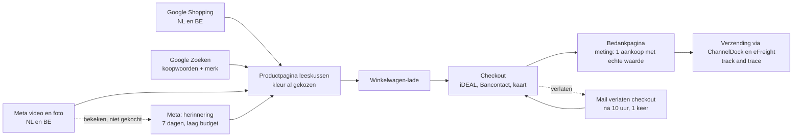

# Bline: funnel en advertentieplan voor blinesleep.nl

Versie 1.0, 5 oktober 2026. Voor de start van de eigen webshop (fase 1: leeskussen en losse hoes, NL en BE). Alles staat klaar om te zetten zodra de koppelingen er zijn; niets draait voordat Joost "live" zegt.

Basis: lessen uit het Google Ads MCC (`research_notes/Bline Sleep risicos en voorbeelden/google_ads_mcc_lessen.md`), de fouten van uwleeskussen.nl, de bol-cijfers van Bline en de webshop zoals die op 05-10 in Shopify staat (`reports/Bline shop opbouw logboek.md`).

---

## 1. De funnel in één beeld

**Waarom zo kort:** één product, één beslissing. Elke advertentie landt op de productpagina met de juiste kleur al gekozen, nooit op de homepage of op "alle producten" (dat ging mis bij uwleeskussen.nl).

## 2. Wat er op de site al klopt voor conversie

- Productpagina: prijs, levertijd, kleurkeuze met bolletjes, knop, gratis verzending en 14 dagen bedenktijd direct onder de knop. Meelopende knop "In winkelwagen" op mobiel.
- Bij een kleurkeuze zie je alleen foto's van die kleur.
- Specificaties, "Waarom dit kussen" (antwoord op de klachten bij concurrenten: te hard, kleur anders dan de foto, hoes niet wasbaar, te breed) en veelgestelde vragen.
- Winkelwagen als lade, geen pop-ups, geen aftelklokken.

**Nog toevoegen zodra het kan:**
1. Reviewscore met bron: "4,5 uit 5 bij 13 reviews op bol.com" (Ratings API 05-10: 9 x 5, 3 x 4, 1 x 2 sterren, gemiddeld 4,54). Alleen het getal en de bron, geen bol-teksten overnemen.
2. Video van het kussen (bestand van Joost) als tweede beeld in de galerij.

## 3. Meting (eerst, anders niets aanzetten)

| Wat | Hoe | Klaar als |
|---|---|---|
| Toestemming | Shopify-cookiemelding voor de EU aan, Google Consent Mode v2 via de Google-app | banner zichtbaar in NL en BE |
| Google | Google & YouTube-app: Merchant Center plus Google Ads. Primaire conversie: alleen **Aankoop**, met de echte orderwaarde. Toevoegen aan winkelwagen en checkout starten: secundair | testbestelling telt als 1 aankoop met juiste waarde |
| Meta | Facebook & Instagram-app: pixel plus Conversions API, gegevensdeling "Maximaal" | testbestelling zichtbaar als Purchase in Events Manager, geen dubbele telling |
| Nooit meer | conversies met een vaste waarde van €1, micro-conversies als doel (dat liet PMax bij uwleeskussen.nl op het verkeerde sturen) | |

## 4. Google Ads

**Account:** een nieuw Google Ads-account voor Bline, aangemaakt via de Google & YouTube-app in Shopify. Niet het oude account van uwleeskussen.nl: daar zitten de nep-conversies en de afgekeurde advertenties met medische claims in de geschiedenis.

**Opzet** (volgens de MCC-lessen: Shopping eerst, per land apart, merk apart, geen Performance Max tot 30+ aankopen per maand):

| Campagne | Type | Budget per dag | Bieden in week 1 tot 3 | Daarna |
|---|---|---|---|---|
| 00. Search \| Merk \| NL+BE | Zoeken | €1 | Max. klikken, CPC-plafond €0,40 | zo laten |
| 01. Shopping \| Leeskussen \| NL | Standaard Shopping | €8 | Max. klikken, CPC-plafond €0,60 | doel-ROAS 300% na 15 tot 30 aankopen |
| 01. Shopping \| Leeskussen \| BE | Standaard Shopping | €3 | Max. klikken, CPC-plafond €0,60 | idem |
| 02. Search \| Generiek \| NL | Zoeken | €3 | Max. klikken, CPC-plafond €0,70 | doel-ROAS 300% |

Totaal €15 per dag, ongeveer €450 per maand. Netwerken: alleen Google Zoeken (geen zoekpartners, geen Display). Taal Nederlands; BE in het Frans pas als er Franse pagina's zijn.

**Zoekwoorden generiek (exact en woordgroep):** leeskussen, leeskussen bed, leeskussen kopen, rugkussen bed, rugkussen voor in bed, bookseat, boekkussen, kussen om rechtop te zitten in bed, leeskussen traagschuim.

**Uitsluitingen (op accountniveau):** baby, zwangerschap, zwangerschapskussen, voedingskussen, kind, kinderen, hond, kat, auto, nekkussen, reiskussen, haken, breien, patroon, zelf maken, gratis, tweedehands, marktplaats, ikea, action, wigkussen medisch, rugpijn, hernia.

**Merk:** bline, bline leeskussen, blinesleep, bline sleep.

**Advertenties (responsive):** landingspagina altijd de productpagina, pad blinesleep.nl/leeskussen.

Koppen (max. 30 tekens, gecontroleerd):
1. Leeskussen met boekenvak
2. Bline leeskussen
3. Lezen in bed, zonder gedoe
4. Hoes wasbaar op 30 graden
5. 5 kleuren, 65 x 50 x 45 cm
6. Gratis verzending NL en BE
7. 14 dagen bedenktijd
8. Rechtop zitten in bed
9. Vulling: 3,8 kg traagschuim
10. Vak voor boek en telefoon
11. Binnen 1-2 werkdagen in huis
12. Losse hoezen te koop
13. Betaal met iDEAL of Bancontact
14. Rugkussen voor bed en bank
15. Bekijk alle kleuren

Beschrijvingen (max. 90 tekens, gecontroleerd):
1. Leeskussen met rugleuning en zijvak voor je boek, bril of telefoon. Hoes kan in de was.
2. Stevig traagschuim dat blijft staan. In wit, beige, blauw, grijs en zwart.
3. Gratis verzending in Nederland en België. Binnen 1-2 werkdagen in huis.
4. Niet goed? Je hebt 14 dagen bedenktijd. Losse hoezen in alle kleuren te koop.

Geen woorden als ergonomisch, rugpijn, houding of beste. De advertenties van uwleeskussen.nl werden beperkt door medische claims.

## 5. Meta (Facebook en Instagram)

| Onderdeel | Keuze |
|---|---|
| Campagne | Verkoop, 1 campagne, Advantage+-doelgroep, NL en BE |
| Optimaliseren op | Aankoop (pixel plus Conversions API) |
| Budget | €10 per dag, 14 dagen als test |
| Advertenties | 1) video van het kussen (zodra Joost het bestand stuurt), 2) carrousel met de 5 kleuren, 3) één sfeerfoto (beige, vrouw met boek) |
| Herinnering | na de test: €2 per dag op mensen die de productpagina bekeken en niet kochten, 7 dagen |

Tekst (primair): "Zondagavond, boek erbij. En dan zakt je kussen weer achter je rug weg. Dit leeskussen blijft staan, met een vak opzij voor je boek en telefoon. Hoes kan in de was. Gratis verzending in Nederland en België."
Kop: "Lezen in bed, zonder kussenfort." Knop: "Nu kopen".

## 6. Mail

- **Verlaten checkout:** Shopify-automatisering (gratis), 1 mail na 10 uur: "Je leeskussen staat nog klaar", met foto van de gekozen kleur. Geen kortingscode, geen tweede mail.
- **Orderbevestiging en verzending:** de concepten uit `reports/bijlagen/Bline shop teksten.md`.
- **Na de bezorging:** één mail met de luchttip (24 tot 48 uur laten luchten en opschudden) en het wasvoorschrift. Een reviewvraag mag in de eigen shop, maar pas nadat er een reviewsysteem op de site staat; dat is een latere stap.

## 7. Rekenregels en stopregels

**Break-even:** bundel €79,99 geeft ongeveer €34 bijdrage per verkoop vóór advertenties (inkoop €19,27, verzending €6,21, pick en pack €2,15, betaalkosten ongeveer €1,20, retourvoorziening ongeveer €3). Break-even ROAS ongeveer 2,3 (omzet incl. btw gedeeld door advertentiekosten); wit €69,99 ongeveer 2,2. Kosten per aankoop mogen dus hooguit **€34** zijn.

| Regel | Wanneer | Actie |
|---|---|---|
| Meting eerst | geen aankoop zichtbaar na de testbestelling | niets aanzetten |
| Leeg kanaal | €150 uitgegeven in een kanaal zonder aankoop | kanaal pauzeren, eerst meting en productpagina nalopen |
| Te duur | kosten per aankoop over 14 dagen boven €34 | biedplafond 15% omlaag, slechtste zoektermen uitsluiten |
| Goed | kosten per aankoop onder €25 over 14 dagen | budget +20% per week |
| Weekcheck | elke maandag | cijfers per kanaal naast het weekplan, zoektermen snoeien |

Verwachting (inschatting, geen belofte): bij een CPC van €0,50 tot €0,80 en 2 tot 3% conversie liggen de kosten per aankoop tussen €17 en €40. De eerste 4 weken zijn een meting, geen winstmachine.

## 8. Volgorde naar live

1. Joost: domein, Shopify Payments, ChannelDock, Google- en Meta-app koppelen (zie de lijst in het logboek).
2. Claude: testbestelling nalopen (betaling, ChannelDock-pick van de bundel, track and trace, meting in Google en Meta).
3. Joost zegt "live": wachtwoord uit.
4. Claude: Merchant Center controleren (geen afkeuringen), Google-campagnes en Meta-campagne zetten volgens dit plan, budgetten zoals hierboven.
5. Elke maandag: weekcheck met de stopregels.
