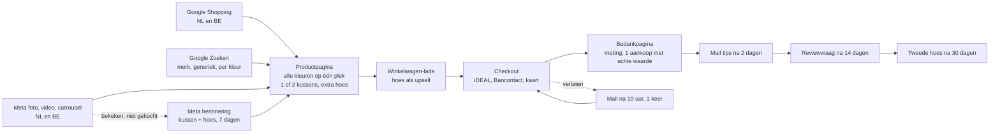

# Bline: funnel en advertentieplan voor blinesleep.nl

Versie 2.0, 5 oktober 2026 (v1.0 van dezelfde dag is bijgewerkt na shop v3). Fase 1: één product, het leeskussen in vijf kleuren, met de losse hoes als upsell, voor NL en BE. Alles staat klaar; niets draait voordat Joost "live" zegt.

Bestanden die klaarliggen:
- **Meta:** 8 advertenties plus een carrousel van 5 kaarten, met teksten: `mockups/blinesleep/ads/meta/` (`teksten.md`).
- **Google:** importbestanden voor Google Ads Editor (merk, generiek, per kleur, uitsluitingen, extensies) en het Shopping-plan: `mockups/blinesleep/ads/google/` (`LEESMIJ.md`).
- **Mails:** `reports/bijlagen/Bline mails funnel.md`.

---

## 1. De funnel in één beeld

**Landingspagina's (bijgewerkt 06-10):** de homepage is weer een echte homepage (merk, kleuren, momenten, knop naar het product). Advertenties landen op de productpagina, die alle vijf kleuren toont en de kleur laat wisselen zonder te laden: zonder kleur op `/products/leeskussen-beige`, met één kleur in beeld op `/products/leeskussen-<kleur>`. De keuze kan vooraf gezet worden met `?aantal=2` en `?hoes=1` (getest). Alleen de merkcampagne landt op de homepage. Nooit op een collectie.

## 2. Vertrouwen: wat er staat en wat nog kan

**Staat er nu:**
- 4,5 uit 5 op bol.com met bron en verdeling; eigen Judge.me-reviews zodra er 3 zijn.
- "Waarom Bline": een Nederlands merk (Shop4You, Borne), een echte klantenservice, 30 dagen proberen (besluit Joost 06-10, langer dan de wettelijke 14 dagen).
- App-link bij de koopknop ("Twijfel over maat of kleur? App ons"), telefoon in footer en vragen.
- Bedrijfsgegevens, KvK en btw in de footer; betaaliconen; gratis verzending en levertijd bij de knop.
- Video, getekende maten en vergelijking met losse kussens.

**Beslissingen voor Joost** (kosten of beleid, daarom niet zelf gedaan):

| Nr | Wat | Waarom | Kosten | Advies |
|---|---|---|---|---|
| 1 | Achteraf betalen (Klarna of Riverty) aanzetten in Shopify Payments | in NL een van de sterkste vertrouwensknoppen bij een onbekende winkel | transactiekosten iets hoger | ja, bij livegang |
| 2 | Keurmerk WebwinkelKeur | bekend schildje, onafhankelijke reviews | ongeveer €10 tot €15 per maand | na de eerste 4 weken beslissen |
| 3 | Gratis retour | nu betaalt de klant de retour | gemiddeld enkele euro's per verkoop | eerst niet; testen als de conversie achterblijft (30 dagen proberen staat sinds 06-10) |
| 4 | Kaartje in de doos met QR naar de reviewpagina | eigen reviews komen sneller | drukwerk | ja |
| 5 | Google Klantenreviews (Merchant Center) | sterren in Shopping na genoeg reviews | gratis | ja, na koppeling |

## 3. Welke platformen, en waarom

| Platform | Rol | Wanneer | Budget |
|---|---|---|---|
| **Google Shopping** | mensen die al "leeskussen" zoeken; hoogste koopintentie | vanaf live | €11 per dag (NL €8, BE €3) |
| **Google Zoeken** | merk beschermen en generieke koopwoorden, per kleur | vanaf live | €4 per dag |
| **Meta (Facebook en Instagram)** | nieuwe kopers die nog niet zoeken; het product is visueel en lost een herkenbaar probleem op | vanaf live, 14 dagen test | €10 per dag, daarna €2 herinnering |
| **bol.com** | loopt al (Sponsored Products), blijft apart | doorlopend | zoals nu |
| Pinterest | slaapkamer- en leesinspiratie, past bij het product | fase 2, na 4 weken | eerst organisch, daarna €5 per dag test |
| TikTok | werkt alleen met echte video's van gebruikers | fase 3, zodra creators via Collabs video's maken | nog niet |
| Performance Max | pas bij 30+ aankopen per maand (les uit het MCC) | later | |

## 4. Meting (eerst, anders niets aanzetten)

| Wat | Hoe | Klaar als |
|---|---|---|
| Toestemming | Shopify-cookiemelding voor de EU aan, Google Consent Mode v2 via de Google-app | banner zichtbaar in NL en BE |
| Google | Google & YouTube-app: Merchant Center plus Google Ads. Primaire conversie: alleen **Aankoop**, met de echte orderwaarde. Toevoegen aan winkelwagen en checkout starten: secundair | testbestelling telt als 1 aankoop met juiste waarde |
| Meta | Facebook & Instagram-app: pixel plus Conversions API, gegevensdeling "Maximaal" | testbestelling zichtbaar als Purchase in Events Manager, geen dubbele telling |
| Nooit meer | conversies met een vaste waarde van €1, micro-conversies als doel (dat liet PMax bij uwleeskussen.nl op het verkeerde sturen) | |

## 5. Google Ads

**Account:** een nieuw Google Ads-account voor Bline, aangemaakt via de Google & YouTube-app in Shopify. Niet het oude account van uwleeskussen.nl: daar zitten de nep-conversies en de afgekeurde advertenties met medische claims in de geschiedenis.

**Opzet** (volgens de MCC-lessen: Shopping eerst, per land apart, merk apart, geen Performance Max tot 30+ aankopen per maand):

| Campagne | Type | Budget per dag | Bieden in week 1 tot 3 | Daarna |
|---|---|---|---|---|
| 00. Search \| Merk \| NL+BE | Zoeken | €1 | Max. klikken, CPC-plafond €0,40 | zo laten |
| 01. Shopping \| Leeskussen \| NL | Standaard Shopping | €8 | Max. klikken, CPC-plafond €0,60 | doel-ROAS 300% na 15 tot 30 aankopen |
| 01. Shopping \| Leeskussen \| BE | Standaard Shopping | €3 | Max. klikken, CPC-plafond €0,60 | idem |
| 02. Search \| Generiek \| NL | Zoeken | €3 | Max. klikken, CPC-plafond €0,70 | doel-ROAS 300% |

Totaal €15 per dag, ongeveer €450 per maand. Netwerken: alleen Google Zoeken (geen zoekpartners, geen Display). Taal Nederlands; BE in het Frans pas als er Franse pagina's zijn.

**Zoekwoorden generiek (exact en woordgroep):** leeskussen, leeskussen bed, leeskussen kopen, rugkussen bed, rugkussen voor in bed, bookseat, boekkussen, kussen om rechtop te zitten in bed, leeskussen traagschuim.

**Uitsluitingen (op accountniveau):** baby, zwangerschap, zwangerschapskussen, voedingskussen, kind, kinderen, hond, kat, auto, nekkussen, reiskussen, haken, breien, patroon, zelf maken, gratis, tweedehands, marktplaats, ikea, action, wigkussen medisch, rugpijn, hernia.

**Merk:** bline, bline leeskussen, blinesleep, bline sleep.

**Advertenties (responsive):** 7 advertenties met elk 15 koppen en 4 beschrijvingen, lengtes automatisch gecontroleerd, in `mockups/blinesleep/ads/google/bline-google-4_advertenties.csv`. "Leeskussen algemeen" landt op `/` (de productpagina), elke kleurgroep op `/products/leeskussen-<kleur>`. Sitelinks, highlights en een snippet met de vijf kleuren in `bline-google-6_extensies.csv`. Shopping-feed: zie `mockups/blinesleep/ads/google/LEESMIJ.md` (langere titels per kleur, beeld 01 als hoofdbeeld, hoezen eerst uitgesloten).

Geen woorden als ergonomisch, rugpijn, houding of beste. De advertenties van uwleeskussen.nl werden beperkt door medische claims.

## 6. Meta (Facebook en Instagram)

| Onderdeel | Keuze |
|---|---|
| Campagne | `bl_sales_nlbe`: Verkoop, Advantage+-doelgroep en -plaatsingen, NL en BE |
| Optimaliseren op | Aankoop (pixel plus Conversions API) |
| Budget | €10 per dag, 14 dagen als test |
| Advertenties | 1 kussenfort (4:5 en 9:16), 2 momenten (4:5 en 9:16), 3 kleuren plus carrousel, 4 video, 5 score, 6 stevig |
| Herinnering | `bl_herinnering_nlbe`, na de test: €2 per dag, productpagina bekeken of in winkelwagen en niet gekocht, 7 dagen; advertentie 7 (kussen + hoes, landt met hoes al aangevinkt) en 1 |

Alle beelden, teksten, koppen, landingspagina's en UTM's: `mockups/blinesleep/ads/meta/teksten.md`. Beelden zijn de goedgekeurde originelen, onveranderd; alleen tekst en kleurvlakken eromheen.

## 7. Mail

Vijf mails, teksten in `reports/bijlagen/Bline mails funnel.md`: verlaten checkout (na 10 uur, 1 keer), tips na verzending (dag 2), reviewvraag via Judge.me (dag 14, geen beloning), tweede hoes (dag 30, alleen als er geen hoes bij zat), welkom na aanmelding. Geen kortingscodes zonder akkoord. Orderbevestiging en verzending: `reports/bijlagen/Bline shop teksten.md`.

## 8. Rekenregels en stopregels

**Break-even:** bundel €79,99 geeft ongeveer €34 bijdrage per verkoop vóór advertenties (inkoop €19,27, verzending €6,21, pick en pack €2,15, betaalkosten ongeveer €1,20, retourvoorziening ongeveer €3). Break-even ROAS ongeveer 2,3 (omzet incl. btw gedeeld door advertentiekosten); wit €69,99 ongeveer 2,2. Kosten per aankoop mogen dus hooguit **€34** zijn.

| Regel | Wanneer | Actie |
|---|---|---|
| Meting eerst | geen aankoop zichtbaar na de testbestelling | niets aanzetten |
| Leeg kanaal | €150 uitgegeven in een kanaal zonder aankoop | kanaal pauzeren, eerst meting en productpagina nalopen |
| Te duur | kosten per aankoop over 14 dagen boven €34 | biedplafond 15% omlaag, slechtste zoektermen uitsluiten |
| Goed | kosten per aankoop onder €25 over 14 dagen | budget +20% per week |
| Weekcheck | elke maandag | cijfers per kanaal naast het weekplan, zoektermen snoeien |

Verwachting (inschatting, geen belofte): bij een CPC van €0,50 tot €0,80 en 2 tot 3% conversie liggen de kosten per aankoop tussen €17 en €40. De eerste 4 weken zijn een meting, geen winstmachine.

## 9. Volgorde naar live

1. Joost: domein, Shopify Payments, ChannelDock, Google- en Meta-app koppelen (zie de lijst in het logboek).
2. Claude: testbestelling nalopen (betaling, ChannelDock-pick van de bundel, track and trace, meting in Google en Meta).
3. Joost zegt "live": wachtwoord uit.
4. Claude: Merchant Center controleren (geen afkeuringen), Google-campagnes en Meta-campagne zetten volgens dit plan, budgetten zoals hierboven.
5. Elke maandag: weekcheck met de stopregels.

## 10. Link- en UTM-afspraken

Google Ads gebruikt automatische tagging (gclid); daar geen UTM's aan toevoegen. Alle andere links krijgen vaste UTM's, kleine letters, zonder spaties:

| Kanaal | utm_source | utm_medium | utm_campaign | utm_content |
|---|---|---|---|---|
| Meta-advertenties | facebook of instagram ({{site_source_name}}) | paid_social | `{{campaign.name}}` | `{{ad.name}}` |
| Creators (Collabs) | naam van de creator, bijvoorbeeld `boekenblog_lisa` | creator | `collabs_2026q4` | `post`, `story` of `reel` |
| Mail (Shopify Email) | shopify_email | email | naam van de flow, bijvoorbeeld `verlaten_checkout` | `knop` of `beeld` |
| Blog naar product | (geen UTM: interne links nooit taggen) | | | |
| bol-verpakking of insert met QR | `insert` | qr | `doos_2026` | kleur, bijvoorbeeld `beige` |

Landingspagina's: het kleurproduct (`/products/leeskussen-beige` enzovoort), eventueel met `?aantal=2` of `?hoes=1`; de merkcampagne op de homepage. Nooit een collectie.

Bestandsnamen van beelden: `bline-<product>-<kleur>-<soort>-<nr>.jpg`, bijvoorbeeld `bline-leeskussen-beige-packshot-01.jpg`, `bline-leeskussen-beige-gebruik-02.jpg`, `bline-hoes-blauw-rits-01.jpg`, `bline-over-joost-01.jpg`.
