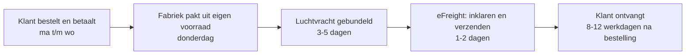

# Productkeuze en logistiek Bline Sleep

Peildatum 5 oktober 2026. Aanvulling op `reports/Strategie premium slaapmerk.md`. **Feit** = uit bol-data, offerte of bron. **Inschatting** = eigen rekenwerk; de aannames staan erbij.

Joosts terechte punt: "verzenden vanuit Nederland" en "geen voorraad inkopen" spreken elkaar tegen. Hieronder staat hoe dat wel samengaat: klanten betalen eerst, de fabriek houdt de voorraad, wij halen elke week alleen op wat al verkocht is. In het begin zit dat in een hogere vrachtprijs in de marge in plaats van in kapitaal.

---

## 1. Met welke producten beginnen

### Wat klanten op bol zoeken (feit, bol-API, laatste 12 maanden NL en BE)

| Zoekterm | Zoekopdrachten per jaar | Seizoen |
|---|---|---|
| dekbedovertrek | 117.752 | stabiel, piek nov-jan |
| dekbed | 75.985 | sterk winter (nov 12.246, aug 4.201) |
| hoeslaken | 75.146 | stabiel |
| hoofdkussen | 50.201 | stabiel |
| plaid | 36.035 | sterk winter |
| kussensloop | 32.812 | stabiel |
| verzwaringsdeken | 23.475 | winter (nov-jan 2.900-3.500 per maand) |
| topper | 20.596 | stabiel |
| beddengoed | 16.100 | stabiel |
| zijden kussensloop | **12.873** | stabiel, 900-1.900 per maand |
| leeskussen | 12.286 | winter |
| wasbaar dekbed | 6.219 | stabiel |
| zomerdekbed | 6.096 | **mei-aug** (piek juni 1.502) |
| dekbed dons + ganzendons + 4 seizoenen | ca. 3.950 | winter |
| linnen dekbedovertrek | 1.377 | stabiel |
| tencel dekbedovertrek | 970 | **zomer** (juni-sep 102-161) |

Twee lessen uit deze cijfers (inschatting):
- **Dons zoekt men op bol weinig**, de premium donsklant zoekt via Google en koopt op vertrouwen. Dat bevestigt de keuze van Joost: de eigen shop blinesleep is het hoofdkanaal, bol is alleen een etalage voor een paar zoekproducten.
- **Zijden kussensloop en verzwaringsdeken** hebben op bol een grote, specifieke vraag voor een nicheproduct. Dat zijn de producten die we op bol als etalage zetten, zodat klanten het merk leren kennen en daarna op de eigen shop kopen.

### Scoring van de kandidaten (inschatting, 1 = slecht, 5 = goed)

| Product | Vraag | Marge en orderwaarde | Geschikt voor luchtvracht | Onderscheid mogelijk | Laag retour- en maatrisico | Leverancier klaar | **Totaal** |
|---|---|---|---|---|---|---|---|
| **Donsdekbed (4-seizoenen, zomer)** | 3 | 5 | 3 (vacuüm) | 5 (bewijs dons) | 3 | 4 | **23** |
| **Lyocell beddengoed (set + hoeslaken)** | 4 | 4 | 4 | 4 (koel, zacht) | 3 | 3 | **22** |
| **Zijden kussensloop** | 4 | 3 | 5 | 3 | 4 | 3 | **22** |
| Verzwaringsdeken | 4 | 4 | **1** (7-9 kg) | 3 (Cura sterk) | 3 | 5 | 20 |
| Hoeslaken diepe hoek | 5 | 3 | 4 | 3 | 2 | 3 | 20 |
| Hoofdkussen | 4 | 4 | 3 | 2 (Cloudpillo) | 3 | 3 | 19 |
| Plaid | 4 | 3 | 3 | 2 | 4 | 3 | 19 |
| Topper | 4 | 3 | 1 | 2 | 2 | 2 | 14 |

### Advies: start met drie producten die samen één verhaal vertellen

| Rol | Product | Waarom |
|---|---|---|
| **Held** | **Het Donsdekbed** (zomer en 4-seizoenen) | Hoogste bijdrage per stuk, dekbedden groeien, laag invoerrecht (3,7%), en bewijs (donspercentage, vulkracht, RDS) is het onderscheid. Seizoen loopt nu. |
| **Aanvuller en zomerheld** | **Lyocell beddengoed** (overtrekset en hoeslaken met diepe hoek) | Verhoogt de orderwaarde bij het dekbed, en is in de zomer zelf de held ("koel slapen"); zoekvraag stijgt in juni-september. |
| **Instap en cadeau** | **Zijden kussensloop** | 12.900 zoekopdrachten per jaar, licht (0,3 kg), past door de brievenbus, perfect als cadeau en als eerste kennismaking met het merk. |

**Verzwaringsdeken: wel doen, maar als tweede stap.** De vraag is groot (23.475) en Sine is klaar, maar 7-9 kg per deken maakt luchtvracht te duur (zie §3). Die komt met de eerste zee- of treinzending, rond februari, en is dan de held voor winter 2027.

**Zomerdekbed** komt in april, op tijd voor de piek in mei tot augustus.

---

## 2. Het logistiek model: verkopen voordat je inkoopt

### Het principe

1. **De fabriek houdt de voorraad** van onze producten, al voorzien van ons label en onze verpakking. Dat is het partnerschap dat we in het fabrieksgesprek vragen (zie het specificatieblad, regel "Voorraadmodel").
2. **De klant bestelt en betaalt** op blinesleep. Op de productpagina staat vooraf een harde leverdatum.
3. **Elke donderdag** gaan alle orders van die week als één luchtvrachtzending van de fabriek naar eFreight. Wij betalen de fabriek alleen voor wat al verkocht is.
4. **eFreight klaart in en verstuurt** in Nederland. De klant krijgt een Nederlands pakket, een Nederlands retouradres en Nederlandse service.

### Drie fases

| Fase | Wanneer | Hoe | Levertijd voor de klant | Kapitaal |
|---|---|---|---|---|
| **1. Wekelijkse drop** | start tot ca. 50 orders per week | Fabriek houdt voorraad, wij halen wekelijks per luchtvracht op wat verkocht is | 8-12 werkdagen, datum vooraf zichtbaar | Bijna nul: klant betaalt voordat wij de fabriek betalen |
| **2. Buffer voor bestsellers** | vanaf een bestseller die elke week verkoopt | 2-4 weken voorraad van de top 3-5 producten bij eFreight, per luchtvracht | 1-2 werkdagen voor bestsellers, rest via de drop | Klein: alleen bestsellers, 2-4 weken |
| **3. Zee voor bewezen producten** | per product dat 3 maanden stabiel verkoopt | Zee- of treinzending, 6-8 weken buffer | 1-2 werkdagen | Middel: alleen bewezen producten, gefinancierd uit de marge van fase 1-2 |

**Uitzondering vanaf dag één:** de zijden kussensloop houden we direct op voorraad (100 stuks, circa €1.600). Hij is goedkoop, licht en de ideale "nu-bestellen"-aankoop of cadeau. Daarnaast 10-20 dekbedden en sets voor fotografie, creators en showroom.

### Als de fabriek geen voorraad voor ons wil houden

Dat is het eerste wat we bij de fabrieksreis toetsen. Er zijn twee terugvalopties:

1. **Reservering met aanbetaling:** wij betalen 30% van een reservering van bijvoorbeeld 50 stuks per product, de fabriek houdt die vast, wij betalen de rest per wekelijkse afroep. Kapitaal: enkele duizenden euro's.
2. **Voorraad bij een agent in China** (Ningbo of Shanghai): wij kopen kleine partijen (50-100 stuks), die liggen goedkoop bij een agent die elke week een luchtzending samenstelt. Dan zit er wel kapitaal in de inkoop, maar niet in vracht, invoerrecht en Nederlandse opslag, en de partijen zijn klein.

**Wat we niet doen:** losse pakketten rechtstreeks van de fabriek naar de klant. Dat kost sinds 1 juli 2026 €3 heffing per pakket plus de behandelvergoeding vanaf 1 november, boven €150 moeten wij invoerbtw en invoerrecht vooraf regelen (anders betaalt de klant aan de deur), de klant ziet een Chinese afzender en retouren gaan alsnog via Nederland. Alleen als noodoplossing voor een enkele spoedorder.

### Juridisch en betaling

- **Leverdatum vooraf tonen.** De wettelijke standaard is levering binnen 30 dagen; 8-12 werkdagen valt daar ruim binnen (inschatting, laten toetsen).
- **Vooruitbetaling:** in Nederland mag je een consument niet verplichten meer dan de helft vooruit te betalen (Burgerlijk Wetboek, consumentenkoop; laten toetsen door een jurist). In de praktijk betaalt de klant via iDEAL direct, maar bied ook **achteraf betalen via Klarna of Riverty** aan. Die betalen ons direct uit, de klant later. Zo blijft de geldstroom positief en zit je juridisch goed.
- **14 dagen herroepingsrecht** geldt gewoon; retouren gaan naar eFreight.
- **Invoer:** artikel 23-vergunning voor de invoer-btw en registratie bij UPV Textiel vóór de eerste zending.

---

## 3. De marge met hogere verzendkosten in het begin

Aannames (inschatting, behalve invoerrecht, btw en de Sine-prijs):
- Luchtvracht gebundeld €6,50 per kg (kleine zendingen, incl. ophalen), plus vaste kosten per zending van circa €100 (inklaring en handling; offerte eFreight nodig), verdeeld over de orders van die week.
- US$1 = €0,92. Fulfilment en verzending in NL €5 (brievenbus) tot €12 (dekbed). Betaalkosten 1,9% + €0,25.
- Retouren 10% (5% bij zijde); een geretourneerd dekbed na proefslapen verkopen we als B-keus.

### Per product: fase 1 (lucht, wekelijkse drop) tegenover fase 3 (zee)

| | Donsdekbed 240x220 | Lyocell overtrekset 240x220 | Zijden kussensloop 60x70 | Verzwaringsdeken 7 kg |
|---|---|---|---|---|
| Verkoopprijs incl. btw | €429 | €159 | €59 | €179 |
| Netto-omzet ex btw | €354,55 | €131,40 | €48,76 | €147,93 |
| Inkoop FOB | US$90 = €83 (**aanname**, offerte openen) | US$30 = €27,60 (aanname) | US$12 = €11 (aanname) | US$27,20 = €25 (**feit**, Sine) |
| Luchtvracht | €36 (vacuüm, volumegewicht ca. 5,5 kg) + €5 vast | €13 (2 kg) + €3 vast | €2 + €1 vast | €49 (7,5 kg) + €5 vast |
| Invoerrecht | 3,7%: €4,60 | 12%: €5,20 | 12%: €1,70 | 3,7-12%: €3-9 (TARIC checken) |
| **Landed (lucht)** | **€128,60** | **€48,80** | **€15,70** | **€82-88** |
| Fulfilment, betaling, retour | €12 + €8,40 + €14 | €8 + €3,30 + €1,50 | €5 + €1,40 + €0,40 | €12 + €3,70 + €8 |
| **Bijdrage vóór ads (lucht)** | **ca. €192 (54%)** | **ca. €70 (53%)** | **ca. €26 (54%)** | **ca. €37-43 (25-29%)** |
| Landed bij zee (vracht €2-4) | ca. €91 | ca. €34 | ca. €13 | ca. €30 |
| **Bijdrage vóór ads (zee)** | **ca. €230 (65%)** | **ca. €85 (65%)** | **ca. €29 (59%)** | **ca. €95 (64%)** |

Wat dit laat zien:
1. **Joosts aanpak klopt.** Luchtvracht in het begin kost bij dekbed, beddengoed en zijde 10-12 procentpunt marge, maar er blijft ruim genoeg over om advertenties te betalen. Dat is goedkoper dan kapitaal vastzetten in voorraad die misschien niet verkoopt.
2. **De verzwaringsdeken is de uitzondering:** per luchtvracht houd je €37-43 over, te weinig voor betaalde klantwerving. Die gaat dus pas mee als er een zee- of treinzending komt.
3. **De bundel is de motor.** Een Slaapset (dekbed, overtrekset en zijden sloop) van €599 levert in fase 1 circa €265 bijdrage op met één verzending. Daarmee mag een nieuwe klant €100 aan advertenties kosten en verdien je nog steeds.

### Wanneer een product van lucht naar zee gaat

Een product gaat naar fase 2 (buffer) als het **4 weken achter elkaar** minstens 5 stuks per week verkoopt, en naar fase 3 (zee) als het **3 maanden** stabiel verkoopt én de marge na advertenties positief is. Zo groeit de voorraad mee met de bewezen vraag, en niet andersom (de Made.com-fout).

---

## 4. Kapitaal in fase 1

| Post | Bedrag (inschatting) |
|---|---|
| Samples en labtests (dons, lyocell, zijde) | €3-5k |
| Eigen labels, vacuümzakken met print, cadeaudozen (MOQ) | €2-4k |
| Kleine voorraad: 100 zijden slopen + 10-20 dekbedden en sets voor foto, creators en showroom | €3-4k |
| Fabrieksreis (Canton Fair plus Hangzhou en Hefei) en sourcing-agent | €4-6k |
| Merk, fotografie, video, webshop | €6-10k |
| Advertentietest en launch | €8-12k |
| Juridisch en compliance (voorwaarden, GPSR, artikel 23, UPV) | €1-2k |
| **Totaal** | **ca. €27-43k** |

Dat is minder dan in de eerdere strategie (€50-60k), omdat er bijna geen voorraad wordt ingekocht. Het werkkapitaal is zelfs negatief: de klant betaalt voordat wij de fabriek betalen. Het risico verschuift naar de afspraak met de fabriek. Daarom is het fabrieksgesprek in november het belangrijkste moment van het hele plan.

---

## 5. Wat je deze week nodig hebt

1. **Specificatiebladen** (bijlage `reports/bijlagen/Specificatiebladen Bline Sleep.xlsx`): donsdekbed, verzwaringsdeken, lyocell beddengoed en zijden kussensloop, in Nederlands, Engels en Chinees, plus een tabblad om offertes naast elkaar te zetten. Stuur ze naar Samsung Down, Charming, Sine, Serica en een weverij met stockkleuren.
2. **Offerte bij eFreight** voor wekelijkse gebundelde luchtvracht uit Hangzhou/Shanghai en Hefei: prijs per kg, vaste kosten per zending, inklaring, fulfilment per order en retourafhandeling.
3. **Domein blinesleep** koppelen aan een Shopify-winkel (zie de voorbeeldschermen).
4. **Bijlagen met offertes** openen of in Drive zetten, zodat de aannames hierboven echte prijzen worden.
